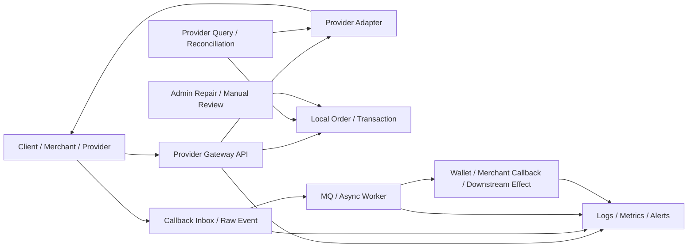
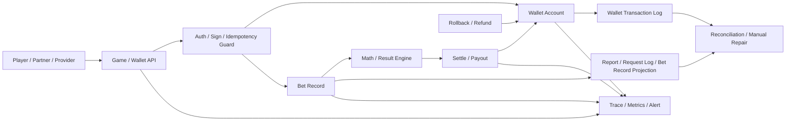

# System Design Templates

本檔是可選架構加強，不是投遞前必做。

目的：把已完成 evidence 的 production flows 抽象成面試可講的 0 到 1 system design template。它不是每個系統重掃 code，也不是宣稱 Nick 主導過完整 0 到 1 大系統。

## 使用邊界

- 證據來源：已完成的 `flow.md`、`career-interview.md`、`contribution-claim-consolidation.md`、domain `architecture-map.md` / `integration-map.md`。
- 掃描深度：Level 2 萃取。必要時才回 code 補查關鍵邊界；不做全 repo Level 3 重掃。
- 面試定位：展示從 production flow 抽象出 API、state、DB、MQ、idempotency、reconciliation、observability 與 rollout plan 的能力。
- 履歷邊界：不新增正式履歷 claim；正式履歷仍以 `05 / 08` 與 project-level contribution consolidation 為準。

推薦模板：

| 順序 | Template | 定位 | 狀態 |
| --- | --- | --- | --- |
| 1 | Provider Integration template | payment provider、遊戲 provider、callback、query、補償、對帳 | v1 completed |
| 2 | Wallet / Bet-Settle template | wallet source of truth、bet record、settle、rollback、transaction boundary | v1 completed |
| 3 | MQ / Batch / Projection template | Kafka / RabbitMQ、report projection、retry、DLQ、重跑、資料修復 | pending |
| 4 | Slot Math / RTP Validation template | math-core contract、simulation、result validation、版本相容 | pending / optional |

## Provider Integration Template v1

### 1. 面試定位

這份模板回答：

```text
如果我要從 0 設計一個第三方 provider integration 系統，
如何處理 request、callback、query、timeout unknown、重送、補償、對帳與人工修復？
```

適用場景：

- 第三方金流 provider 充值 / 提現。
- 第三方遊戲 provider seamless wallet / transfer wallet。
- Provider callback -> MQ -> admin/report persistence。
- 商戶 / provider gateway 類 backend 職缺。

不適用或不可誇大：

- 不代表 Nick 主導過完整 payment platform。
- 不代表 Nick 設計過完整 wallet / ledger / reconciliation。
- 不代表系統已具備 exactly-once、完整 outbox 或全自動對帳。
- 不把 `k3s-deploy`、system map 或 analysis-only flow 升級成正式履歷成果。

### 2. Evidence 對照

| Evidence | 用途 | Claim 邊界 |
| --- | --- | --- |
| `projects/iwin/payment/flows/payment-order-provider-request/flow.md` | payment provider request、merchant order id、sign、amount unit、provider accepted / timeout unknown | Nick 可保守寫參與多 provider request / query / callback；不可寫完整金流 owner |
| `projects/iwin/payment/flows/payment-provider-callback/flow.md` | callback guard、ack、MQ、order state、上分 / 退款副作用 | code-backed callback framework 分析；不單獨寫成 callback owner |
| `projects/iwin/payment/contribution-claim-consolidation.md` | payment project-level claim gate | 可寫 provider / 商戶對接；不可寫 wallet / ledger / reconciliation owner |
| `projects/iwin/iwin_gameserver/flows/third-party-transfer-in-out/career-interview.md` | 遊戲 provider 投派、wallet mutation、log projection、reconciliation 風險 | 可併入第三方 provider 投派整合；不可寫完整 gameserver wallet owner |
| `projects/ugsoft/ugsoft-connector-api/flows/transfer-wallet-in-out-query/flow.md` | transfer wallet request / query、provider transaction lookup、Redis guard、DB lookup | 可寫 provider connector / transfer wallet；不可寫完整 wallet owner |
| `projects/ugsoft/ugsoft-connector-api/flows/provider-callback-bet-settle-to-mq/flow.md` | provider callback、adapter callback、MQ producer、admin consumer 入庫 | 可寫 callback / MQ supporting；不可寫 exactly-once / outbox owner |
| `projects/iwin/integration-map.md` / `projects/ugsoft/integration-map.md` | 跨 project source of truth 與排查順序 | 架構視角，不新增履歷 claim |

### 3. 0 到 1 核心切法



核心不是「打一支 provider API」，而是建立一個可以承受外部不可靠事件的邊界：

1. API gateway 層：驗簽、白名單、參數 normalize、trace id。
2. Provider adapter 層：每個 provider 的 request / callback / query contract 隔離。
3. Local state 層：本地 order / transaction 是內部 source of truth。
4. Raw event / inbox 層：保存 provider request / callback / query evidence。
5. Async worker 層：將 callback 或查單結果轉成下游副作用。
6. Reconciliation 層：處理 timeout unknown、callback missing、provider / local state mismatch。
7. Admin repair 層：人工修復必須有權限、audit、狀態 transition guard。
8. Observability 層：能追單、追 callback、追 MQ、追 downstream effect。

### 4. 最小資料模型

#### `provider_order`

| 欄位 | 用途 |
| --- | --- |
| `id` | internal id |
| `merchant_order_id` | 本地單號，送給 provider 的主追蹤 key |
| `provider` | provider code |
| `provider_order_id` | provider 回傳單號，可能 request 後才有 |
| `account_id` | 玩家 / 商戶帳號 |
| `amount` / `currency` | 金額與幣別，避免單位混淆 |
| `direction` | deposit / withdraw / transfer-in / transfer-out / bet-settle |
| `status` | local state machine |
| `request_payload_hash` | request evidence，避免存敏感原文時仍可比對 |
| `last_provider_status` | provider latest status |
| `created_at` / `updated_at` | 查 aging / timeout |

#### `provider_event`

| 欄位 | 用途 |
| --- | --- |
| `event_id` | internal event id |
| `provider` | provider code |
| `merchant_order_id` | 對回 local order |
| `provider_transaction_id` | provider side transaction key |
| `event_type` | callback / query / retry / manual |
| `event_status` | provider event status |
| `raw_payload_ref` | raw evidence reference，不在 KB 放 secret |
| `sign_valid` | 驗簽結果 |
| `processed_status` | pending / processed / ignored / failed |
| `idempotency_key` | provider + event type + transaction id |
| `received_at` / `processed_at` | callback delay / replay |

#### `provider_effect`

| 欄位 | 用途 |
| --- | --- |
| `effect_id` | 下游副作用 id |
| `merchant_order_id` | 對回 order |
| `effect_type` | credit / refund / debit / mq_publish / merchant_callback |
| `target_system` | wallet / admin / report / merchant callback |
| `status` | pending / success / failed / unknown |
| `retry_count` | 重送次數 |
| `error_code` / `error_message` | 補償依據 |

### 5. State Machine

#### Payment / Transfer 類

```text
NEW
-> LOCAL_CREATED
-> PROVIDER_REQUESTED
-> PROVIDER_ACCEPTED
-> CALLBACK_RECEIVED
-> EFFECT_APPLIED
-> SUCCESS
```

異常分支：

```text
PROVIDER_REQUESTED -> REQUEST_TIMEOUT_UNKNOWN
PROVIDER_ACCEPTED -> CALLBACK_MISSING
CALLBACK_RECEIVED -> EFFECT_FAILED
EFFECT_FAILED -> MANUAL_REPAIR_PENDING
MANUAL_REPAIR_PENDING -> SUCCESS / FAILED / CANCELLED
```

#### Bet-settle callback 類

```text
CALLBACK_RECEIVED
-> VALIDATED
-> MERCHANT_CALLBACK_SUCCESS
-> MQ_PUBLISHED
-> CONSUMED
-> BET_RECORD_SAVED
-> REPORT_READY
```

異常分支：

```text
VALIDATED -> MERCHANT_CALLBACK_FAILED
MERCHANT_CALLBACK_SUCCESS -> MQ_PUBLISH_FAILED
MQ_PUBLISHED -> CONSUME_FAILED
BET_RECORD_SAVED -> REPORT_LAGGING
```

### 6. Idempotency 設計

#### Key 選擇

| 情境 | 建議 key |
| --- | --- |
| payment request | `provider + merchant_order_id` |
| payment callback | `provider + merchant_order_id + provider_transaction_id + event_status` |
| withdraw refund | `provider + original_order_id + refund_type` |
| transfer wallet | `agent + account + transfer_reference_id`，DB lookup 比 Redis guard 重要 |
| bet-settle | `provider + provider_bet_id + currency + event_type` |
| gameserver transfer | `provider + event_type + transaction_id / bet_id` |

#### Owner 判斷

- Redis lock 只能防連點，不是長期冪等。
- DB unique key 或 processed transaction record 要在下游副作用前建立。
- 如果先改 wallet 再補 processed record，中間 crash 仍可能 double apply。
- callback 重送應回既有結果，不應重做副作用。
- 已終態訂單不能被舊 callback 覆蓋。

### 7. Failure Window

| Failure window | 後果 | Owner 解法 |
| --- | --- | --- |
| local order insert success, provider request fail | 本地有單，provider 無單 | 標 request failed，可重試 / 換 provider / 人工取消 |
| provider request timeout | provider 可能已 accepted | 進 unknown，不直接成功或失敗；靠 query / reconciliation |
| provider accepted, callback missing | 訂單卡住 | aging monitor + provider query job + manual queue |
| callback ack success, MQ publish fail | provider 不再重送，但內部沒處理 | callback inbox / outbox / publisher confirm / alert |
| MQ consumed, downstream effect fail | order 與 wallet / report 不一致 | effect table + retry / DLQ / repair |
| provider callback duplicate | 重複上分 / 重複退款 / 重複 bet record | idempotency key + terminal-state guard |
| provider success, local transaction persist fail | 查單 / lookup 缺資料 | transaction outbox / provider query fallback / manual repair |
| report projection lag | 後台查不到，誤判交易失敗 | report 不當 source of truth；提供 lag alert 與 trace map |

### 8. Reconciliation / 對帳策略

最小可行對帳分三層：

1. Order aging：找 `PROVIDER_ACCEPTED`、`PROCESSING`、`REQUEST_TIMEOUT_UNKNOWN` 超時單。
2. Provider query：用 `merchant_order_id` / provider transaction id 查 provider 終態。
3. Local effect compare：比對 local order、wallet / transaction log、provider event、report projection。

對帳輸出不應直接亂改狀態，而是產生 repair candidates：

```text
order_id
provider_status
local_status
wallet_effect_status
recommended_action
risk_level
evidence_links
```

人工修復必須：

- 有二次確認。
- 有權限邊界。
- 有 before / after audit。
- 只能走合法 state transition。
- 修復後可再 reconciliation 驗證。

### 9. Observability

最少要能查：

- `merchant_order_id`
- `provider_order_id`
- `provider_transaction_id`
- `transfer_reference_id`
- `callback event id`
- `MQ message id`
- `effect id`

核心指標：

| 指標 | 用途 |
| --- | --- |
| provider request success / timeout rate | provider 穩定性 |
| callback delay p50 / p95 / p99 | provider 延遲與卡單 |
| unknown aging count | 需要查單 / 對帳 |
| duplicate callback count | provider 重送與冪等壓力 |
| MQ publish fail / consume fail | async pipeline 健康 |
| manual repair count | 系統補償能力與操作風險 |
| provider / local mismatch count | 對帳差異 |

告警優先級：

1. 金額副作用失敗：wallet credit / refund / transfer effect failed。
2. Unknown aging：provider accepted 但長時間無終態。
3. MQ publish / consume fail：callback 進來但內部沒落地。
4. Duplicate spike：可能 provider 重送或上游 retry 異常。
5. Report lag：不要誤判成交易失敗，但要讓營運知道延遲。

### 10. Rollout Plan

#### Phase 1：Adapter isolation

- 每個 provider 一個 adapter。
- 統一 request / callback / query interface。
- 所有 provider payload normalize 成 common DTO。
- 保留 raw event reference 與 trace id。

#### Phase 2：State and idempotency

- 明確 order state machine。
- 建 provider event inbox。
- 在下游副作用前建立 idempotency record。
- 終態 guard：成功 / 失敗 / 取消不可被舊事件覆蓋。

#### Phase 3：Async reliability

- callback 不直接做重副作用。
- callback inbox -> worker / MQ。
- producer confirm / retry / DLQ。
- effect table 保存下游副作用狀態。

#### Phase 4：Reconciliation and repair

- aging query job。
- provider query job。
- mismatch report。
- manual repair SOP。
- repair 後自動 recheck。

#### Phase 5：Observability and operations

- dashboard：provider request、callback delay、unknown aging、MQ fail、manual repair。
- runbook：卡單、重複 callback、provider timeout、MQ lag、report lag。
- provider onboarding checklist：sign、IP、amount unit、callback ack、query API、idempotency key。

### 11. 面試 3 分鐘講法

```text
如果我要設計一個 provider integration 系統，我不會只把它看成打一支第三方 API。

我會先切成三層：provider adapter、本地狀態、非同步補償。Adapter 負責隔離不同 provider 的 request、callback、query、簽章、金額單位與欄位差異；本地狀態用 order 或 transaction 當內部 source of truth；callback 或查單結果再透過 inbox / MQ / worker 去做 wallet、merchant callback 或 report 這些下游副作用。

這裡最重要的是 timeout unknown 和重送。Provider request timeout 不能直接當失敗，因為 provider 可能已經 accepted；要進 unknown 狀態，靠 query 或 reconciliation 收斂。Provider callback 也通常是 at-least-once，所以 callback handler 必須驗簽、保存 raw event、用 provider transaction id 或 merchant order id 做 idempotency，已終態訂單不能被舊 callback 覆蓋。

下游副作用我會獨立追狀態，例如 wallet credit、refund、bet record MQ、report projection。因為 callback ack、MQ publish、consumer 寫 DB、wallet mutation 都不是同一個 transaction。短期至少要有 terminal-state guard、effect retry、aging monitor 和人工 repair；長期可以補 callback inbox / outbox、DLQ replay、provider query job 和 reconciliation dashboard。

我實際經驗比較貼近 provider / 商戶對接與既有 production flow 維護，例如 payment provider request / callback / query / withdraw、遊戲 provider transfer / bet-settle callback、MQ 入庫與報表 projection。我不會把它說成我主導完整金流或完整 wallet / ledger；但我能從這些 flow 拆出 source of truth、idempotency、failure window、補償與可觀測性設計。
```

### 12. 常見追問

| 追問 | 回答要點 |
| --- | --- |
| Provider request timeout 怎麼辦？ | 不直接成功 / 失敗，標 unknown；用 provider query / reconciliation 收斂。 |
| Callback 已 ack，但 MQ publish 失敗？ | 需要 callback inbox / outbox、publisher confirm、alert；至少 raw event 要可 replay。 |
| Redis lock 夠不夠防重？ | 不夠。Redis lock 防連點；真正冪等要靠 DB unique / processed event / transaction record。 |
| 已成功訂單收到失敗 callback？ | 終態 guard；舊事件只能記 audit，不覆蓋終態。 |
| 查單結果和 callback 衝突？ | 以 provider 終態與本地 state machine 合法 transition 收斂；保留兩邊 evidence，必要時人工 repair。 |
| Report 查不到是不是交易沒成功？ | 不一定。Report 是 projection；先查 local order / wallet / provider event，再看 projection lag。 |
| 要不要 exactly-once？ | 面試不硬說 exactly-once；實務上用 at-least-once + idempotency + reconciliation。 |
| 最先補什麼？ | 先補 trace key、idempotency guard、unknown aging monitor；再補 outbox / reconciliation dashboard。 |

### 13. 不可誇大清單

- 不說「我設計完整 payment platform」。
- 不說「我建立完整 reconciliation」。
- 不說「wallet / ledger 是我 owner」。
- 不說「MQ 已 exactly-once」。
- 不說「所有 provider 都已防重」。
- 不說「system map 證明我主導整個平台」。
- 不說「分析過的 flow 都是我開發」。

## Wallet / Bet-Settle Template v1

### 1. 面試定位

這份模板回答：

```text
如果我要從 0 設計一個遊戲 wallet / bet-settle 系統，
如何處理下注扣款、bet record、開獎結果、派彩、rollback、轉帳錢包、查單與補償？
```

適用場景：

- Slot / game runtime 下注、開獎、派彩。
- Transfer wallet 轉入 / 轉出 / 全額轉出 / 查單。
- 第三方遊戲 provider bet / settle / refund / transfer-in-out。
- Partner API 上下分到 gameserver wallet side effect。

不適用或不可誇大：

- 不代表 Nick 主導完整 wallet / ledger。
- 不代表系統已具備完整 double-entry accounting。
- 不代表所有下注 / 派彩 / rollback 都已 exactly-once。
- 不把 `third_games_api` adapter、admin query 或 report projection 當成 wallet source of truth。

### 2. Evidence 對照

| Evidence | 用途 | Claim 邊界 |
| --- | --- | --- |
| `projects/antplay/antplay-slot-game-api/flows/slot-bet-settle-rollback/flow.md` | slot bet -> math result -> bet record -> settle / rollback 主線 | 真實開發過 + code-backed；可作 game-api runtime / betting settlement evidence，不寫完整 wallet owner |
| `projects/antplay/antplay-slot-game-api/flows/transfer-wallet-money-in-out/flow.md` | transfer wallet API、DB + Redis balance、transaction / lookup / request log | 真實開發過 + code-backed；不可寫主導完整 transfer wallet owner |
| `projects/iwin/iwin_gameserver/flows/third-party-transfer-in-out/career-interview.md` | provider command -> gameserver wallet mutation -> log projection | 可併入 iwin_gameserver provider 投派整合；不可寫完整 gameserver wallet owner |
| `projects/iwin/game_api/flows/partner-deposit-withdraw-bill/career-interview.md` | partner API -> Mongo order -> GM command -> wallet side effect | code-backed 面試素材；不寫正式履歷 claim |
| `projects/ugsoft/ugsoft-connector-api/flows/transfer-wallet-in-out-query/flow.md` | provider connector transfer wallet、transaction lookup、provider query | 可寫 provider connector / transfer wallet；不可寫完整 wallet owner |
| `projects/antplay/integration-map.md` / `projects/iwin/integration-map.md` | runtime source of truth、async audit、report projection 邊界 | 架構視角，不新增履歷 claim |

### 3. 0 到 1 核心切法



核心不是「扣錢再加錢」而已，而是明確定義：

1. 哪裡是 wallet source of truth。
2. 哪裡是 bet record / round state。
3. 哪裡只是 request log、report projection 或 admin query。
4. 一局 bet 的 success contract 是 wallet applied、bet record saved，還是 downstream report ready。
5. rollback / refund 是否和原 bet 使用同一組 trace key。

### 4. 最小資料模型

#### `wallet_account`

| 欄位 | 用途 |
| --- | --- |
| `account_id` | 玩家帳號 |
| `agent_id` / `merchant_id` | 所屬代理 / 商戶 |
| `currency` | 幣別 |
| `balance` | 可用餘額 |
| `version` | optimistic lock / 防併發覆蓋 |
| `updated_at` | 對帳與 cache rebuild |

#### `wallet_transaction`

| 欄位 | 用途 |
| --- | --- |
| `transaction_id` | 內部交易 id |
| `external_reference_id` | provider / partner / transfer reference |
| `account_id` / `currency` | wallet 維度 |
| `type` | bet / settle / rollback / transfer-in / transfer-out / refund |
| `amount` | 正負值或 direction + amount |
| `before_balance` / `after_balance` | audit 與查帳 |
| `status` | pending / success / failed / unknown / reversed |
| `idempotency_key` | 防重 key |
| `source_flow` | game bet / partner API / provider callback |

#### `bet_record`

| 欄位 | 用途 |
| --- | --- |
| `bet_id` / `round_id` | 一局遊戲主 key |
| `provider` / `game_id` | provider / 遊戲 |
| `account_id` / `currency` | 玩家與幣別 |
| `bet_amount` | 下注額 |
| `total_win` | 派彩額 |
| `step` | CREATE / DEAL / RESULT / CANCEL / FAIL |
| `wallet_transaction_id` | 對應扣款 / 派彩交易 |
| `result_ref` | math result / detail reference |
| `notify_status` / `notify_count` | provider settle / rollback 補通知 |

#### `wallet_effect`

| 欄位 | 用途 |
| --- | --- |
| `effect_id` | 下游副作用 id |
| `bet_id` / `transaction_id` | 對回主交易 |
| `effect_type` | request_log_mq / report_projection / provider_settle / admin_notice |
| `status` | pending / success / failed |
| `retry_count` | retry / 補通知 |
| `last_error` | repair / alert |

### 5. State Machine

#### Bet / settle 主線

```text
BET_REQUESTED
-> WALLET_DEBIT_PENDING
-> WALLET_DEBITED
-> BET_RECORD_DEAL
-> RESULT_READY
-> BET_RECORD_RESULT
-> SETTLE_PENDING
-> WALLET_CREDITED / PROVIDER_SETTLED
-> SETTLED
```

rollback / cancel：

```text
BET_RECORD_DEAL / BET_RECORD_RESULT
-> ROLLBACK_PENDING
-> WALLET_REFUNDED / PROVIDER_ROLLBACKED
-> CANCELLED
```

異常：

```text
WALLET_DEBITED -> BET_RECORD_SAVE_FAILED
BET_RECORD_RESULT -> SETTLE_FAILED
SETTLE_PENDING -> NOTIFY_RETRYING
ROLLBACK_PENDING -> ROLLBACK_FAILED
any -> UNKNOWN_NEEDS_RECONCILIATION
```

#### Transfer wallet 主線

```text
TRANSFER_REQUESTED
-> REQUEST_VALIDATED
-> IDEMPOTENCY_CHECKED
-> TRANSACTION_RECORDED
-> WALLET_UPDATED
-> LOOKUP_READY
-> SUCCESS
```

異常：

```text
TRANSACTION_RECORDED -> WALLET_UPDATE_FAILED
WALLET_UPDATED -> REDIS_SYNC_FAILED
LOOKUP_MISSING -> QUERY_FAILED
any -> MANUAL_REPAIR_PENDING
```

### 6. Idempotency 設計

| 情境 | 建議 key | 注意 |
| --- | --- | --- |
| slot bet | `agent + account + bet_id / round_id` | 必須在 wallet debit 前或同 transaction 建立防重 |
| settle | `agent + bet_id + settle_type` | RESULT 後重送 settle 應回既有結果 |
| rollback | `agent + bet_id + rollback_type` | rollback / refund 也是 money mutation，需防重 |
| transfer-in/out | `agent + account + transfer_reference_id + type` | Redis lock 只防連點，DB unique / lookup 才是長期防重 |
| partner deposit / withdraw | `partner + merchant_order_id + type` | 若每次產 UUID，partner timeout 重送會難判斷 |
| provider transfer-in-out | `provider + event_type + transaction_id / bet_id` | 要先確認 provider spec 的唯一鍵語意 |

Owner 判斷：

- `request log` 不是 idempotency source。
- `report projection` 不是 wallet source of truth。
- `Redis balance` 多數是 hot cache；若與 DB 不一致，需明確誰能 rebuild 誰。
- `bet record` 與 `wallet transaction` 要能互相追，但不一定是同一張表。
- 補通知 job 是 retry / repair，不等於完整 ledger reconciliation。

### 7. Failure Window

| Failure window | 後果 | Owner 解法 |
| --- | --- | --- |
| wallet debit success, bet record save fail | 玩家扣款但沒有完整注單 | debit + bet record 同 transaction，或 pending bet + repair |
| bet record RESULT success, settle fail | 有結果但未派彩 / provider 未收到 | settle effect table + retry /補通知 + alert |
| transfer transaction recorded, wallet update fail | 查單看成功但餘額未變 | transaction 狀態先 pending，wallet 成功後再 success |
| DB wallet success, Redis sync fail | 熱餘額錯誤 | Redis rebuild、cache mismatch alert、以 DB 為準 |
| rollback request duplicate | 重複退款 | rollback idempotency key + original bet linkage |
| provider timeout after wallet mutation | 上游重送造成 double apply | processed transaction record + return existing result |
| report / request log MQ fail | audit 缺失但主交易可能成功 | audit outbox / retry / DLQ；不要 rollback 主交易 |
| admin query stale | 營運誤判交易狀態 | admin query 標示 projection lag，trace 到 wallet / bet source |

### 8. Reconciliation / 對帳策略

最小可行對帳：

1. Wallet transaction sum vs wallet account balance。
2. Bet record RESULT / CANCEL vs wallet transaction。
3. Provider / partner statement vs local bet / transfer transaction。
4. Report projection vs wallet / bet source of truth。
5. Redis balance vs DB wallet balance。

對帳輸出：

```text
account_id
currency
bet_id / transaction_id
wallet_status
bet_record_step
provider_status
projection_status
recommended_action
evidence
```

人工修復規則：

- 不直接改 balance；優先補一筆反向或修正 transaction。
- repair 必須引用原 `bet_id` / `transaction_id` / external reference。
- repair 要有 maker-checker 或至少操作 audit。
- repair 後重跑 reconciliation。

### 9. Observability

必備 trace key：

- `account_id`
- `bet_id` / `round_id`
- `transaction_id`
- `transfer_reference_id`
- `provider_transaction_id`
- `wallet_transaction_id`
- `request_log_id`

核心指標：

| 指標 | 用途 |
| --- | --- |
| wallet debit / credit fail count | money side effect 失敗 |
| bet record stuck in DEAL / RESULT | 卡在中間狀態 |
| settle / rollback retry count | provider 或下游不穩 |
| Redis / DB balance mismatch | cache 不一致 |
| reconciliation mismatch count | 對帳差異 |
| manual repair count | 系統補償壓力 |
| report projection lag | 後台查詢延遲 |

### 10. Rollout Plan

#### Phase 1：State machine first

- 定義 bet / transfer / rollback 的合法狀態。
- 不允許舊事件覆蓋終態。
- 把 unknown 狀態明確化，不直接成功或失敗。

#### Phase 2：Idempotency before mutation

- 先建立 processed record 或 pending transaction。
- DB unique key 支撐重送回放。
- Redis lock 只作輔助，不作唯一防線。

#### Phase 3：Wallet and bet consistency

- wallet transaction 與 bet record 可雙向追蹤。
- wallet mutation 與 bet state 盡量同 transaction；跨服務時補 outbox / repair。
- transfer wallet DB / Redis 有 rebuild 機制。

#### Phase 4：Retry / compensation

- settle / rollback / request log / report projection 各自有 effect status。
- 補通知 job 要有最大次數、告警、人工接手。
- repair SOP 不直接繞過 state machine。

#### Phase 5：Reconciliation and operations

- 每日 / 即時 mismatch report。
- 卡單 dashboard。
- Redis / DB balance mismatch dashboard。
- Provider / partner statement 對帳。
- Admin 查詢標示 source of truth 與 projection lag。

### 11. 面試 3 分鐘講法

```text
如果我要設計一個 wallet / bet-settle 系統，我會先把它拆成 wallet source of truth、bet record、下游副作用三層。

一局下注不是只有扣款和回傳結果。正常流程應該是：先驗證玩家與 request，建立 idempotency key，扣 wallet 或建立 pending wallet transaction，建立 bet record，取得 math result，再把 bet record 推到 RESULT，最後做 settle 或 rollback。這裡要先定義 success contract：API success 是代表 wallet 已異動、bet record 已寫入，還是 provider settle / report projection 都完成？我通常不會把 report 或 request log 當成交易真相。

最危險的 failure window 是跨資源狀態不一致，例如 wallet 已扣但 bet record 沒寫、RESULT 已寫但 settle 失敗、transfer transaction 已寫 success 但 wallet update 失敗、DB wallet 成功但 Redis 沒同步。這些不能只靠 try-catch 或 Redis lock。比較穩的做法是用 transaction id / bet id 做冪等，wallet transaction 和 bet record 能互相追，跨服務副作用用 effect table、retry、DLQ 或補通知 job 收斂。

如果要 owner 這套系統，我會先補三件事：第一，完整 state machine 和終態 guard；第二，wallet mutation 前的 idempotency / pending record；第三，reconciliation dashboard，比對 wallet transaction、bet record、provider statement、report projection 和 Redis / DB balance。這樣就算有 timeout、重送、rollback 或報表延遲，也能知道現在真相在哪一層，以及該自動補償還是人工修復。

我的實際經驗和分析材料主要來自 AntPlay slot bet / settle / transfer wallet、iwin gameserver provider transfer-in-out、UGSoft transfer wallet 與 partner money API。這能支撐我談 wallet correctness、bet record state、rollback、idempotency 和 reconciliation；但我不會說自己主導完整 wallet / ledger。
```

### 12. 常見追問

| 追問 | 回答要點 |
| --- | --- |
| Wallet source of truth 是 DB 還是 Redis？ | 通常 DB / wallet transaction 是 truth，Redis 是 hot cache；若不是，要有明確 rebuild 與 mismatch 策略。 |
| 扣款成功但 bet record 失敗怎麼辦？ | 不可 silent success；要 pending / unknown + repair，或把 wallet transaction 與 bet record 放同 transaction。 |
| RESULT 後 settle 失敗要 rollback 嗎？ | 視 contract；可用 settle effect retry /補通知，不一定 rollback bet，但要 alert 和人工接手。 |
| Redis lock 夠防重嗎？ | 不夠，只防連點；長期重送靠 DB unique / processed transaction。 |
| Report 查不到是不是下注沒成功？ | 不一定。Report 是 projection，要先查 wallet transaction / bet record source。 |
| rollback 如何防重？ | rollback / refund 也是 money mutation，要用 original bet id + rollback type 做 idempotency。 |
| 要不要做 double-entry ledger？ | 視系統成熟度。面試可說目前模板是 ledger-ish；若金融級要求，會引入 immutable journal / double-entry。 |
| 最先補什麼？ | state machine、idempotency before mutation、reconciliation dashboard。 |

### 13. 不可誇大清單

- 不說「我主導完整 wallet / ledger」。
- 不說「我建立 double-entry accounting」。
- 不說「所有 bet / settle / rollback 都 exactly-once」。
- 不說「Redis / DB 一定強一致」。
- 不說「report projection 是交易帳本」。
- 不說「partner / provider analysis-only flow 是我開發」。

## Relationship Check

本檔新增的是 system design template，不是新履歷 claim。

- `05-resume-master-zh.md`：不更新。
- `08-application-autobiography-zh.md`：不更新。
- `04-interview-casebook.md`：不更新；本模板可作 case 延伸材料。
- `17-salary-negotiation.md`：不更新；不新增談薪 claim。
- `06-todo.md`：需標示 Provider Integration template v1、Wallet / Bet-Settle template v1 已完成。
- `11-senior-interview-readiness.md`：需標示前兩份 system design template 已完成。
