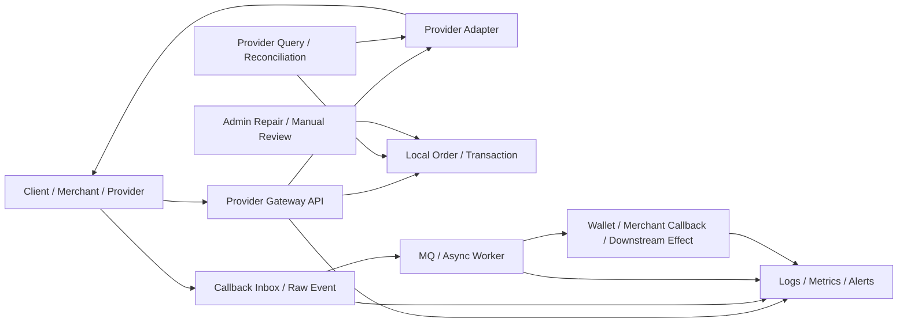
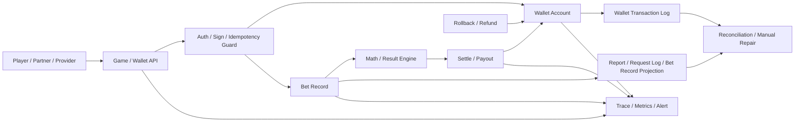
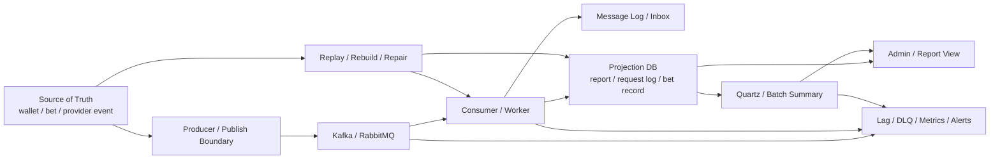
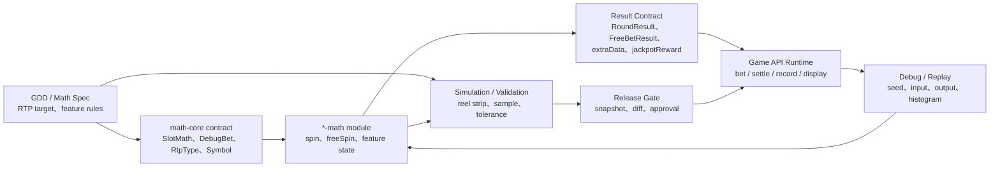

# System Design Templates

本檔是可選架構加強，不是投遞前必做。

目的：把已完成 evidence 的 production flows 抽象成面試可講的 0 到 1 system design template。它不是每個系統重掃 code，也不是宣稱 Nick 主導過完整 0 到 1 大系統。

## 使用邊界

- 證據來源：已完成的 `flow.md`、`career-interview.md`、`contribution-claim-consolidation.md`、domain `architecture-map.md` / `integration-map.md`。
- 掃描深度：Level 2 萃取。必要時才回 code 補查關鍵邊界；不做全 repo Level 3 重掃。
- 面試定位：展示從 production flow 抽象出 API、state、DB、MQ、idempotency、reconciliation、observability 與 rollout plan 的能力。
- 履歷邊界：不新增正式履歷 claim；正式履歷仍以 `05 / 08` 與 project-level contribution consolidation 為準。

## Production Readiness 邊界

四份 template 符合的是「Senior / Platform 面試的 production thinking」，不是可直接上線的完整 production spec。

可以說：

```text
這四份模板是從實際 production flows 抽象出的 system design 骨架。
它們能展示 state、idempotency、failure window、reconciliation、observability、rollout 與 claim boundary。
真正落地時，仍要依公司現有 infra、流量、資料量、SLA、資安、法規、team ownership 與維運能力補詳細設計、POC、壓測、review、runbook。
```

不能說：

```text
這四份就是可以直接上線的系統。
這四份是業界標準答案。
Nick 主導過完整可上線平台。
```

更精準的判斷：

| Template | 可上線程度 | 上線前必補 |
| --- | --- | --- |
| Provider Integration | 架構方向合理，但不是完整可上線規格 | provider contract、SLA、資安、驗簽 / 白名單、對帳批次、人工修復 SOP、壓測、告警 |
| Wallet / Bet-Settle | production thinking 對，但不能宣稱金融級 ledger | transaction model、ledger / journal 取捨、鎖策略、reconciliation、壓測、權限與審計 |
| MQ / Batch / Projection | 接近實務設計骨架，但不是 broker spec | Kafka / RabbitMQ 選型細節、DLQ policy、backpressure、retention、資料修復流程、監控告警 |
| Slot Math / RTP Validation | 適合遊戲 domain validation 口說，但不是 certification-ready | 正式 math spec、seed / sample policy、validation artifact、QA / certification evidence、runtime validation |

## 選型原則

選型不是先選技術，而是先看 failure mode。

| 問題類型 | 優先設計 | 原因 |
| --- | --- | --- |
| 同步交易 / 錢相關 | DB transaction、state machine、idempotency、reconciliation | 金額錯、重複扣補、狀態覆蓋是主要風險 |
| 外部 provider | adapter pattern、local order source of truth、callback inbox、query / repair | provider timeout、callback 重送、查單差異、外部 contract 變動是主要風險 |
| 高流量非同步 | MQ / batch / projection、DLQ、replay、projection rebuild | 主交易不應被報表 / audit 拖慢，且要處理漏消費 / 重複消費 |
| 報表 / projection | source of truth 與 projection 分離、batch metadata、rebuild / compare | 報表錯不等於交易錯，修復要能回源重建 |
| Slot math / RTP | deterministic input、simulation validation、result contract、runtime path 對齊 | 長期 RTP、feature state、前端展示與 runtime result 不一致是主要風險 |

面試可用說法：

```text
我不會因為 Kafka 很潮、RabbitMQ 很常見或 ledger 聽起來高級就先選技術。
我會先看 domain failure mode：金流怕錢錯，wallet 怕重複扣補，MQ 怕漏消費 / 重複消費，batch 怕報表錯，slot math 怕長期 RTP / result contract 和 runtime 不一致。
選型要回到這些 failure mode，再決定 transaction boundary、MQ、projection、reconciliation、observability 和 rollout。
```

推薦模板：

| 順序 | Template | 定位 | 狀態 |
| --- | --- | --- | --- |
| 1 | Provider Integration template | payment provider、遊戲 provider、callback、query、補償、對帳 | v1 completed |
| 2 | Wallet / Bet-Settle template | wallet source of truth、bet record、settle、rollback、transaction boundary | v1 completed |
| 3 | MQ / Batch / Projection template | Kafka / RabbitMQ、report projection、retry、DLQ、重跑、資料修復 | v1 completed |
| 4 | Slot Math / RTP Validation template | math-core contract、simulation、result validation、版本相容 | v1 completed / optional |

## Provider Integration Template v1

### 1. 面試定位

這份模板回答：

```text
如果我要從 0 設計一個第三方 provider integration 系統，
如何處理 request、callback、query、timeout unknown、重送、補償、對帳與人工修復？
```

適用場景：

- 第三方金流 provider 充值 / 提現。
- 第三方遊戲 provider seamless wallet / transfer wallet。
- Provider callback -> MQ -> admin/report persistence。
- 商戶 / provider gateway 類 backend 職缺。

不適用或不可誇大：

- 不代表 Nick 主導過完整 payment platform。
- 不代表 Nick 設計過完整 wallet / ledger / reconciliation。
- 不代表系統已具備 exactly-once、完整 outbox 或全自動對帳。
- 不把 `k3s-deploy`、system map 或 analysis-only flow 升級成正式履歷成果。

### 2. Evidence 對照

| Evidence | 用途 | Claim 邊界 |
| --- | --- | --- |
| `projects/iwin/payment/flows/payment-order-provider-request/flow.md` | payment provider request、merchant order id、sign、amount unit、provider accepted / timeout unknown | Nick 可保守寫參與多 provider request / query / callback；不可寫完整金流 owner |
| `projects/iwin/payment/flows/payment-provider-callback/flow.md` | callback guard、ack、MQ、order state、上分 / 退款副作用 | code-backed callback framework 分析；不單獨寫成 callback owner |
| `projects/iwin/payment/contribution-claim-consolidation.md` | payment project-level claim gate | 可寫 provider / 商戶對接；不可寫 wallet / ledger / reconciliation owner |
| `projects/iwin/iwin_gameserver/flows/third-party-transfer-in-out/career-interview.md` | 遊戲 provider 投派、wallet mutation、log projection、reconciliation 風險 | 可併入第三方 provider 投派整合；不可寫完整 gameserver wallet owner |
| `projects/ugsoft/ugsoft-connector-api/flows/transfer-wallet-in-out-query/flow.md` | transfer wallet request / query、provider transaction lookup、Redis guard、DB lookup | 可寫 provider connector / transfer wallet；不可寫完整 wallet owner |
| `projects/ugsoft/ugsoft-connector-api/flows/provider-callback-bet-settle-to-mq/flow.md` | provider callback、adapter callback、MQ producer、admin consumer 入庫 | 可寫 callback / MQ supporting；不可寫 exactly-once / outbox owner |
| `projects/iwin/integration-map.md` / `projects/ugsoft/integration-map.md` | 跨 project source of truth 與排查順序 | 架構視角，不新增履歷 claim |

### 3. 0 到 1 核心切法



核心不是「打一支 provider API」，而是建立一個可以承受外部不可靠事件的邊界：

1. API gateway 層：驗簽、白名單、參數 normalize、trace id。
2. Provider adapter 層：每個 provider 的 request / callback / query contract 隔離。
3. Local state 層：本地 order / transaction 是內部 source of truth。
4. Raw event / inbox 層：保存 provider request / callback / query evidence。
5. Async worker 層：將 callback 或查單結果轉成下游副作用。
6. Reconciliation 層：處理 timeout unknown、callback missing、provider / local state mismatch。
7. Admin repair 層：人工修復必須有權限、audit、狀態 transition guard。
8. Observability 層：能追單、追 callback、追 MQ、追 downstream effect。

### 4. 最小資料模型

#### `provider_order`

| 欄位 | 用途 |
| --- | --- |
| `id` | internal id |
| `merchant_order_id` | 本地單號，送給 provider 的主追蹤 key |
| `provider` | provider code |
| `provider_order_id` | provider 回傳單號，可能 request 後才有 |
| `account_id` | 玩家 / 商戶帳號 |
| `amount` / `currency` | 金額與幣別，避免單位混淆 |
| `direction` | deposit / withdraw / transfer-in / transfer-out / bet-settle |
| `status` | local state machine |
| `request_payload_hash` | request evidence，避免存敏感原文時仍可比對 |
| `last_provider_status` | provider latest status |
| `created_at` / `updated_at` | 查 aging / timeout |

#### `provider_event`

| 欄位 | 用途 |
| --- | --- |
| `event_id` | internal event id |
| `provider` | provider code |
| `merchant_order_id` | 對回 local order |
| `provider_transaction_id` | provider side transaction key |
| `event_type` | callback / query / retry / manual |
| `event_status` | provider event status |
| `raw_payload_ref` | raw evidence reference，不在 KB 放 secret |
| `sign_valid` | 驗簽結果 |
| `processed_status` | pending / processed / ignored / failed |
| `idempotency_key` | provider + event type + transaction id |
| `received_at` / `processed_at` | callback delay / replay |

#### `provider_effect`

| 欄位 | 用途 |
| --- | --- |
| `effect_id` | 下游副作用 id |
| `merchant_order_id` | 對回 order |
| `effect_type` | credit / refund / debit / mq_publish / merchant_callback |
| `target_system` | wallet / admin / report / merchant callback |
| `status` | pending / success / failed / unknown |
| `retry_count` | 重送次數 |
| `error_code` / `error_message` | 補償依據 |

### 5. State Machine

#### Payment / Transfer 類

```text
NEW
-> LOCAL_CREATED
-> PROVIDER_REQUESTED
-> PROVIDER_ACCEPTED
-> CALLBACK_RECEIVED
-> EFFECT_APPLIED
-> SUCCESS
```

異常分支：

```text
PROVIDER_REQUESTED -> REQUEST_TIMEOUT_UNKNOWN
PROVIDER_ACCEPTED -> CALLBACK_MISSING
CALLBACK_RECEIVED -> EFFECT_FAILED
EFFECT_FAILED -> MANUAL_REPAIR_PENDING
MANUAL_REPAIR_PENDING -> SUCCESS / FAILED / CANCELLED
```

#### Bet-settle callback 類

```text
CALLBACK_RECEIVED
-> VALIDATED
-> MERCHANT_CALLBACK_SUCCESS
-> MQ_PUBLISHED
-> CONSUMED
-> BET_RECORD_SAVED
-> REPORT_READY
```

異常分支：

```text
VALIDATED -> MERCHANT_CALLBACK_FAILED
MERCHANT_CALLBACK_SUCCESS -> MQ_PUBLISH_FAILED
MQ_PUBLISHED -> CONSUME_FAILED
BET_RECORD_SAVED -> REPORT_LAGGING
```

### 6. Idempotency 設計

#### Key 選擇

| 情境 | 建議 key |
| --- | --- |
| payment request | `provider + merchant_order_id` |
| payment callback | `provider + merchant_order_id + provider_transaction_id + event_status` |
| withdraw refund | `provider + original_order_id + refund_type` |
| transfer wallet | `agent + account + transfer_reference_id`，DB lookup 比 Redis guard 重要 |
| bet-settle | `provider + provider_bet_id + currency + event_type` |
| gameserver transfer | `provider + event_type + transaction_id / bet_id` |

#### Owner 判斷

- Redis lock 只能防連點，不是長期冪等。
- DB unique key 或 processed transaction record 要在下游副作用前建立。
- 如果先改 wallet 再補 processed record，中間 crash 仍可能 double apply。
- callback 重送應回既有結果，不應重做副作用。
- 已終態訂單不能被舊 callback 覆蓋。

### 7. Failure Window

| Failure window | 後果 | Owner 解法 |
| --- | --- | --- |
| local order insert success, provider request fail | 本地有單，provider 無單 | 標 request failed，可重試 / 換 provider / 人工取消 |
| provider request timeout | provider 可能已 accepted | 進 unknown，不直接成功或失敗；靠 query / reconciliation |
| provider accepted, callback missing | 訂單卡住 | aging monitor + provider query job + manual queue |
| callback ack success, MQ publish fail | provider 不再重送，但內部沒處理 | callback inbox / outbox / publisher confirm / alert |
| MQ consumed, downstream effect fail | order 與 wallet / report 不一致 | effect table + retry / DLQ / repair |
| provider callback duplicate | 重複上分 / 重複退款 / 重複 bet record | idempotency key + terminal-state guard |
| provider success, local transaction persist fail | 查單 / lookup 缺資料 | transaction outbox / provider query fallback / manual repair |
| report projection lag | 後台查不到，誤判交易失敗 | report 不當 source of truth；提供 lag alert 與 trace map |

### 8. Reconciliation / 對帳策略

最小可行對帳分三層：

1. Order aging：找 `PROVIDER_ACCEPTED`、`PROCESSING`、`REQUEST_TIMEOUT_UNKNOWN` 超時單。
2. Provider query：用 `merchant_order_id` / provider transaction id 查 provider 終態。
3. Local effect compare：比對 local order、wallet / transaction log、provider event、report projection。

對帳輸出不應直接亂改狀態，而是產生 repair candidates：

```text
order_id
provider_status
local_status
wallet_effect_status
recommended_action
risk_level
evidence_links
```

人工修復必須：

- 有二次確認。
- 有權限邊界。
- 有 before / after audit。
- 只能走合法 state transition。
- 修復後可再 reconciliation 驗證。

### 9. Observability

最少要能查：

- `merchant_order_id`
- `provider_order_id`
- `provider_transaction_id`
- `transfer_reference_id`
- `callback event id`
- `MQ message id`
- `effect id`

核心指標：

| 指標 | 用途 |
| --- | --- |
| provider request success / timeout rate | provider 穩定性 |
| callback delay p50 / p95 / p99 | provider 延遲與卡單 |
| unknown aging count | 需要查單 / 對帳 |
| duplicate callback count | provider 重送與冪等壓力 |
| MQ publish fail / consume fail | async pipeline 健康 |
| manual repair count | 系統補償能力與操作風險 |
| provider / local mismatch count | 對帳差異 |

告警優先級：

1. 金額副作用失敗：wallet credit / refund / transfer effect failed。
2. Unknown aging：provider accepted 但長時間無終態。
3. MQ publish / consume fail：callback 進來但內部沒落地。
4. Duplicate spike：可能 provider 重送或上游 retry 異常。
5. Report lag：不要誤判成交易失敗，但要讓營運知道延遲。

### 10. Rollout Plan

#### Phase 1：Adapter isolation

- 每個 provider 一個 adapter。
- 統一 request / callback / query interface。
- 所有 provider payload normalize 成 common DTO。
- 保留 raw event reference 與 trace id。

#### Phase 2：State and idempotency

- 明確 order state machine。
- 建 provider event inbox。
- 在下游副作用前建立 idempotency record。
- 終態 guard：成功 / 失敗 / 取消不可被舊事件覆蓋。

#### Phase 3：Async reliability

- callback 不直接做重副作用。
- callback inbox -> worker / MQ。
- producer confirm / retry / DLQ。
- effect table 保存下游副作用狀態。

#### Phase 4：Reconciliation and repair

- aging query job。
- provider query job。
- mismatch report。
- manual repair SOP。
- repair 後自動 recheck。

#### Phase 5：Observability and operations

- dashboard：provider request、callback delay、unknown aging、MQ fail、manual repair。
- runbook：卡單、重複 callback、provider timeout、MQ lag、report lag。
- provider onboarding checklist：sign、IP、amount unit、callback ack、query API、idempotency key。

### 11. 面試 3 分鐘講法

```text
如果我要設計一個 provider integration 系統，我不會只把它看成打一支第三方 API。

我會先切成三層：provider adapter、本地狀態、非同步補償。Adapter 負責隔離不同 provider 的 request、callback、query、簽章、金額單位與欄位差異；本地狀態用 order 或 transaction 當內部 source of truth；callback 或查單結果再透過 inbox / MQ / worker 去做 wallet、merchant callback 或 report 這些下游副作用。

這裡最重要的是 timeout unknown 和重送。Provider request timeout 不能直接當失敗，因為 provider 可能已經 accepted；要進 unknown 狀態，靠 query 或 reconciliation 收斂。Provider callback 也通常是 at-least-once，所以 callback handler 必須驗簽、保存 raw event、用 provider transaction id 或 merchant order id 做 idempotency，已終態訂單不能被舊 callback 覆蓋。

下游副作用我會獨立追狀態，例如 wallet credit、refund、bet record MQ、report projection。因為 callback ack、MQ publish、consumer 寫 DB、wallet mutation 都不是同一個 transaction。短期至少要有 terminal-state guard、effect retry、aging monitor 和人工 repair；長期可以補 callback inbox / outbox、DLQ replay、provider query job 和 reconciliation dashboard。

我實際經驗比較貼近 provider / 商戶對接與既有 production flow 維護，例如 payment provider request / callback / query / withdraw、遊戲 provider transfer / bet-settle callback、MQ 入庫與報表 projection。我不會把它說成我主導完整金流或完整 wallet / ledger；但我能從這些 flow 拆出 source of truth、idempotency、failure window、補償與可觀測性設計。
```

### 12. 常見追問

| 追問 | 回答要點 |
| --- | --- |
| Provider request timeout 怎麼辦？ | 不直接成功 / 失敗，標 unknown；用 provider query / reconciliation 收斂。 |
| Callback 已 ack，但 MQ publish 失敗？ | 需要 callback inbox / outbox、publisher confirm、alert；至少 raw event 要可 replay。 |
| Redis lock 夠不夠防重？ | 不夠。Redis lock 防連點；真正冪等要靠 DB unique / processed event / transaction record。 |
| 已成功訂單收到失敗 callback？ | 終態 guard；舊事件只能記 audit，不覆蓋終態。 |
| 查單結果和 callback 衝突？ | 以 provider 終態與本地 state machine 合法 transition 收斂；保留兩邊 evidence，必要時人工 repair。 |
| Report 查不到是不是交易沒成功？ | 不一定。Report 是 projection；先查 local order / wallet / provider event，再看 projection lag。 |
| 要不要 exactly-once？ | 面試不硬說 exactly-once；實務上用 at-least-once + idempotency + reconciliation。 |
| 最先補什麼？ | 先補 trace key、idempotency guard、unknown aging monitor；再補 outbox / reconciliation dashboard。 |

### 13. 不可誇大清單

- 不說「我設計完整 payment platform」。
- 不說「我建立完整 reconciliation」。
- 不說「wallet / ledger 是我 owner」。
- 不說「MQ 已 exactly-once」。
- 不說「所有 provider 都已防重」。
- 不說「system map 證明我主導整個平台」。
- 不說「分析過的 flow 都是我開發」。

## Wallet / Bet-Settle Template v1

### 1. 面試定位

這份模板回答：

```text
如果我要從 0 設計一個遊戲 wallet / bet-settle 系統，
如何處理下注扣款、bet record、開獎結果、派彩、rollback、轉帳錢包、查單與補償？
```

適用場景：

- Slot / game runtime 下注、開獎、派彩。
- Transfer wallet 轉入 / 轉出 / 全額轉出 / 查單。
- 第三方遊戲 provider bet / settle / refund / transfer-in-out。
- Partner API 上下分到 gameserver wallet side effect。

不適用或不可誇大：

- 不代表 Nick 主導完整 wallet / ledger。
- 不代表系統已具備完整 double-entry accounting。
- 不代表所有下注 / 派彩 / rollback 都已 exactly-once。
- 不把 `third_games_api` adapter、admin query 或 report projection 當成 wallet source of truth。

### 2. Evidence 對照

| Evidence | 用途 | Claim 邊界 |
| --- | --- | --- |
| `projects/antplay/antplay-slot-game-api/flows/slot-bet-settle-rollback/flow.md` | slot bet -> math result -> bet record -> settle / rollback 主線 | 真實開發過 + code-backed；可作 game-api runtime / betting settlement evidence，不寫完整 wallet owner |
| `projects/antplay/antplay-slot-game-api/flows/transfer-wallet-money-in-out/flow.md` | transfer wallet API、DB + Redis balance、transaction / lookup / request log | 真實開發過 + code-backed；不可寫主導完整 transfer wallet owner |
| `projects/iwin/iwin_gameserver/flows/third-party-transfer-in-out/career-interview.md` | provider command -> gameserver wallet mutation -> log projection | 可併入 iwin_gameserver provider 投派整合；不可寫完整 gameserver wallet owner |
| `projects/iwin/game_api/flows/partner-deposit-withdraw-bill/career-interview.md` | partner API -> Mongo order -> GM command -> wallet side effect | code-backed 面試素材；不寫正式履歷 claim |
| `projects/ugsoft/ugsoft-connector-api/flows/transfer-wallet-in-out-query/flow.md` | provider connector transfer wallet、transaction lookup、provider query | 可寫 provider connector / transfer wallet；不可寫完整 wallet owner |
| `projects/antplay/integration-map.md` / `projects/iwin/integration-map.md` | runtime source of truth、async audit、report projection 邊界 | 架構視角，不新增履歷 claim |

### 3. 0 到 1 核心切法



核心不是「扣錢再加錢」而已，而是明確定義：

1. 哪裡是 wallet source of truth。
2. 哪裡是 bet record / round state。
3. 哪裡只是 request log、report projection 或 admin query。
4. 一局 bet 的 success contract 是 wallet applied、bet record saved，還是 downstream report ready。
5. rollback / refund 是否和原 bet 使用同一組 trace key。

### 4. 最小資料模型

#### `wallet_account`

| 欄位 | 用途 |
| --- | --- |
| `account_id` | 玩家帳號 |
| `agent_id` / `merchant_id` | 所屬代理 / 商戶 |
| `currency` | 幣別 |
| `balance` | 可用餘額 |
| `version` | optimistic lock / 防併發覆蓋 |
| `updated_at` | 對帳與 cache rebuild |

#### `wallet_transaction`

| 欄位 | 用途 |
| --- | --- |
| `transaction_id` | 內部交易 id |
| `external_reference_id` | provider / partner / transfer reference |
| `account_id` / `currency` | wallet 維度 |
| `type` | bet / settle / rollback / transfer-in / transfer-out / refund |
| `amount` | 正負值或 direction + amount |
| `before_balance` / `after_balance` | audit 與查帳 |
| `status` | pending / success / failed / unknown / reversed |
| `idempotency_key` | 防重 key |
| `source_flow` | game bet / partner API / provider callback |

#### `bet_record`

| 欄位 | 用途 |
| --- | --- |
| `bet_id` / `round_id` | 一局遊戲主 key |
| `provider` / `game_id` | provider / 遊戲 |
| `account_id` / `currency` | 玩家與幣別 |
| `bet_amount` | 下注額 |
| `total_win` | 派彩額 |
| `step` | CREATE / DEAL / RESULT / CANCEL / FAIL |
| `wallet_transaction_id` | 對應扣款 / 派彩交易 |
| `result_ref` | math result / detail reference |
| `notify_status` / `notify_count` | provider settle / rollback 補通知 |

#### `wallet_effect`

| 欄位 | 用途 |
| --- | --- |
| `effect_id` | 下游副作用 id |
| `bet_id` / `transaction_id` | 對回主交易 |
| `effect_type` | request_log_mq / report_projection / provider_settle / admin_notice |
| `status` | pending / success / failed |
| `retry_count` | retry / 補通知 |
| `last_error` | repair / alert |

### 5. State Machine

#### Bet / settle 主線

```text
BET_REQUESTED
-> WALLET_DEBIT_PENDING
-> WALLET_DEBITED
-> BET_RECORD_DEAL
-> RESULT_READY
-> BET_RECORD_RESULT
-> SETTLE_PENDING
-> WALLET_CREDITED / PROVIDER_SETTLED
-> SETTLED
```

rollback / cancel：

```text
BET_RECORD_DEAL / BET_RECORD_RESULT
-> ROLLBACK_PENDING
-> WALLET_REFUNDED / PROVIDER_ROLLBACKED
-> CANCELLED
```

異常：

```text
WALLET_DEBITED -> BET_RECORD_SAVE_FAILED
BET_RECORD_RESULT -> SETTLE_FAILED
SETTLE_PENDING -> NOTIFY_RETRYING
ROLLBACK_PENDING -> ROLLBACK_FAILED
any -> UNKNOWN_NEEDS_RECONCILIATION
```

#### Transfer wallet 主線

```text
TRANSFER_REQUESTED
-> REQUEST_VALIDATED
-> IDEMPOTENCY_CHECKED
-> TRANSACTION_RECORDED
-> WALLET_UPDATED
-> LOOKUP_READY
-> SUCCESS
```

異常：

```text
TRANSACTION_RECORDED -> WALLET_UPDATE_FAILED
WALLET_UPDATED -> REDIS_SYNC_FAILED
LOOKUP_MISSING -> QUERY_FAILED
any -> MANUAL_REPAIR_PENDING
```

### 6. Idempotency 設計

| 情境 | 建議 key | 注意 |
| --- | --- | --- |
| slot bet | `agent + account + bet_id / round_id` | 必須在 wallet debit 前或同 transaction 建立防重 |
| settle | `agent + bet_id + settle_type` | RESULT 後重送 settle 應回既有結果 |
| rollback | `agent + bet_id + rollback_type` | rollback / refund 也是 money mutation，需防重 |
| transfer-in/out | `agent + account + transfer_reference_id + type` | Redis lock 只防連點，DB unique / lookup 才是長期防重 |
| partner deposit / withdraw | `partner + merchant_order_id + type` | 若每次產 UUID，partner timeout 重送會難判斷 |
| provider transfer-in-out | `provider + event_type + transaction_id / bet_id` | 要先確認 provider spec 的唯一鍵語意 |

Owner 判斷：

- `request log` 不是 idempotency source。
- `report projection` 不是 wallet source of truth。
- `Redis balance` 多數是 hot cache；若與 DB 不一致，需明確誰能 rebuild 誰。
- `bet record` 與 `wallet transaction` 要能互相追，但不一定是同一張表。
- 補通知 job 是 retry / repair，不等於完整 ledger reconciliation。

### 7. Failure Window

| Failure window | 後果 | Owner 解法 |
| --- | --- | --- |
| wallet debit success, bet record save fail | 玩家扣款但沒有完整注單 | debit + bet record 同 transaction，或 pending bet + repair |
| bet record RESULT success, settle fail | 有結果但未派彩 / provider 未收到 | settle effect table + retry /補通知 + alert |
| transfer transaction recorded, wallet update fail | 查單看成功但餘額未變 | transaction 狀態先 pending，wallet 成功後再 success |
| DB wallet success, Redis sync fail | 熱餘額錯誤 | Redis rebuild、cache mismatch alert、以 DB 為準 |
| rollback request duplicate | 重複退款 | rollback idempotency key + original bet linkage |
| provider timeout after wallet mutation | 上游重送造成 double apply | processed transaction record + return existing result |
| report / request log MQ fail | audit 缺失但主交易可能成功 | audit outbox / retry / DLQ；不要 rollback 主交易 |
| admin query stale | 營運誤判交易狀態 | admin query 標示 projection lag，trace 到 wallet / bet source |

### 8. Reconciliation / 對帳策略

最小可行對帳：

1. Wallet transaction sum vs wallet account balance。
2. Bet record RESULT / CANCEL vs wallet transaction。
3. Provider / partner statement vs local bet / transfer transaction。
4. Report projection vs wallet / bet source of truth。
5. Redis balance vs DB wallet balance。

對帳輸出：

```text
account_id
currency
bet_id / transaction_id
wallet_status
bet_record_step
provider_status
projection_status
recommended_action
evidence
```

人工修復規則：

- 不直接改 balance；優先補一筆反向或修正 transaction。
- repair 必須引用原 `bet_id` / `transaction_id` / external reference。
- repair 要有 maker-checker 或至少操作 audit。
- repair 後重跑 reconciliation。

### 9. Observability

必備 trace key：

- `account_id`
- `bet_id` / `round_id`
- `transaction_id`
- `transfer_reference_id`
- `provider_transaction_id`
- `wallet_transaction_id`
- `request_log_id`

核心指標：

| 指標 | 用途 |
| --- | --- |
| wallet debit / credit fail count | money side effect 失敗 |
| bet record stuck in DEAL / RESULT | 卡在中間狀態 |
| settle / rollback retry count | provider 或下游不穩 |
| Redis / DB balance mismatch | cache 不一致 |
| reconciliation mismatch count | 對帳差異 |
| manual repair count | 系統補償壓力 |
| report projection lag | 後台查詢延遲 |

### 10. Rollout Plan

#### Phase 1：State machine first

- 定義 bet / transfer / rollback 的合法狀態。
- 不允許舊事件覆蓋終態。
- 把 unknown 狀態明確化，不直接成功或失敗。

#### Phase 2：Idempotency before mutation

- 先建立 processed record 或 pending transaction。
- DB unique key 支撐重送回放。
- Redis lock 只作輔助，不作唯一防線。

#### Phase 3：Wallet and bet consistency

- wallet transaction 與 bet record 可雙向追蹤。
- wallet mutation 與 bet state 盡量同 transaction；跨服務時補 outbox / repair。
- transfer wallet DB / Redis 有 rebuild 機制。

#### Phase 4：Retry / compensation

- settle / rollback / request log / report projection 各自有 effect status。
- 補通知 job 要有最大次數、告警、人工接手。
- repair SOP 不直接繞過 state machine。

#### Phase 5：Reconciliation and operations

- 每日 / 即時 mismatch report。
- 卡單 dashboard。
- Redis / DB balance mismatch dashboard。
- Provider / partner statement 對帳。
- Admin 查詢標示 source of truth 與 projection lag。

### 11. 面試 3 分鐘講法

```text
如果我要設計一個 wallet / bet-settle 系統，我會先把它拆成 wallet source of truth、bet record、下游副作用三層。

一局下注不是只有扣款和回傳結果。正常流程應該是：先驗證玩家與 request，建立 idempotency key，扣 wallet 或建立 pending wallet transaction，建立 bet record，取得 math result，再把 bet record 推到 RESULT，最後做 settle 或 rollback。這裡要先定義 success contract：API success 是代表 wallet 已異動、bet record 已寫入，還是 provider settle / report projection 都完成？我通常不會把 report 或 request log 當成交易真相。

最危險的 failure window 是跨資源狀態不一致，例如 wallet 已扣但 bet record 沒寫、RESULT 已寫但 settle 失敗、transfer transaction 已寫 success 但 wallet update 失敗、DB wallet 成功但 Redis 沒同步。這些不能只靠 try-catch 或 Redis lock。比較穩的做法是用 transaction id / bet id 做冪等，wallet transaction 和 bet record 能互相追，跨服務副作用用 effect table、retry、DLQ 或補通知 job 收斂。

如果要 owner 這套系統，我會先補三件事：第一，完整 state machine 和終態 guard；第二，wallet mutation 前的 idempotency / pending record；第三，reconciliation dashboard，比對 wallet transaction、bet record、provider statement、report projection 和 Redis / DB balance。這樣就算有 timeout、重送、rollback 或報表延遲，也能知道現在真相在哪一層，以及該自動補償還是人工修復。

我的實際經驗和分析材料主要來自 AntPlay slot bet / settle / transfer wallet、iwin gameserver provider transfer-in-out、UGSoft transfer wallet 與 partner money API。這能支撐我談 wallet correctness、bet record state、rollback、idempotency 和 reconciliation；但我不會說自己主導完整 wallet / ledger。
```

### 12. 常見追問

| 追問 | 回答要點 |
| --- | --- |
| Wallet source of truth 是 DB 還是 Redis？ | 通常 DB / wallet transaction 是 truth，Redis 是 hot cache；若不是，要有明確 rebuild 與 mismatch 策略。 |
| 扣款成功但 bet record 失敗怎麼辦？ | 不可 silent success；要 pending / unknown + repair，或把 wallet transaction 與 bet record 放同 transaction。 |
| RESULT 後 settle 失敗要 rollback 嗎？ | 視 contract；可用 settle effect retry /補通知，不一定 rollback bet，但要 alert 和人工接手。 |
| Redis lock 夠防重嗎？ | 不夠，只防連點；長期重送靠 DB unique / processed transaction。 |
| Report 查不到是不是下注沒成功？ | 不一定。Report 是 projection，要先查 wallet transaction / bet record source。 |
| rollback 如何防重？ | rollback / refund 也是 money mutation，要用 original bet id + rollback type 做 idempotency。 |
| 要不要做 double-entry ledger？ | 視系統成熟度。面試可說目前模板是 ledger-ish；若金融級要求，會引入 immutable journal / double-entry。 |
| 最先補什麼？ | state machine、idempotency before mutation、reconciliation dashboard。 |

### 13. 不可誇大清單

- 不說「我主導完整 wallet / ledger」。
- 不說「我建立 double-entry accounting」。
- 不說「所有 bet / settle / rollback 都 exactly-once」。
- 不說「Redis / DB 一定強一致」。
- 不說「report projection 是交易帳本」。
- 不說「partner / provider analysis-only flow 是我開發」。

## MQ / Batch / Projection Template v1

### 1. 面試定位

這份模板回答：

```text
如果我要從 0 設計一個 MQ / batch / report projection 系統，
如何處理事件進入、consumer 冪等、報表投影、批次重跑、DLQ、資料修復與 observability？
```

適用場景：

- Kafka / RabbitMQ event -> DB projection。
- Bet record、request log、settled bet、report summary 等 async ingestion。
- Quartz / batch summary / backup / cleanup。
- Admin report、BI report、audit log、operation dashboard 類後台資料流。

不適用或不可誇大：

- 不代表 Nick 主導過完整 Kafka / RabbitMQ platform。
- 不代表系統已具備 exactly-once、完整 outbox / inbox 或全自動資料修復。
- 不把 report projection 當成交易 source of truth。
- 不把 batch job 寫成完整資料平台 owner。

### 2. Evidence 對照

| Evidence | 用途 | Claim 邊界 |
| --- | --- | --- |
| `projects/antplay/antplay-slot-game-job/flows/proxy-user-data-report-projection/flow.md` | Kafka settled bets -> proxy / player / day / currency report projection，搭配 Quartz summary / backup / delete | 可談 Kafka projection、報表彙總與批次收斂；不可寫完整 Kafka platform owner |
| `projects/iwin/game_job/flows/daily-game-data-summary/flow.md` | Quartz daily summary，從 log / day partition 彙總到 daily record，含時間窗、備份、清理風險 | 可談 batch summary、partition data、報表投影；不可寫完整 BI owner |
| `projects/antplay/antplay-slot-game-api/flows/request-log-rabbitmq-async/flow.md` | API request log 透過 RabbitMQ async persistence，不阻塞主交易 | 可談 async audit / observability supporting flow；不可說 request log 是交易真相 |
| `projects/ugsoft/ugsoft-admin-api/flows/connect-bet-record-mq-ingestion/flow.md` | RabbitMQ consumer 接收 bet record，寫入 `pt_bet_record`，處理 duplicate check 與後續 quota update | 可談 consumer ingestion / duplicate guard；不可寫完整 quota / settle owner |
| `projects/ugsoft/ugsoft-connector-api/flows/provider-callback-bet-settle-to-mq/flow.md` | provider callback 經 connector publish MQ，再由 admin consumer 入庫 | 可談 callback -> MQ -> downstream persistence 邊界；不可寫完整 outbox owner |
| `projects/antplay/integration-map.md` / `projects/iwin/integration-map.md` / `projects/ugsoft/integration-map.md` | 跨 project source of truth、projection 與排查順序 | 架構視角，不新增履歷 claim |

### 3. 0 到 1 核心切法



核心不是「丟 MQ」或「每天跑一支 job」，而是把 source of truth、event transport、projection 與 repair boundary 分清楚：

1. Source of truth：wallet transaction、bet record、provider order 或原始交易表才是主要真相。
2. Publish boundary：決定主交易成功是否包含 MQ publish；若不包含，要有補送 / outbox / alert。
3. Message identity：每個 event 必須有可去重、可追蹤、可 replay 的 key。
4. Consumer idempotency：consumer 不能假設 MQ 只送一次。
5. Projection table：報表與查詢優化表必須可重建，不應反過來改交易真相。
6. Batch summary：批次要有時間窗、batch id、expected / processed / failed count。
7. Replay / repair：DLQ、重跑、補資料必須先 dry-run 或用 idempotent upsert。
8. Observability：lag、DLQ、批次耗時、資料差異與 stale report age 要能被看見。

### 4. 最小資料模型

#### `message_inbox`

| 欄位 | 用途 |
| --- | --- |
| `message_id` | MQ message id 或 internal event id |
| `topic` / `queue` | Kafka topic / RabbitMQ queue |
| `partition` / `offset` | Kafka replay / trace 用；RabbitMQ 可用 delivery tag / publish sequence 替代 |
| `event_type` | request_log / bet_record / settled_bet / daily_summary |
| `idempotency_key` | consumer 去重主 key |
| `payload_hash` | 比對 payload 是否重送不同內容 |
| `status` | received / processing / projected / failed / dlq / replayed |
| `retry_count` | retry 次數 |
| `error_code` / `error_message` | 修復依據 |
| `received_at` / `processed_at` | lag 與 SLA |

#### `projection_record`

| 欄位 | 用途 |
| --- | --- |
| `projection_key` | 報表唯一維度，例如 day + agent + player + currency |
| `source_event_key` | 對回 source event / bet / order |
| `data_day` | 批次與分區查詢主軸 |
| `metric_type` | bet_amount / win_amount / request_count / valid_bet |
| `metric_value` | 彙總值 |
| `version` | snapshot / rebuild 版本 |
| `last_event_time` | projection freshness |
| `updated_at` | stale report age |

#### `batch_run`

| 欄位 | 用途 |
| --- | --- |
| `batch_id` | 每次 job 執行識別 |
| `job_name` | daily_summary / backup / cleanup / rebuild |
| `source_range_start` / `source_range_end` | 掃描來源時間窗 |
| `target_table` | 投影或備份目標 |
| `expected_count` / `processed_count` / `failed_count` | 完整度檢查 |
| `status` | running / success / partial_failed / failed / repaired |
| `started_at` / `finished_at` | job duration |
| `operator` | system / manual repair user |

### 5. State Machine

#### Message / Projection

```text
PUBLISHED
-> CONSUMED
-> VALIDATED
-> PROJECTED
-> ACKED
```

異常分支：

```text
CONSUMED -> VALIDATION_FAILED
VALIDATED -> PROJECT_FAILED
PROJECT_FAILED -> RETRYING
RETRYING -> DLQ
DLQ -> REPLAYING
REPLAYING -> PROJECTED / REPAIR_FAILED
```

#### Batch / Summary

```text
SCHEDULED
-> RUNNING
-> SOURCE_SCANNED
-> STAGING_WRITTEN
-> PUBLISHED_TO_REPORT
-> COMPLETED
```

異常分支：

```text
SOURCE_SCANNED -> PARTIAL_FAILED
STAGING_WRITTEN -> PUBLISH_FAILED
PUBLISHED_TO_REPORT -> BACKUP_FAILED / CLEANUP_FAILED
PARTIAL_FAILED -> REPAIR_PENDING
REPAIR_PENDING -> REPLAYING / MANUAL_REPAIR
```

### 6. Idempotency / Replay 設計

| 情境 | 建議 key | Owner 判斷 |
| --- | --- | --- |
| Kafka settled bets projection | `topic + partition + offset`，或 `settle_batch_id + bet_id` | offset 可 trace，business key 才能防重算 |
| RabbitMQ request log | `request_id / trace_id + endpoint + request_time` | request log 是 audit supporting，不反推交易成功 |
| Bet record ingestion | `provider + provider_bet_id + account + currency + event_type` | duplicate check 要在寫 projection / quota 前 |
| Daily summary batch | `job_name + data_day + source_range + version` | 避免同日重跑時 delete / insert 造成空窗 |
| Replay task | `original_message_key + replay_batch_id` | replay 要能標記來源，避免把修復當新交易 |

Replay 原則：

- Projection 可以重跑，但 source of truth 不應被 replay 直接改壞。
- DLQ replay 要先確認 idempotency key 與 payload hash。
- 若 projection 是累加型，重跑前要能辨識已加過；若做不到，改用 snapshot / staging / replace。
- Batch delete + insert 要避免報表短暫查空；較穩的做法是 staging table + version switch。
- Manual repair 要留下 before / after、operator、reason 與 source evidence。

### 7. Failure Window

| Failure window | 後果 | Owner 解法 |
| --- | --- | --- |
| 主交易成功但 MQ publish fail | source 已成功，projection / audit 缺資料 | outbox / publish retry / alert；不要把 report 缺資料判成交易失敗 |
| MQ publish success 但 producer 未收到 ack | producer 可能重送 | idempotency key + payload hash；consumer 不假設只送一次 |
| Consumer 寫 DB 成功但 ack fail | MQ 重送造成重複寫 | DB unique / upsert / inbox processed record |
| Consumer 先 ack 後寫 DB fail | message 消失但 projection 缺資料 | 避免 ack before durable write；必要時有 audit log / replay source |
| Projection 累加重複執行 | 報表金額或 count 放大 | business key 去重，或 snapshot 重建 |
| Batch 掃描時間窗不準 | 漏資料 / 重複資料 | 明確 source range、watermark、補跑策略 |
| Delete + insert 重建報表 | 查詢空窗或部分資料 | staging + version switch；或標示 rebuild in progress |
| Backup success / cleanup fail | 儲存成本上升、舊資料仍被查到 | cleanup status / retry / retention monitor |
| Cleanup success / backup fail | 資料遺失風險 | 先 backup verified，再 cleanup；cleanup 前有 count compare |
| DLQ replay 缺邊界 | 修復時二次副作用 | replay dry-run、idempotent upsert、人工核准 |

### 8. Reconciliation / Data Repair

最小 reconciliation 分四層：

1. Source vs message：source 交易筆數、金額、狀態是否都有 publish evidence。
2. Message vs inbox：broker delivered count、consumer received count、DLQ count 是否一致。
3. Inbox vs projection：processed message 是否都有投影結果。
4. Projection vs report：報表彙總與 source aggregation 是否差異過大。

Data repair 不應直接「補一筆看起來對的報表」：

```text
repair_task
-> define source range
-> dry-run count / amount compare
-> rebuild staging projection
-> compare old vs new
-> switch version / apply upsert
-> post-check report
```

常見修復策略：

- 單筆 message replay：適合 request log、bet record ingestion。
- 時間窗 rebuild：適合 daily summary、agent / player report。
- Source aggregation compare：適合 money / bet amount correctness。
- Versioned projection：適合避免重建空窗。
- Manual exception list：適合無法自動判斷的 provider / partner 異常資料。

### 9. Observability

最少要能回答：

- 這筆 source event 是否 publish 成功？
- 這筆 message 是否被 consumer 收到？
- Consumer 是否處理成功？失敗原因是 schema、DB、duplicate 還是 downstream？
- Projection 目前延遲多久？
- Batch 今天掃了哪個時間窗？處理幾筆？失敗幾筆？
- DLQ 裡有多少筆？最老的是多久以前？
- 報表與 source aggregation 差異是多少？

建議指標：

- Consumer lag / queue depth。
- DLQ count / retry count / oldest message age。
- Projection stale age。
- Batch duration / expected vs processed count。
- Rebuild / replay success rate。
- Duplicate event count。
- Source vs projection amount diff。
- Report query latency。

### 10. Rollout Plan

#### Phase 1：先定 source of truth 與 projection 邊界

- 說清楚交易真相在哪張表 / 哪個 service。
- 報表、request log、audit log 不反向決定交易是否成功。
- 明確 API success 是否包含 MQ publish。

#### Phase 2：Message identity and idempotent consumer

- 定義 business idempotency key。
- Consumer 寫入前先查 processed / inbox / unique key。
- Retry 不造成重複累加。

#### Phase 3：Batch run metadata

- 每支 job 都有 `batch_id`、source range、expected / processed / failed count。
- 不只看排程有沒有跑，也要看資料是否完整。

#### Phase 4：Replay / DLQ / repair path

- DLQ 可查、可分類、可 replay。
- Replay 前有 dry-run / compare。
- Manual repair 有 audit trail。

#### Phase 5：Projection rebuild and report cutover

- 對重要報表補 staging / version switch。
- 支援時間窗重建。
- report UI 或 admin 查詢能標示資料延遲與重建狀態。

### 11. 面試 3 分鐘講法

```text
如果我要設計 MQ / batch / report projection 系統，我會先把它拆成 source of truth、message transport、projection、batch summary、repair 五層。

我不會把 MQ 或報表表當成交易真相。交易真相通常在 wallet transaction、bet record、provider order 或原始 source table；MQ 和 batch 的任務是把這些真相可靠地投影到查詢、報表、audit 或後台畫面。因此第一步要先定義 API 成功是否包含 MQ publish，以及如果 publish fail，要靠 outbox、補送或 alert 收斂。

第二個重點是 consumer 冪等。Kafka / RabbitMQ 都不能假設只送一次，所以每筆 message 要有 business idempotency key，例如 bet id、provider bet id、request id、data day + agent + player + currency。consumer 寫 projection 前要先建立 processed record 或用 DB unique / upsert，避免 retry 或 replay 造成金額和 count 重複累加。

第三個重點是 batch 和 report projection 必須可重建。每支 batch job 要有 batch id、source range、expected count、processed count、failed count。重要報表重建時，我會優先用 staging table 或 version switch，避免 delete + insert 造成查詢空窗。DLQ 或資料修復也不應直接改報表，而是先 dry-run，比對 source aggregation，再 replay 或 rebuild。

我的實際材料主要來自 AntPlay Kafka report projection、RabbitMQ request log、UGSoft bet record MQ ingestion，以及 iwin game_job daily summary。這些能支撐我談 event-driven projection、batch summary、重跑、資料修復和 observability；但我不會誇大成我主導完整 Kafka platform 或 BI data platform。
```

### 12. 常見追問

| 追問 | 回答要點 |
| --- | --- |
| MQ publish 成功才算交易成功嗎？ | 看 contract。money / bet source 通常先以交易 DB 為真相；若 projection 必須同步，需 outbox / local transaction boundary。 |
| Consumer 如何防重？ | business idempotency key + processed record / DB unique / upsert；不要只靠 MQ delivery guarantee。 |
| Kafka offset 可以當 idempotency key 嗎？ | 可以 trace delivery，但 business replay / rebuild 更適合用 bet id、order id、request id 等 business key。 |
| RabbitMQ message ack 要放哪裡？ | durable write / processed record 成功後再 ack；先 ack 後寫 DB 會造成 message 消失。 |
| 報表資料和交易資料不一致怎麼辦？ | 先判斷 source of truth，再做 source vs message vs projection vs report compare；不要直接改報表湊數。 |
| Batch 重跑會不會重複累加？ | 若是累加型要有去重或重建策略；更穩的是 staging / snapshot / version replace。 |
| DLQ replay 怎麼防二次副作用？ | replay 前檢查 idempotency key、payload hash、原處理狀態；優先 idempotent upsert 或 dry-run。 |
| 怎麼知道 job 真的跑完？ | 不只看 scheduler success，要看 batch_run 的 source range、expected / processed / failed count 與 post-check。 |

### 13. 不可誇大清單

- 不說「我主導完整 Kafka / RabbitMQ 平台」。
- 不說「我做過完整 exactly-once / outbox / inbox 架構」。
- 不說「我主導完整 BI / data platform」。
- 不說「所有報表都可以自動修復」。
- 不說「request log / report projection 是交易 source of truth」。
- 不把 analysis-only 或主管 / 團隊 context 寫成 Nick direct evidence。

## Slot Math / RTP Validation Template v1

### 1. 面試定位

這份模板回答：

```text
如果我要從 0 設計一套 slot math module / RTP validation / result contract 的上線流程，
如何處理 math-core contract、RTP / reel strip simulation、feature state、result schema、runtime 對齊與 release gate？
```

適用場景：

- Slot math core / game math module 維護。
- RTP / reel strip / simulation validation。
- Buy free、scatter、jackpot、special wild、fixedMultiBet / currency 類 result contract。
- 遊戲 / slot / provider domain 的差異化面試。

不適用或不可誇大：

- 不代表 Nick 主導完整遊戲數學模型。
- 不代表 Nick 設計完整 RTP 策略、派彩模型或 certification 流程。
- 不代表全部 `*-math` repo 都由 Nick 主導或全量 Level 3 深掃。
- 不把 math module 寫成 wallet / settlement / jackpot pool owner。

### 2. Evidence 對照

| Evidence | 用途 | Claim 邊界 |
| --- | --- | --- |
| `projects/antplay/math-core/contribution-claim-consolidation.md` | SlotMath contract、DebugBetVO、RtpType、Symbol、fixedMultiBet / currency 類 core evidence | 可談 math-core contract 維護；不可寫完整 framework owner |
| `projects/antplay/star-math/contribution-claim-consolidation.md` | `*-math` grouped claim gate，五條代表 flow 已 Step 5 | 可保守寫多個 slot math module 維護與驗證；不可寫全部 math modules owner |
| `projects/antplay/star-math/flows/fixed-multi-bet-currency-math-core-compatibility/flow.md` | fixedMultiBet / currency / totalBet / jackpot scaling contract | 可談 money-like correctness；不可寫 wallet correctness owner |
| `projects/antplay/star-math/flows/rtp-reel-strip-simulation-validation/flow.md` | RTP target、reel strip、simulation loop、sample size、runtime path 對齊 | 可談 high-risk domain validation；不可寫 RTP strategy owner |
| `projects/antplay/star-math/flows/buy-free-scatter-rtp3-result-contract/flow.md` | buy free odds、RTP_3 routing、scatter / lastSymbols、RoundResult / FreeBetResult | 可談 feature result contract；不可寫完整 buy free owner |
| `projects/antplay/star-math/flows/jackpot-symbol-hit-and-prize-scaling/flow.md` | jackpot symbol hit、balance callback、fixedMultiBet prize scaling、reward list | 可談 jackpot result contract；不可寫 jackpot pool / settlement owner |
| `projects/antplay/star-math/flows/special-wild-feature-state-transform/flow.md` | feature state transform、extraData、front-end display contract、scoring symbol 收斂 | 可談 feature state / result consistency；不可寫完整 feature owner |
| `projects/antplay/architecture-map.md` | AntPlay math / runtime system map | 架構視角，不新增履歷 claim |

### 3. 0 到 1 核心切法



核心不是「會改輪帶」或「會跑一個 simulation」，而是建立一個可驗證、可追溯、可對齊 runtime 的 math release boundary：

1. Spec boundary：RTP、free trigger、jackpot hit、buy free odds、feature rule 要能追到規格或調整理由。
2. Core contract：math-core interface / VO / enum 必須讓多個 module 漸進相容。
3. Module implementation：每個遊戲 module 的 `InputData`、factory、operator service、result contract 要一致。
4. Simulation validation：用真實 spin path 跑樣本，不重新手寫一套派彩。
5. Result contract：前端展示、bet record、runtime 統計與客服排查要讀得懂同一份 result。
6. Runtime acceptance：game-api / wallet / bet record 只接受語意完整、可追蹤的 math result。
7. Release gate：輪帶、RTP、feature contract 進 production 前要有 snapshot、diff、validation output。
8. Debug / replay：能用 seed、input、RTP flag、result JSON 回放或定位問題。

### 4. 最小資料 / Contract 模型

#### `math_input`

| 欄位 | 用途 |
| --- | --- |
| `game_code` | 對應 math module |
| `agent_id` / `currency` | jackpot balance、currency multiplier、agent override |
| `line_bet` / `fixed_multi_bet` | totalBet / jackpot scaling / buy free cost |
| `rtp_flag` | RTP_1 / RTP_2 / RTP_3 / optimizer table |
| `game_state` | base game / free game / feature state |
| `debug_seed` / `rng_sequence` | debug / replay |
| `feature_input` | buy free type、jackpot switch、special feature trigger |

#### `math_result`

| 欄位 | 用途 |
| --- | --- |
| `total_bet` | 上游扣款與統計語意 |
| `total_win` | 派彩 / settlement input |
| `round_results` | base / free rounds |
| `free_bet_results` | free game 細節 |
| `jackpot_reward_list` | jackpot type / amount / currency |
| `extra_data` | 前端動畫、feature state、free game routing |
| `rtp_flag` / `feature_type` | 排查 result 來源 |
| `input_hash` / `result_hash` | snapshot / regression compare |

#### `validation_run`

| 欄位 | 用途 |
| --- | --- |
| `run_id` | 每次 validation 識別 |
| `game_code` / `module_version` | 對應 repo / commit |
| `target_rtp` / `tolerance` | 接受標準 |
| `sample_size` / `attempts` | 統計可信度 |
| `seed` | 可重跑性 |
| `base_rtp` / `free_rtp` / `trigger_rate` / `jp_hit_rate` | validation output |
| `accepted` | release gate |
| `artifact_ref` | 輪帶、histogram、log snapshot |

### 5. State / Feature Contract

#### RTP / Reel Strip Validation

```text
SPEC_TARGET
-> RATIO_DEFINED
-> CANDIDATE_REEL_GENERATED
-> SIMULATION_RUNNING
-> METRIC_COLLECTED
-> ACCEPTED / REJECTED
-> RELEASE_CANDIDATE
```

#### Runtime Spin / Result

```text
INPUT_RECEIVED
-> CONTRACT_NORMALIZED
-> REEL_SELECTED
-> SPIN_EXECUTED
-> FEATURE_TRANSFORMED
-> RESULT_ASSEMBLED
-> RUNTIME_ACCEPTED
```

#### Feature State Examples

```text
Buy Free:
request buyFree -> odds selected -> flagRTP=RTP_3 -> free result assembled -> result JSON carries buyFree metadata

Jackpot:
symbols hit -> jackpot type -> balance callback -> prize scaled -> reward list -> totalWin includes jackpot

Special Wild:
raw symbols -> parent / child marker -> scoring symbol -> extraData display contract -> free game routing
```

### 6. Validation / Regression 設計

| 驗證層 | 要驗什麼 | Owner 判斷 |
| --- | --- | --- |
| Contract compile | math-core interface、VO、enum 是否讓舊 module 不壞 | default fallback 安全，但不能代表所有 module 完整支援 |
| Deterministic debug | 同 input / seed / RNG 能否重現同 result | debugBet 要帶 currency、fixedMultiBet、RTP flag |
| RTP simulation | base RTP、free trigger、free RTP、JP hit rate 是否在 tolerance | sample size、seed、runtime path 要記錄 |
| Result schema | RoundResult、FreeBetResult、extraData、jackpotReward 是否完整 | 前端 / bet record /客服排查要讀得懂 |
| Runtime alignment | simulation 用的 path 是否和 production spin path 一致 | 不應另外手寫 validation 派彩邏輯 |
| Cross-module compatibility | 新 core contract 是否逐 module 落地 | module-by-module 驗證，不用 core default 直接宣稱完成 |

### 7. Failure Window

| Failure window | 後果 | Owner 解法 |
| --- | --- | --- |
| RTP target / tolerance 設錯 | validation 通過但 business target 錯 | target 需連到 GDD / math spec / approval |
| sample size 不足 | RTP / hit rate 被隨機波動誤判 | 記錄 rounds、attempts、seed、confidence |
| simulation 沒走 production spin path | 驗證結果不能代表 runtime | validation 呼叫真實 `AbstractSlotMath#spin` / module factory |
| `rtp_flag` routing 錯 | buy free / optimizer 跑錯輪帶 | release test 檢查 RTP flag -> table mapping |
| fixedMultiBet / currency 漏帶 | totalBet、jackpot scaling、debug result 不一致 | core contract + module input + result 欄位一起驗 |
| jackpot balance callback 格式錯 | 查錯 agent / type / currency 或 amount 變 0 | payload contract test + runtime alert |
| feature marker 流入 scoring | 特殊 wild / feature state 影響算分 | transform state 與 scoring symbol 明確收斂 |
| `extraData` 與 symbols 不一致 | 前端動畫、客服查詢與結算不一致 | result schema snapshot / replay |
| result JSON 缺 feature metadata | bet record / darkpool / report 混算 normal / buy free | afterBet / record contract 檢查 |
| debug / replay 缺 seed 或 input | 事故後無法重現 | 保存 seed、input、RTP flag、result snapshot |

### 8. Release Gate / Rollout Plan

#### Phase 1：Contract first

- 先定 `math_input` 與 `math_result` contract。
- `SlotMath` 新簽名用 default fallback 保持相容。
- 明確哪些 module 已 override，哪些仍是 fallback。

#### Phase 2：Module-level validation

- 每個 module 建立 sample input。
- 覆蓋 normal bet、debug bet、free spin、buy free、jackpot / feature path。
- fixedMultiBet / currency / RTP flag 要能在 input、totalBet、result 中核對。

#### Phase 3：RTP / reel strip validation

- 用真實 spin path 跑 simulation。
- 記錄 target、tolerance、sample size、seed、output snapshot。
- 不只看 total RTP，也看 free trigger、free RTP、jackpot hit、feature distribution。

#### Phase 4：Runtime result acceptance

- game-api 接 math result 前檢查必備欄位。
- result JSON 要能支撐前端展示、bet record、客服查詢、報表分類。
- Jackpot / buy free / special feature 不混成一般 spin。

#### Phase 5：Release and rollback

- 輪帶 / config / module version 要可 diff。
- 上線後監控 feature trigger、RTP trend、error log、result schema error。
- 若出問題，能回退輪帶 / module version，或關閉 feature flag。

### 9. Observability / Debug

最少要能查：

- 這一局用了哪個 game module / commit / RTP flag。
- `lineBet`、`fixedMultiBet`、`currency` 是否進入 math input。
- 使用哪組 reel strip / buy free table / optimizer table。
- result 的 `totalBet`、`totalWin`、`jackpotRewardList` 是否語意一致。
- `extraData` 是否足以還原 feature transform 與前端動畫。
- simulation run 的 seed、sample size、target、tolerance、output snapshot。
- runtime record 是否保存 feature metadata，避免後續報表混算。

建議保留：

- debug input / output snapshot。
- validation run report。
- reel strip diff。
- feature result schema sample。
- RTP / trigger / hit rate histogram。
- module version / config version。

### 10. 面試 3 分鐘講法

```text
如果我要設計一套 slot math / RTP validation 流程，我會先把它拆成四層：math-core contract、game module implementation、validation pipeline、runtime result acceptance。

第一層是 contract。math module 不是單純回一個 win amount，它要把 lineBet、currency、fixedMultiBet、RTP flag、game state、debug seed 這些 input 正確帶進 totalBet、totalWin、RoundResult、FreeBetResult、jackpotRewardList 和 extraData。像 fixedMultiBet / currency 這類欄位，如果 core interface 有了但某個 module 沒 override，就會出現 caller 以為支援、實際 totalBet 沒乘到的風險。

第二層是 validation。RTP / reel strip 不能只看理論比例，也不能手寫另一套派彩邏輯來驗證。我會用真實 math spin path 跑大量 simulation，記錄 target RTP、tolerance、sample size、seed、base RTP、free trigger、free RTP、jackpot hit rate。這樣輪帶進 production 前，至少知道 validation 和 runtime 是同一條路徑。

第三層是 feature result contract。Buy free 不是只有 RTP_3，還包含 odds、freeSpinBet routing、scatter / lastSymbols、FreeBetResult 和 result JSON；Jackpot 不是只有命中 symbol，還包含 agent / type / currency 查池、fixedMultiBet prize scaling、reward list 與 totalWin；Special Wild 也不是只改盤面，還要把 feature state 收斂成 scoring symbol，並把 extraData 給前端動畫。

我的實際材料主要來自 AntPlay math-core 與多個 slot math module 的五條代表 flow：fixedMultiBet / currency contract、RTP reel strip simulation、buy free / RTP_3 result、jackpot scaling、special wild state transform。這能支撐我談高風險 domain logic 的 validation 和 result contract，但我不會說自己主導完整遊戲數學模型、RTP 策略或 certification platform。
```

### 11. 常見追問

| 追問 | 回答要點 |
| --- | --- |
| Slot math 為什麼算 Backend 能力？ | 因為它是高風險 domain logic：contract、determinism、runtime alignment、result schema、release gate 都是 backend owner 能力。 |
| RTP simulation pass 就可以上線嗎？ | 不夠。還要看 sample size、seed、runtime path 是否一致、feature trigger / jackpot hit / result schema 是否通過。 |
| 如何避免 simulation 和 production 不一致？ | validation 要呼叫真實 math module spin path，並記錄 module version、RTP flag、reel strip、input snapshot。 |
| fixedMultiBet / currency 的風險是什麼？ | totalBet、jackpot scaling、debug bet、前端 result 若有一層漏帶，金額語意就會不一致。 |
| Buy free 最危險的點？ | odds、RTP_3 routing、free result schema、bet record metadata 要一致；否則扣款、展示、統計會對不上。 |
| Jackpot 是 math 還是 wallet？ | math module 只負責 hit / prize contract；pool 扣減、wallet settlement、對帳在 runtime / wallet 層。 |
| `extraData` 是 log 嗎？ | 不是。對 Special Wild 這類 feature，它是前端展示與 free game routing 的 result contract。 |
| 怎麼做 release rollback？ | 保留 module version、config / reel strip diff、validation artifact；必要時回退輪帶或關 feature flag。 |

### 12. 不可誇大清單

- 不說「我主導完整遊戲數學模型」。
- 不說「我設計完整 RTP 策略 / 派彩模型 / certification 流程」。
- 不說「我負責全部 71 個 `*-math` repo」。
- 不說「我主導完整 jackpot pool / wallet / settlement」。
- 不說「所有 feature 都有完整 automated validation pipeline」。
- 不把 grouped / code-backed 分析素材寫成單一遊戲完整 owner。

## Relationship Check

本檔新增的是 system design template，不是新履歷 claim。

- `05-resume-master-zh.md`：不更新。
- `08-application-autobiography-zh.md`：不更新。
- `04-interview-casebook.md`：不更新；本模板可作 case 延伸材料。
- `17-salary-negotiation.md`：不更新；不新增談薪 claim。
- `06-todo.md`：需標示四份 system design template v1 已完成，其中 Slot Math / RTP Validation 是可選差異化。
- `11-senior-interview-readiness.md`：需標示四份 system design template v1 已完成，Slot Math / RTP Validation 仍不是必做，且四份模板是面試架構骨架，不是可直接上線 production spec。
