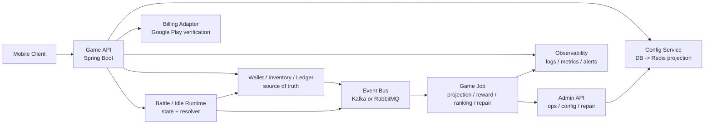

# Game Backend Architecture Selection

本檔整理 `/Users/nick/Git/iwin`、`/Users/nick/Git/antplay`、`/Users/nick/Git/ugsoft`、`/Users/nick/Git/DevOps` 的架構觀察，回答三件事：

1. 面試用 side project 要怎麼選型。
2. 商業用卡牌經營養成 / 回合制戰鬥 / 放置類養成戰鬥要怎麼選型。
3. 四組既有系統的優點能否結合成新的遊戲服務器架構。

它不是新的 flow Step，也不是履歷 claim 自動升級器。正式履歷仍以 `05 / 08` 與 project-level contribution consolidation 為準。

## Evidence Scope

| 項目 | 結論 |
| --- | --- |
| 掃描範圍 | 本地 source tree、pom / config 類型、domain system maps、既有 flow / contribution consolidation、部分 controller / service / listener / deploy docs |
| Source repo 狀態 | 公司 repo 只讀分析；本輪未改 source repo，未 pull / merge / checkout |
| 遠端狀態 | 依本地工作樹與本地 refs 判斷；未宣稱所有 source repo 已更新到遠端最新 |
| 敏感資訊 | DevOps / application config 中出現內網與憑證線索；本檔只保留架構事實，不記錄 URL、IP、密碼、token 或 production 細節 |
| Google Play / 上架政策 | 本檔只談架構；實際商業上架前需另查當下 Google Play、隱私、付款、抽卡 / 機率揭露與地區法規 |

## 四組系統定位

| 系統 | 主要型態 | 架構價值 | 不適合直接照抄的點 |
| --- | --- | --- | --- |
| `iwin` | legacy / multi-module game server monorepo + 多個 Spring service | Netty / protobuf / in-memory player state / dbproxy / async log pipeline，適合理解低延遲 game runtime | 耦合較重、legacy context 多、side project 直接仿會過大 |
| `antplay` | repo-per-service / microservice-ish Spring Boot 架構 | game-api、game-job、admin-api、math-core、platform-mock 邊界清楚，適合面試與可維護架構 | runtime 多為 API / job 型；若是即時多人戰鬥，不能只靠 Spring MVC |
| `ugsoft` | provider connector + admin control plane | 第三方 provider gateway、transfer wallet、callback、RequestLog / BetRecord MQ、白名單 / 後台控制面 | 主要是整合平台與後台，不是完整遊戲 runtime |
| `DevOps` | deployment / CI / Kafka / observability supporting | Docker / CI template、Kafka local stack、OpenObserve + fluent-bit、Docker Swarm 部署經驗，可補商業化運維骨架 | 目前更像環境與 runbook supporting，不代表完整 SRE / Kubernetes owner |

## 效能與可維護性判斷

不能只問「單體或微服務哪個效能好」。要先問是哪種效能：

| 問題 | 較適合的方向 | 理由 |
| --- | --- | --- |
| 低延遲連線、封包處理、玩家狀態同步 | `iwin` 類 Netty / protobuf runtime | 事件驅動、連線常駐、封包小、可保留 in-memory room / player state |
| 一般遊戲 API、下注 / 結算、商戶 API、後台 API | `antplay` / `ugsoft` 類 Spring Boot service | 可維護、可測、可水平擴、service boundary 清楚 |
| 報表、投影、通知、活動統計、分表維護 | `antplay-slot-game-job` / `game_job` / `DevOps Kafka` 類 job + MQ | 主交易與非同步 projection 分離，錯誤可重跑 |
| provider connector、callback、transfer wallet | `ugsoft-connector-api` + `antplay/iwin provider flows` | adapter / local state / request log / MQ / admin query 邊界清楚 |
| 面試展示 | `antplay` + `ugsoft` + 少量 `iwin runtime` 思路 | 能講 API、DB、Redis、MQ、job、admin、observability、claim boundary |
| 商業化遊戲長期維運 | hybrid | runtime、wallet、job、admin、deploy、observability 都要有，但不必一開始全拆微服務 |

結論：

```text
raw game runtime performance: iwin-style wins
engineering ROI / interview / maintainability: antplay + ugsoft-style wins
commercial production: hybrid wins
```

## 流量承載與 Infra 判斷

這段是教學型 KB，不是履歷 claim。架構設計能在面試加分，因為它展示的是「能分清瓶頸與風險」；但不能直接說「這套架構能扛百萬流量」，除非有明確流量定義、壓測資料、機器規格與 production evidence。

### 百萬流量要先定義

`百萬流量` 必須拆開講：

| 說法 | 意義 | 難度 |
| --- | --- | --- |
| 百萬 MAU | 月活百萬 | 偏產品規模，後端壓力不一定高 |
| 百萬 DAU | 日活百萬 | 需要穩定 API、DB、cache、job 與監控 |
| 百萬 CCU | 同時在線百萬 | 需要 gateway、連線管理、分區、容量規劃與專門 infra |
| 百萬 QPS | 每秒百萬 request | 極高難度，需要完整 SRE、壓測、分片、成本與瓶頸治理 |
| 每日百萬交易 / reward | 高交易量 | 交易正確性、idempotency、DB / MQ / job 更重要 |

卡牌經營養成、回合制、放置類遊戲如果是百萬 DAU，第一版可以用 modular monolith + 水平擴展 + DB / Redis / MQ / projection 的方式設計到合理方向；如果是百萬 CCU 或百萬 QPS，就是另一個等級，不應在面試或履歷中誇大。

### 不是多開機器就好

多開機器 / 多開 container 主要解決無狀態 API 層 throughput，不會自動解決所有瓶頸。

| 層級 | 能不能靠加 replica | 主要風險 |
| --- | --- | --- |
| API / controller | 通常可以 | 仍受 thread pool、connection pool、DB / Redis / MQ 下游限制 |
| Battle runtime | 視是否有狀態 | room / session / battle state 不能亂飄，要設計 routing / sticky / state store |
| Wallet / inventory | 不能只靠加機器 | transaction、lock、idempotency、duplicate reward |
| DB | 不能單純靠 API 擴 | index、lock、partition、read/write split、connection pool |
| Redis | 不能單純靠 API 擴 | hot key、big key、cache stampede、memory / eviction |
| MQ / job | 需要 partition / consumer group / idempotency | lag、duplicate consume、DLQ、replay |
| External provider / billing | 不受自己加機器控制 | rate limit、timeout、callback 重送、query / repair |

正確口徑：

```text
API 層可以水平擴展；狀態層要靠資料模型、分區、鎖、冪等、cache、MQ、projection、壓測與監控一起設計。
```

### 商業用最小 Infra 知識

Senior Backend 不必一開始變 SRE，但至少要懂：

- Load balancer 如何把流量分到 API replica。
- Container replica 只適合無狀態服務；有狀態 runtime 要處理 session / room routing。
- DB 可能先爆：slow query、index、lock wait、deadlock、connection pool。
- Redis 可能先爆：hot key、big key、cache miss、TTL / rebuild。
- MQ 可能先爆：consumer lag、retry storm、DLQ、partition key。
- JVM 可能先爆：thread pool、heap、GC、CPU、connection pool。
- Observability 要能看：QPS、latency、error rate、DB slow query、Redis ops、MQ lag、job result、business error。
- 壓測不是只打 API，要觀察 downstream bottleneck 和資料正確性。

### 面試講法

```text
我不會把扛流量簡化成多開幾台機器。多開 container 主要解決 API 層 throughput，但真正的瓶頸通常在 DB、Redis、MQ、外部 provider 或 transaction boundary。我的設計會先把主交易、cache、projection、job 分清楚：API 盡量無狀態化，wallet / inventory 用 DB transaction 和 idempotency 保護，報表與排行榜走 MQ / projection，Redis 做 cache 但不當資產 source of truth。流量上來後再用 metrics 和壓測找瓶頸，決定是加 replica、拆 service、分表、調 index、加 consumer，還是改資料流。
```

## 面試用 Side Project 選型

### 目標

面試用 side project 不是要模仿公司完整大系統，而是要做一個能講清楚 Senior Backend 判斷的最小完整系統：

- source of truth 在哪。
- 哪些只是 cache / projection / report。
- 錢包 / 戰鬥 / 獎勵狀態怎麼轉。
- retry / idempotency / compensation 怎麼設計。
- MQ / job / admin / observability 怎麼支撐 production。

### 推薦架構

先做 modular monolith 或少量 service，不要一開始就全微服務。

```text
game-api
  player auth
  game start / action / result
  wallet command
  battle command

wallet-ledger
  balance source of truth
  transaction / journal
  idempotency key
  manual repair boundary

combat-engine
  card / unit / skill / turn resolver
  deterministic battle result
  seed / replay data

game-job
  Kafka / RabbitMQ consumer
  report projection
  reward settlement
  retry / DLQ / reconciliation

admin-api
  config
  player query
  battle / wallet audit
  manual repair

ops-support
  Docker Compose
  metrics
  structured logs
  trace id
```

### 技術選型

| 層 | 面試用推薦 |
| --- | --- |
| Language | Java 17 / 21 |
| Framework | Spring Boot 3 |
| DB | PostgreSQL 或 MySQL |
| Cache | Redis |
| MQ | RabbitMQ 或 Kafka，選一個即可 |
| Admin | Spring Boot admin API + simple web / Swagger |
| Deploy | Docker Compose |
| Observability | Actuator / Prometheus / structured log / trace id |
| Battle / math | Java pure module，不依賴 web framework |

面試用不需要 Kubernetes、不需要完整 service mesh、不需要完整商城與金流，也不需要把所有 gameplay 都做完。重點是做出 2-3 條 production-grade flow：

1. 玩家戰鬥結算：action -> battle result -> reward -> wallet / inventory transaction。
2. 放置收益領取：offline earning -> claim -> idempotency -> reward transaction。
3. admin config 更新：DB source of truth -> Redis projection -> runtime fail closed。

## 商業用：卡牌經營養成 / 回合制戰鬥 / 放置類養成戰鬥

### 遊戲型態判斷

這三類通常不是高頻 realtime action，而是「狀態正確性」比「毫秒級封包」更重要：

| 類型 | 主要風險 | 架構重點 |
| --- | --- | --- |
| 卡牌經營養成 | 卡牌 / 裝備 / 資源狀態錯、升級材料扣錯、抽卡 / 掉落機率爭議 | inventory / economy source of truth、機率與結果 evidence、admin config version |
| 回合制戰鬥 | 戰鬥結果不一致、重送 action、斷線重連、獎勵重複領 | deterministic battle resolver、battle session state、result replay、idempotency |
| 放置類養成戰鬥 | offline reward 被刷、時間差異、重複領取、排行榜 / 活動結算錯 | server-side time、claim transaction、anti-abuse、projection / leaderboard job |

### 商業用初始架構



### 商業用模組責任

| 模組 | 責任 |
| --- | --- |
| `game-api` | login、玩家資料、卡牌 / 隊伍 / 關卡、戰鬥開始 / 結束、放置收益領取 |
| `battle-runtime` | 回合制戰鬥規則、技能 resolve、seed / replay、結果驗證 |
| `wallet-inventory-ledger` | 鑽石、金幣、體力、道具、卡牌碎片、交易流水、冪等 |
| `config-admin` | 卡牌、關卡、掉落、活動、商店、抽卡池、版本控管 |
| `billing-adapter` | Google Play Billing server verification、訂單狀態、補單 |
| `game-job` | 每日任務、排行榜、放置收益結算、活動結算、資料投影 |
| `event-log` | battle result、reward granted、purchase verified、admin change |
| `observability` | trace id、error code、slow query、MQ lag、job result、人工修復 audit |

### 商業用選型原則

1. 小團隊第一版用 modular monolith，比一開始拆微服務穩。
2. `wallet / inventory / billing` 必須是 source of truth，不要只信 Redis。
3. Redis 用於 session、rate limit、config projection、排行榜 cache；不要把長期資產只放 Redis。
4. 戰鬥結果要可重放：保留 battle seed、input、server result、reward transaction id。
5. 放置收益必須 server-side 計算，並用 claim transaction 防重複領。
6. admin config 必須有版本、審核、回滾與 runtime readiness check。
7. MQ / job 用於報表、排行榜、通知、活動結算；不要把主交易成功綁死在報表 consumer。
8. Google Play / 隱私 / 機率揭露 / 付款政策需在上架前查最新規範。

## 四組系統如何整合成新遊戲服務器

不要直接 merge codebase。正確做法是抽概念：

| 來源 | 抽出的優點 | 放到新架構的位置 |
| --- | --- | --- |
| `iwin` | Netty / protobuf、runtime state、async log / dbproxy、gameserver flow thinking | realtime gateway 或 battle runtime |
| `antplay` | game-api / game-job / admin-api / math-core / platform-mock 邊界 | service / module boundary |
| `ugsoft` | provider connector、callback、transfer wallet、request log MQ、white IP control plane | external adapter / billing / provider / admin control |
| `DevOps` | Docker deploy、CI template、Kafka local stack、OpenObserve / fluent-bit | deploy / observability / local production simulation |

推薦新架構：

```text
game-gateway
  WebSocket / HTTP gateway
  auth token
  rate limit
  request trace

game-api
  player API
  battle API
  idle claim
  card / inventory query

battle-runtime
  deterministic turn resolver
  replay / seed
  optional Netty / WebSocket path

wallet-inventory-ledger
  balance / item / card source of truth
  transaction journal
  idempotency
  manual repair

math-combat-core
  card skill formula
  drop / gacha / reward calculation
  simulation / validation

game-job
  MQ consumer
  leaderboard
  event projection
  daily reset
  reconciliation

admin-api
  config
  player support
  audit
  repair
  risk view

provider-billing-adapter
  Google Play order verification
  external provider callback
  local order state

ops
  Docker / CI
  Kafka or RabbitMQ
  OpenObserve / logs
  metrics / alerts
```

## 面試講法

```text
如果是面試用 side project，我不會一開始做成大而全的微服務。我會先用 Spring Boot 3 做 modular monolith，把 game-api、wallet-ledger、combat-engine、game-job、admin-api 分清楚，並做 2-3 條 production-grade flow：戰鬥結算、放置收益領取、admin config projection。這樣可以講 source of truth、idempotency、MQ projection、manual repair 和 observability。

如果是商業用遊戲，我會依遊戲類型拆 runtime。卡牌養成、回合制、放置類通常不是毫秒級 realtime action，第一版重點是資產、戰鬥結果、獎勵與訂單狀態正確，所以會保守把 wallet / inventory / billing 放在 source of truth，Redis 只作 projection / cache。等流量或 realtime 需求出現，再把 battle runtime 或 gateway 拆出去。

我會把 iwin 的低延遲 runtime 思路、AntPlay 的 service boundary 和 math-core、UGSoft 的 provider connector / control plane、DevOps 的 deploy / observability 結合，但不會直接把既有 codebase merge；會抽象成新的遊戲後端架構。
```

## 不建議

- 不建議把 side project 一開始做成十幾個微服務。
- 不建議把 iwin legacy monorepo 原樣複製成新專案。
- 不建議商業用第一版就追求 Kubernetes / service mesh / complex microservice。
- 不建議把 Redis 當 wallet / inventory / purchase 的唯一真相。
- 不建議把 admin report 當 transaction source of truth。
- 不建議因為想上 Google Play 就忽略 Billing verification、隱私、機率揭露、風控與上架政策。

## 後續維護規則

- 若 Nick 問 side project、商業化遊戲、遊戲服務器重構、單體 vs 微服務、iwin / antplay / ugsoft / DevOps 如何整合，優先讀本檔。
- 若要變成正式 side project spec，先從本檔收斂成一份 project README / architecture plan，不直接寫 code。
- 若要真的商業上架，必須另做 policy / legal / Google Play Billing / privacy / security check，本檔只當架構起點。
- 本檔不新增履歷 claim；若要放履歷，只能寫成「具備從既有 production flow 抽象 system design / side project 架構的能力」或作面試口說素材。
