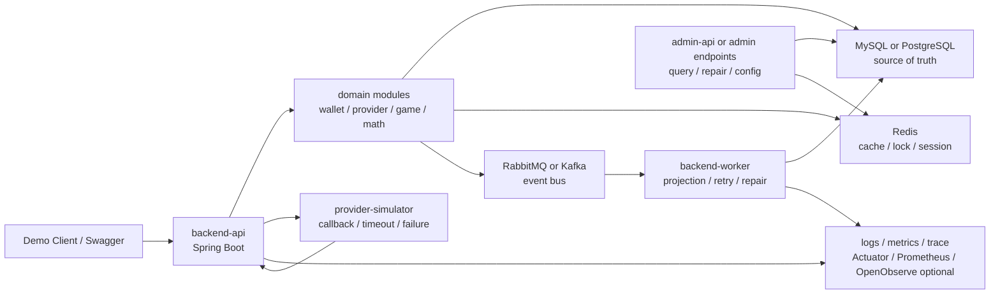

# 0 to 1 Project Strategy Report

本報告回答 Nick 目前模糊但重要的問題：

```text
如果未來想做一個介於「面試用」與「上架獲利用」之間的 0 到 1 專案，
要怎麼從既有 iwin / AntPlay / UGSoft / DevOps code 與 KB 抽出真正有價值的架構？
```

結論先講：

- 目前不建議立刻開一個大型 side project。
- 真正有價值的是「可容器化、可展示、可投遞說明、可被面試追問」的 backend architecture lab。
- 它不是完整商業遊戲平台，也不是 gambling / real-money 產品。
- 最適合的方向是：`遊戲後端交易切片 + provider simulator + wallet / bet-settle + MQ projection + admin / observability`。
- 若未來要上架獲利，應 pivot 成非真錢的卡牌 / 回合制 / 放置養成遊戲，把同一套 backend 思路用在玩家資產、戰鬥結果、獎勵、活動、後台與觀測性。

## Evidence Scope

| 項目 | 結論 |
| --- | --- |
| 掃描日期 | 2026-06-05 |
| 掃描方式 | Level 2 strategy scan：重讀 `nick-vault` side project / system design / todo / source inventory / domain maps，再讀來源 repo 目錄、package descriptor、代表 code path、近期 git log 與 workspace flow 文件 |
| 掃描來源 | `/Users/nick/Git/nick/nick-vault`、`/Users/nick/Git/antplay`、`/Users/nick/Git/iwin`、`/Users/nick/Git/ugsoft`、`/Users/nick/Git/DevOps` |
| Source repo 狀態 | 來源 repo 只讀；本輪未 fetch、未 pull、未 merge、未 checkout、未改 source code |
| 遠端最新性 | 依本地工作樹與本地 refs 判斷；不宣稱已確認內網遠端最新 |
| Dirty state | 掃到部分 source repo 有既有 dirty / untracked 檔，作為「不可直接當乾淨 baseline」的提醒；本報告不列敏感路徑內容 |
| 敏感資訊 | 不記錄內網 URL、IP、token、secret、production config |
| 報告用途 | 架構選型、side project 是否值得做、面試 system design 素材、未來最小專案藍圖 |
| 非用途 | 不新增 Nick 履歷 claim；不代表 Nick 主導過 0 到 1 完整平台；不作商業上架 legal / policy 審查 |

## 目前 KB 結論

`20-game-backend-architecture-selection.md` 已經定調：side project 目前 `暫不做`，它是差異化加分，不是 Senior Java Backend / Platform Backend 投遞必要條件。

本報告不是推翻這個決策，而是補清楚：

1. 若未來真的要做，第一版應該長什麼樣。
2. 哪些既有系統能力值得抽出。
3. 哪些架構選型是面試有價值但不該過度工程。
4. 面試展示版與商業上架版的差距在哪。
5. 不做 side project 時，這份報告仍可當 system design 問答素材。

## Source Repo Observations

### AntPlay

本地專案形態：

- `antplay-slot-game-api`：Spring Boot game runtime API，包含 public game API、bet / settle / rollback、transfer wallet、request log、cache listener、runtime config。
- `antplay-slot-game-job`：Spring Boot job service，包含 Kafka consumer、Quartz job、report projection、big-win / activity / settle pool 類事件處理。
- `antplay-slot-admin-api`：Spring Boot admin / merchant control plane，包含 RabbitMQ consumer、white list、risk / report、auth / RBAC。
- `math-core` 與大量 `*-math`：slot math contract、RTP / reel strip、buy free、jackpot、feature state、結果驗證。
- `platform-mock`：provider failure / rollback 類 supporting。
- 前端、bot、push、official-web 類 repo 不適合作為 Senior Backend 主線。

掃到的技術與套件線索：

| 類型 | 觀察 |
| --- | --- |
| Web / API | Spring Boot、Spring MVC、WebFlux 部分使用 |
| DB | MySQL、JPA、MyBatis 在不同 service 混用 |
| Cache | Redis / `StringRedisTemplate` |
| MQ | RabbitMQ；job repo 另有 Kafka consumer |
| Job | Quartz |
| Observability | Actuator、Micrometer Prometheus、Spring Boot Admin client |
| API docs / test | springdoc / swagger annotations、JUnit / Allure |
| Runtime / support | Netty 在部分 repo 出現；slot math 透過 external math JAR 與 manager 路由 |

代表 code path 線索：

- `antplay-slot-game-api` 有 `TransferBalanceController`、`GameController`、`BetRecordController`、`CompensationService`、`RabbitMqService`、`DistributedLockAop`、`PlayerControlCacheService`。
- `antplay-slot-game-job` 有 `ProxyUserDataConsumerService`、`BigWinConsumerService`、`SettlePoolMonitorConsumerService`、`ReportAgentPlayerJob`、`ScheduleJobService`。
- `math-workspace` 顯示 math 模組不是隨便寫公式，而是有 GDD、相似底包、fixed board、RTP / optimizer、final validation、review gate 的開發閉環。

對 0 to 1 的啟發：

- 可以抽 AntPlay 的 service boundary：`game-api`、`game-job`、`admin-api`、`math-core`。
- 可以抽 Kafka / RabbitMQ / Quartz 的 projection 與 retry 觀念。
- 可以抽 math module 的 deterministic result contract，而不是做完整 slot platform。
- 不要照搬大量 `*-math` 或完整 slot production 複雜度。

### iwin

本地專案形態：

- `payment`：multi-module Spring Boot payment system，含 provider controller、payment / withdraw order、MQ、timer、admin、simulator supporting。
- `game_api` / `third_games_api` / `game_job`：Spring Boot API / provider adapter / batch projection。
- `iwin_gameserver`：multi-module Java game server，含 `slots-center`、`slots-gate`、`slots-dbproxy`、`slots-game-log`、`slots-games` 多 game module。
- `app_bi` / `bi_share`：PHP / BI / admin control plane，主要作入口與查詢 supporting。
- `k3s-deploy`：deployment topology / rollout supporting。

掃到的技術與套件線索：

| 類型 | 觀察 |
| --- | --- |
| Payment | Spring Boot、Spring Security、AOP、Redis、MongoDB、MySQL、MyBatis-Plus、RabbitMQ、RocketMQ / XXL-MQ 線索、ShedLock、WebFlux、Undertow |
| Game API / Job / Third API | Spring Boot、Redis、Nacos config、MySQL、tk-MyBatis、Druid、PageHelper、MongoDB、Quartz |
| Gameserver | Netty、protobuf、MySQL、MyBatis、Redis，多 module game runtime |
| BI / Admin | PHP / composer / Dockerfile |
| Simulator | Spring Boot + JDBC + MySQL，適合 provider contract supporting |

代表 code path 線索：

- `payment` 有大量 provider controller，例如 pay notify、withdraw notify、query status；許多 callback 會走 MQ / async handling。
- `payment` root 模組切出 `admin`、`base`、`mq`、`payment`、`service`、`timer`、`xxl-mq-admin`。
- `iwin_gameserver` 有 gate / center / dbproxy / game-log / games 的 runtime 分層，與 Netty / protobuf 強相關。
- `game_job` 有 Redis to DB、daily summary、payment order projection、Mongo / report 類 service。

對 0 to 1 的啟發：

- iwin 的價值在 runtime / provider / payment / batch 的 failure mode，不在照搬 legacy monorepo。
- 可以抽 `provider request -> callback -> query -> repair` 的失敗處理模型。
- 可以抽 `gameserver runtime -> log / projection -> BI` 的 source of truth vs report projection 邊界。
- 如果做 side project，不要一開始模仿 iwin gameserver 全套 Netty + 多 game module；除非目標是 realtime gateway。

### UGSoft

本地專案形態：

- `ugsoft-connector-api`：provider connector / gateway，處理 transfer wallet、callback、bet record MQ、provider adapter。
- `ugsoft-admin-api`：admin control plane，處理 RabbitMQ ingestion、request log、white IP、auth / RBAC、Quartz。
- `ugsoft-admin-web` / `official-web-v3`：前端 / 官網，不是主線。
- `ugsoft-workspace`：workspace / docs / harness supporting。

掃到的技術與套件線索：

| 類型 | 觀察 |
| --- | --- |
| Web / API | Spring Boot、Spring MVC、WebFlux |
| DB | MySQL、JPA、MyBatis |
| Cache | Redis |
| MQ | RabbitMQ |
| Job | Quartz |
| Resilience | `ugsoft-connector-api` 有 Resilience4j circuit breaker |
| Observability | Actuator、Micrometer Prometheus、Spring Boot Admin client |
| Security / Control plane | Spring Security、white IP / firewall / auth 類 code path |

代表 code path 線索：

- `ugsoft-connector-api` 有 `ConnectCallbackController`、`ConnectClientController`、`TransferService`、`ConnectBetRecordMqService`、`ConnectBetRecordSyncService`、provider adapter 類 service。
- `ugsoft-admin-api` 有 RabbitMQ consumer、request log / bet record ingestion、white IP control plane。
- 近期 git log 有 provider adapter reliability 與 circuit breaker 類修改，說明這類系統真實痛點在外部依賴不穩、timeout、fallback、query、callback。

對 0 to 1 的啟發：

- UGSoft 是做「外部 provider integration」和「admin control plane」的乾淨參考。
- 0 to 1 專案可以抽 `provider-simulator`、`connector-api`、`admin-api` 這條線。
- Resilience4j / circuit breaker 是可加分但不是第一天必須；先把 timeout unknown、idempotency、local state、query / repair 做清楚。

### DevOps

本地專案形態：

- `antplay-api-deploy` / `antplay-web-deploy`：Dockerfile + GitLab CI 類部署流程。
- `antplay-docker-deploys`：docker compose / docker stack / config 類部署集合。
- `ci-template` / `ci-test`：Maven / release pipeline template。
- `kafka`：local Kafka + Kafdrop。
- `openobserve`：OpenObserve + Fluent Bit 類 observability stack。

對 0 to 1 的啟發：

- 面試展示版不需要 K8s 起手，`Docker Compose` 足夠。
- 真正要加分的是一鍵啟動、可看 logs / metrics、可重跑 job、可觀察 MQ lag / failed event，而不是把 YAML 堆滿。
- CI / deploy 可以先做到 build、test、docker image、compose smoke test；Kubernetes / K3s 作第二階段。

## 核心抽象

從四組系統抽出來，最值得 Nick 掌握與未來展示的是四個 backend 切片：

```text
1. Provider Integration
2. Wallet / Bet-Settle / Inventory Ledger
3. MQ / Batch / Projection
4. Math / Combat Result Validation
```

這四片剛好對齊目前履歷主軸，也對齊一個可展示專案的最小價值。

### Source of Truth 分層

這是新專案必須從一開始就清楚的核心：

| 資料 | Source of truth | Cache / projection |
| --- | --- | --- |
| 玩家帳號 | DB user / player table | Redis session / token |
| 錢包 / 資產 | DB ledger / transaction journal | Redis balance cache 只能作讀取加速，不作唯一真相 |
| 遊戲結果 | DB game round / bet record / battle result | report table / admin view |
| Provider 訂單 | DB provider order / provider event | callback log / query cache |
| 報表 | 不應作主交易真相 | projection / summary / BI |
| 排行榜 | DB 或 event source 可重建 | Redis sorted set |
| Runtime config | DB config + version | Redis projection / local memory |
| Math result | deterministic input + result contract | debug output / simulation report |

面試講法：

```text
我會先定義哪裡是 source of truth，哪些只是 cache 或 report。錢包、資產、訂單、下注結果不能只信 Redis 或後台報表；Redis 可以加速讀取，報表可以做 projection，但真正修復和對帳要回到原始交易與事件。
```

## 推薦專案方向

### 名稱

暫定：

```text
containerized-game-transaction-lab
```

不要叫 real-money casino、payment platform、production gambling platform。名稱要避開法規與履歷誇大。

### 一句話定位

```text
一個可用 Docker Compose 啟動的 Java backend lab，展示遊戲交易、provider callback、wallet / bet-settle、MQ projection、admin repair 與 observability 的 production thinking。
```

### 最小功能範圍

第一版只做 4 條 flow：

1. `Provider Order Flow`
   - 建立 provider order。
   - 呼叫 provider simulator。
   - 處理 callback 重送。
   - query fallback。
   - manual repair。

2. `Wallet / Bet-Settle Flow`
   - 玩家下注。
   - 錢包扣款。
   - game result 產生。
   - 派彩 / rollback。
   - idempotency key 防重複。

3. `MQ / Projection Flow`
   - transaction event publish。
   - worker consume。
   - report projection。
   - retry / DLQ。
   - replay / rebuild projection。

4. `Math / Combat Result Validation Flow`
   - deterministic input。
   - seed / fixed board 或 fixed battle。
   - result contract。
   - simulation / validation report。

這四條足夠展示 Senior Backend 能力，不需要做完整遊戲。

## Architecture Proposal

第一版建議用 modular monolith + worker，不要一開始十幾個微服務。



### Module Layout

```text
containerized-game-transaction-lab/
  README.md
  docker-compose.yml
  backend/
    pom.xml
    apps/
      api/
      worker/
      provider-simulator/
    libs/
      common/
      domain-wallet/
      domain-provider/
      domain-game/
      domain-math/
      infra-db/
      infra-mq/
      infra-redis/
  deploy/
    compose/
    k8s-optional/
  docs/
    architecture.md
    flows/
      provider-order.md
      wallet-bet-settle.md
      mq-projection.md
      math-validation.md
    runbook.md
```

如果要保持更簡單，也可以第一版只有一個 Spring Boot app：

```text
backend/
  src/main/java/.../provider
  src/main/java/.../wallet
  src/main/java/.../game
  src/main/java/.../projection
  src/main/java/.../admin
```

但文件中仍要畫出 module boundary。

## Tech Stack Recommendation

### 面試 / 展示版

| 層 | 推薦 | 理由 |
| --- | --- | --- |
| Language | Java 17 或 Java 21 | 對齊 Senior Java Backend；Java 17 保守，Java 21 展示新版本熟悉度 |
| Framework | Spring Boot 3 | 對齊現代職缺；也能對比既有 Spring Boot 2 / legacy 經驗 |
| DB | PostgreSQL 或 MySQL | PostgreSQL 適合免費雲與現代展示；MySQL 對齊既有公司經驗。二選一即可 |
| Migration | Flyway | 展示 schema versioning，避免手動 SQL 混亂 |
| ORM / SQL | MyBatis 或 jOOQ / Spring JDBC | 若對齊 Nick 既有經驗，MyBatis 最自然；不要為炫技硬換 |
| Cache | Redis | session、idempotency guard、rate limit、leaderboard cache |
| MQ | RabbitMQ 起手，Kafka optional | RabbitMQ 比較輕，足夠展示 retry / DLQ；Kafka 可作 projection 進階版 |
| Job | Spring Scheduler / Quartz optional | 第一版可以 Spring Scheduler；要對齊公司經驗再加 Quartz |
| Resilience | Resilience4j optional | provider timeout / circuit breaker 加分，但不要第一天過度設計 |
| Observability | Actuator + structured logs + trace id | 面試可講；Prometheus / OpenObserve 可作第二階段 |
| API docs | OpenAPI / Swagger | 方便面試官試 API |
| Test | JUnit 5 + Testcontainers optional | 第一版至少 unit / integration smoke；Testcontainers 是加分 |
| Container | Docker Compose | 最小可啟動；K8s / K3s 第二階段 |

### 不建議第一版就用

- Kubernetes / service mesh。
- 多語言微服務。
- 真實 Google Play Billing。
- 真實金流 / 真錢。
- 完整前台遊戲 client。
- 複雜帳務 ledger / double-entry accounting。
- 完整 casino / slot platform。
- 全套 CI/CD + observability + SRE runbook。

原因：這些會讓專案變成「展示野心」而不是「展示判斷」。

## Three Versions

### A. Interview MVP

目標：2 到 4 週內做出可跑、可講、可被追問的 backend demo。

內容：

- 1 個 Spring Boot API。
- 1 個 worker 或同 app async consumer。
- DB + Redis + RabbitMQ。
- provider simulator。
- Swagger。
- 3 到 4 條 flow。
- Docker Compose 一鍵啟動。
- README 有架構圖、正常流程、失敗流程、runbook。

價值：

- 最適合面試展示。
- 成本低。
- 可以把 Nick 的 production flow 口說變成可跑證據。

缺點：

- 不是真正商業產品。
- UI 不一定漂亮。
- 不該拿來說能扛大流量。

### B. Portfolio Deployable

目標：4 到 8 週，把 A 變成可公開 demo。

新增：

- 簡單 admin web 或 read-only dashboard。
- seeded demo data。
- public demo account。
- observability dashboard。
- CI build + test。
- deploy to free / low-cost cloud。
- read-only docs for interviewer。

價值：

- 可以給獵頭 / 面試官看。
- 比純履歷更差異化。

風險：

- 維護成本上升。
- 公開 demo 要注意資安、濫用、成本、資料清理。
- 不穩的 demo 反而扣分。

### C. Commercial Pivot

目標：3 到 6 個月以上，把 backend 思路轉成非真錢遊戲。

方向：

- 卡牌養成。
- 回合制戰鬥。
- 放置收益。
- 非真錢經濟系統。
- 可上 Google Play 的 casual / idle RPG。

必補：

- 產品定位。
- 美術 / UX。
- client。
- 帳號 / 隱私。
- Google Play policy。
- 付款與商品若涉及實際金流，要另做合規與安全設計。
- anti-cheat / abuse prevention。

判斷：

- 這已經不是單純 Senior Backend 面試準備。
- 若想獲利，需要產品 / 遊戲設計 / 美術 / 行銷 / 上架 / 留存，不只是 backend。
- backend 可作核心優勢，但不能保證商業成功。

## 面試版 vs 上架版

| 問題 | 面試版 | 上架版 |
| --- | --- | --- |
| 目標 | 展示 backend 判斷 | 服務真實玩家 |
| 成功標準 | 可跑、可講、可追問 | 留存、穩定、成本、合規、轉化 |
| 架構 | modular monolith + compose | 依流量演進，可能拆 service / worker / runtime |
| DB | 單一 DB 足夠 | 需要備份、migration、容量、監控 |
| MQ | 可展示 retry / DLQ | 要處理 lag、replay、retention、poison message |
| Redis | cache / lock demo | 要處理 hot key、eviction、cluster、資料一致性 |
| Observability | logs + metrics 展示 | alert / dashboard / incident SOP |
| Security | basic auth / token | abuse、rate limit、privacy、payment verification |
| Legal / policy | 不碰真錢 | 必須查 Google Play / 隱私 / 付款 / 機率揭露 |

## Refactor / New Tech Strategy

若未來真的寫，可以刻意展示「從 legacy 學到現代化」：

### 可展示的現代化

- 從 provider controller 散落，收斂成 adapter interface。
- 從 callback 直接副作用，改成 callback inbox + idempotency + worker。
- 從 report 直查交易表，改成 event projection。
- 從 Redis-only guard，補 DB unique key / transaction record。
- 從手動 SQL，補 Flyway migration。
- 從 log string，補 trace id / structured log。
- 從沒有重跑策略，補 replay / rebuild projection。
- 從沒有失敗分類，補 retryable / non-retryable / manual repair。

### 不建議為了新而新

- 不要為了 WebFlux 把同步交易全改 reactive。
- 不要為了 Kafka 潮就不用 RabbitMQ。
- 不要為了 DDD 名詞建立過多 package。
- 不要為了 microservice 把 transaction boundary 切碎。
- 不要為了 Kubernetes 忽略 DB / Redis / MQ 才是真瓶頸。

## 最小 Production Thinking Checklist

一個 flow 做完，不是 API 可以 200 就算。至少要能回答：

- 成功狀態是什麼？
- 失敗狀態有哪些？
- 重試會不會重複扣款 / 派獎？
- DB 成功但 MQ 失敗怎麼辦？
- MQ 成功但 consumer 失敗怎麼辦？
- callback 重送怎麼處理？
- provider timeout unknown 怎麼處理？
- report projection 錯了能不能重建？
- admin repair 有沒有 audit？
- Redis 掛了主交易會怎樣？
- DB slow query / lock wait 會在哪裡爆？
- trace id 怎麼從 request 查到 worker？
- 哪些資料是 source of truth？

這些問題比「用了幾個新套件」更有價值。

## 建議決策

### 現在

不要立刻開工大型 side project。

原因：

- 目前 Senior 求職主線已經有真實 production flows。
- 你現在最大瓶頸比較像「講清楚、抗追問、穩住信心」，不是缺一個新 repo。
- 大型 side project 會把焦慮轉成工程量，而且很容易拖過市場測試節奏。

### 可以做的最小準備

只保留一個可選出口：

```text
先不寫 code，只把 0 to 1 backend lab 的 README / architecture / flow spec 打磨成面試口說素材。
```

這可以接在 `18-system-design-templates.md` 後面，用來回答：

- 如果你從 0 設計，會怎麼拆？
- 你會選 RabbitMQ 還是 Kafka？
- 你會怎麼處理 wallet consistency？
- 你會怎麼容器化？
- 你會怎麼讓面試官看出 production readiness？

### 何時真的啟動

只有符合以下其中之一，才值得啟動 A 版 Interview MVP：

1. 你已經投遞並發現面試官一直追問 0 to 1 實作證據。
2. 你想投偏 Platform / Lead / 架構設計職缺，需要更強展示。
3. 你已經把主力 flows 練到能講，仍想做差異化。
4. 你有明確 4 到 6 週空檔，且願意把 scope 壓到 3 到 4 條 flow。

否則，這份報告先當架構素材，不進入開發 backlog。

## 可直接使用的面試說法

```text
如果我要從 0 設計一個可展示的遊戲後端，我不會一開始做完整微服務或完整商業平台。我會先做一個可容器化的交易切片：Spring Boot API、DB、Redis、RabbitMQ、provider simulator、worker 和簡單 admin endpoint。核心 flow 會選 provider order、wallet / bet-settle、MQ projection、math / combat result validation。

我會先定義 source of truth：wallet、order、bet record 和 battle result 以 DB transaction / journal 為準；Redis 只作 cache、session、lock guard 或 leaderboard projection；report table 只是 projection，不當交易真相。外部 provider callback 走 local order state、callback inbox、idempotency key、query fallback 和 manual repair。

這樣的第一版不是要宣稱能直接商業上線，而是展示 production thinking：重試是否安全、DB 成功但 MQ 失敗怎麼補、callback 重送如何去重、report 錯了怎麼重建、admin repair 怎麼留 audit、容器化後怎麼看 log / metrics。若未來要商業化，我會先把它轉成非真錢卡牌 / 回合制 / 放置養成遊戲，再補 client、上架政策、隱私、付款驗證、監控與容量規劃。
```

## Relationship With Existing KB

本報告與既有文件的責任分工：

| 文件 | 責任 |
| --- | --- |
| `20-game-backend-architecture-selection.md` | 遊戲後端選型總原則：side project 暫不做、單體 vs 微服務、商業遊戲架構 |
| `21-zero-to-one-project-strategy-report.md` | 本檔：把 source repo / package / architecture scan 萃取成可落地的 0 to 1 backend lab 報告 |
| `18-system-design-templates.md` | 面試 system design templates：Provider、Wallet / Bet-Settle、MQ / Projection、Slot Math |
| `16-career-skill-matrix.md` | 技術能力與基本功清單 |
| `04-interview-casebook.md` | 90 秒 / 3 分鐘 case 口說 |
| `05 / 08` | 履歷與投遞文本，本報告不直接新增 claim |

## 下一步口徑

如果 Nick 問「下一步」，不要自動建議開 side project。先用三段式：

| 類型 | 建議 |
| --- | --- |
| 必做收口 | 目前沒有因本報告新增的必做收口 |
| 可選加強 | 若想練 0 to 1 架構口說，讀本檔 + `18-system-design-templates.md`，請 AI 追問 3 到 5 題 |
| 暫不建議 | 立刻開完整商業遊戲、K8s 大工程、全微服務、真實金流、完整上架流程 |

若 Nick 明確說「啟動 side project」，第一步不是寫 code，而是：

```text
請依 senior-owner-playbook/21-zero-to-one-project-strategy-report.md
先產一份 containerized-game-transaction-lab 的 README / architecture / flow spec，
只做 Interview MVP scope，不寫 code。
```
