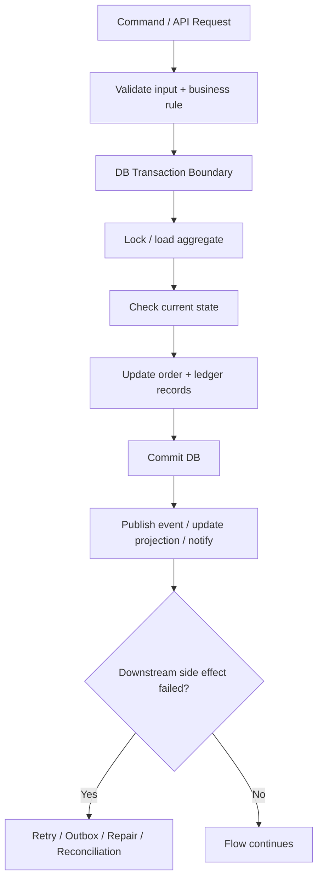
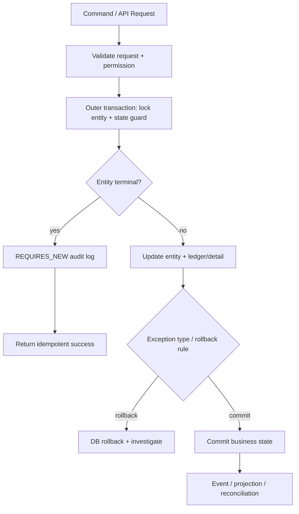
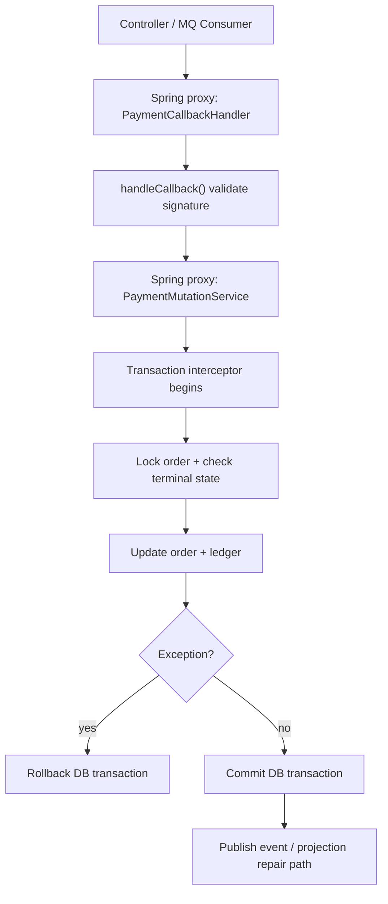

# Backend Learning Log

狀態：weekly checkpoint，不是每日 / 每週流水帳。

用途：記錄每週學習摘要、資料來源、面試題、Production 思考與是否需要回頭補 KB。只保留可支撐面試、production thinking 或 KB 維護判斷的摘要，不保存文章全文、不累積未完成債務。

## 使用規則

- 每週最多新增一個 checkpoint。
- 沒讀完不用補，不回填為學習債務。
- 若主題重複，下一次必須加深 incident、production、trade-off 或 interview depth，不重講基礎。
- 只標註：`已做過`、`參與過`、`分析過`、`可作為目標`、`待驗證`。
- 不改履歷、自傳、三個故事稿；若真的產生好素材，只列為 KB 建議。

## Week 01：Spring Transaction

狀態：已用新版 prompt / template / writing guideline 重跑；作為整本 weekly learning 的第一章，負責建立 local transaction boundary 心智，並加入明確 engineering judgment。

### Executive Summary（Core）

一句話 Takeaway：`@Transactional` 保護的是 local DB transaction，不是整條 business flow。

Production Mindset：我會把 DB transaction 當成保護 source-of-truth state mutation 的工具，不會拿它包住外部 provider、MQ publish 或慢 I/O。

Interview Mindset：先講我會 accept / reject 什麼設計，再補 Spring annotation 細節。

預估閱讀時間：15 分鐘讀 Core；30 分鐘含 Deep Dive。

### 本週主題（Core）

Spring Transaction：local DB transaction boundary、rollback rule、AOP proxy、business flow boundary 與 cross-system failure window。

### Weekly Mode（Core）

Concept Mode + Trade-off Mode。

理由：Week 01 是基礎心智建立週。重點不是背 `@Transactional`，而是建立 reviewer 心智：看到一段 transaction code 時，要能判斷它保護了什麼、放大了什麼風險、哪些 side effect 根本不該被塞進同一個 transaction。

### 為什麼這週學這個（Core）

Spring Transaction 是 Java backend production correctness 的基本盤。很多線上事故不是因為完全不懂 transaction，而是把 local DB transaction 誤認成整條 business flow 的一致性保證。

這週要建立四個判斷：

1. 哪些資料更新必須在同一個 local transaction 裡一起成功或失敗。
2. 哪些動作是 transaction 外的 side effect，例如 MQ publish、notification、external API。
3. 哪些 exception 會 rollback，哪些 exception 被吞掉後會造成意外 commit。
4. DB commit 成功但 downstream 沒成功時，系統要怎麼觀測、補償或收斂。

本週新的 production insight：transaction 不是「越大越安全」。transaction scope 越大，越容易把 lock time、外部 timeout、connection pool 壓力和 rollback ambiguity 一起放大。

### 核心概念（Core）

- `@Transactional` 是宣告式 transaction 管理，Spring 透過 transaction interceptor / AOP proxy 在 method 前後處理 begin、commit、rollback。
- Local transaction 主要保護同一個 transaction resource 內的 DB mutation，不會自動保證 MQ、Redis、external provider、notification 也一起 atomic。
- 預設 rollback 心智：runtime exception / error 會觸發 rollback；checked exception 通常要明確設定 `rollbackFor`。
- transaction scope 太大會拉長 lock time；把慢外部 API 或不可控 I/O 放進 transaction，常會放大 timeout、deadlock、connection pool 壓力。
- DB commit 成功後，event publish、projection update、notification 失敗，是常見 cross-system failure window；要靠 retry、outbox、compensation 或 reconciliation 收斂。

### Beginner-to-Senior 解釋（Core）

Beginner：`@Transactional` 讓 Spring 幫你管理資料庫 transaction，讓一段 DB 操作要嘛 commit，要嘛 rollback。

Mid：常見坑不是只忘記加 annotation，而是 method 沒有經過 Spring proxy、exception 被 catch 掉、checked exception 沒設定 rollback rule、transaction scope 太大。

Senior：要像 reviewer 一樣先問「這段 transaction scope 合理嗎？」Local transaction 保護本地資料狀態轉換；business flow 可能橫跨 HTTP、DB、Redis、MQ、external service、batch、projection；跨系統不一致要靠 idempotency、retry、outbox、compensation、reconciliation。

### Production 情境（Core）

常見 flow：

```text
request received
-> validate input / permission / current state
-> start DB transaction
-> lock or load business record
-> check terminal state / idempotency
-> update source-of-truth tables
-> commit DB
-> publish event / update projection / notify downstream
```

Reviewer 觀點：我會接受 transaction 包住「狀態檢查 + source-of-truth 更新」這段核心 DB mutation；我會拒絕把 external provider call、慢 I/O 或不可控 downstream call 放進同一個 transaction。若 DB 成功但 event 失敗，通常不應直接 rollback 已提交的業務狀態，而要補 event、補 projection、重跑 job 或 reconciliation。

### Technology Landscape（Core）

- Related technologies：Spring declarative transaction、programmatic transaction、JPA transaction、Outbox Pattern、Saga、distributed transaction / XA。
- Current industry mainstream：多數 backend system 以 local transaction + idempotency + retry / compensation / reconciliation 處理 production consistency，不會預設使用 distributed transaction。
- When each technology is a better fit：
  - Spring local transaction：單服務 / 單 DB mutation。
  - Outbox：DB commit 後必須可靠送出 event。
  - Saga / compensation：跨多服務長流程，需要可補償步驟。
  - XA / distributed transaction：強一致需求非常高，且成本與可用性代價可接受。
- Learn Now：Spring transaction boundary、rollback rule、proxy 心智。
- Learn Later：Outbox / Saga 的實作細節。
- Awareness Only：XA / JTA 深層配置與 transaction manager internals。

### 本週可執行任務（Core）

30 分鐘內完成：

```text
用 90 秒回答：DB transaction 成功，但 event / MQ publish 失敗怎麼辦？
```

回答骨架：

1. 這是 dual-write / cross-system failure window。
2. 先確認 source-of-truth DB 是否已 commit。
3. 短期補 event / projection / job 或人工 repair。
4. 長期依風險考慮 outbox、retry、reconciliation。
5. 不要重跑整個 command 造成重複副作用。

### Learning Check（Core）

學完本週 packet 後，Nick 應該能：

1. 用 60 秒說明：`@Transactional` 保護 local DB transaction，但不等於整條 business flow atomic。
2. 說出 1 個 production failure mode：DB commit 成功，但 event publish 失敗，導致 projection 或 downstream 沒更新。
3. 回答 1 題 Senior interview question：DB success / MQ failed 怎麼處理。
4. 說出 1 個 reviewer judgment：我會拒絕在 DB transaction 裡呼叫外部 provider 或慢 I/O，因為它會放大 lock time、timeout coupling 與 rollback ambiguity。

### 小型 code / pseudo-code 範例（Deep Dive）

```java
@Service
class OrderCommandHandler {

    private final OrderStateService orderStateService;
    private final EventPublisher eventPublisher;

    public void completeOrder(CompleteOrderCommand command) throws BusinessException {
        orderStateService.markCompleted(command);

        // Outside DB transaction boundary.
        // If publish fails after DB commit, local transaction cannot roll back event loss.
        eventPublisher.publishOrderCompleted(command.orderId());
    }
}

@Service
class OrderStateService {

    @Transactional(rollbackFor = Exception.class)
    public void markCompleted(CompleteOrderCommand command) throws BusinessException {
        Order order = orderRepo.findByIdForUpdate(command.orderId());

        if (order.isTerminal()) {
            return; // idempotency guard
        }

        order.markCompleted();
        orderRepo.save(order);
        ledgerRepo.insertOrderLedger(order.id(), order.amount());
    }
}
```

重點：`markCompleted` 要經過 Spring bean proxy 才能套用 transaction；DB mutation 和 `publishOrderCompleted` 的 external side effect 要分開思考。若 event 不能遺失，要考慮 outbox 或可重送的 repair path。

### 架構 / Flow 圖（Deep Dive）



### 常見錯誤（Deep Dive）

- 以為 method 標 `@Transactional` 就一定有 transaction。
- 以為 transaction 可以包住 DB + MQ + external API 的所有一致性。
- catch exception 後吞掉，導致應 rollback 的 DB mutation 反而 commit。
- 在 transaction 裡呼叫慢外部 API，拉長 lock time。
- 把 event publish 當成和 DB update 同一個 atomic operation。
- 用 transaction 掩蓋 idempotency 或 terminal-state guard 設計不足。

### Engineering Judgment（Deep Dive）

我會接受：

- 在同一個 transaction 裡完成 state guard、source-of-truth update、ledger / detail record insert。
- transaction 內只做必要 DB mutation，並且保持 scope 短。
- 對 terminal state 做 guard，讓 duplicate request 不會重複產生副作用。

我會拒絕：

- 在 DB transaction 裡呼叫外部 provider、HTTP API、慢查詢或不可控 I/O。
- catch exception 後只記 log、不往外拋，卻期待 transaction rollback。
- 用 `@Transactional` 掩蓋缺少 idempotency、terminal state guard 或 repair path 的問題。

我會要求補設計：

- 如果 event 不能遺失，要有 outbox、retry queue、repair job 或 reconciliation，而不是只在 commit 後直接 publish。
- 如果某段流程需要人工修復，要能用 business id / order id / transaction id 查到 DB state、event publish result 與 downstream processing result。

### Incident / Troubleshooting（Deep Dive）

情境：使用者看到操作成功，但後台報表或下游狀態沒有更新。

排查順序：

1. 查 source-of-truth：核心 DB 狀態是否真的 commit。
2. 查 transaction log / application log：是否發生 exception、rollback、catch-and-swallow。
3. 查 terminal state / idempotency guard：是否重送時被正確擋下。
4. 查 downstream side effect：event publish、consumer、projection、notification 是否失敗或延遲。
5. 查是否把外部 I/O 放在 transaction 內，造成 lock wait、timeout 或 connection pool 壓力。
6. 若 DB success / downstream failed，優先補 event / projection / job，而不是重跑整個 command 造成重複副作用。

### Observability Anchor（Deep Dive）

- 1 useful log：`businessId`, `currentStatus`, `targetStatus`, `transactionStep`, `exceptionClass`, `eventPublishResult`。
- 1 useful metric：`db_transaction_rollback_total`、`event_publish_after_commit_fail_total`。
- 1 useful trace/span：`api.validate -> db.transaction.update_state -> event.publish`。
- 1 alert condition：DB commit 成功但 event publish failure 持續上升，或核心 command rollback rate 異常上升。
- 1 thing that should not alert：duplicate request 被 terminal-state guard 擋下且沒有產生副作用，這是正常 idempotency 行為。

### Senior 面試怎麼問（Deep Dive）

1. `@Transactional` 什麼情境會失效？
2. DB update 成功，但 MQ / event publish 失敗，你怎麼處理？
3. 為什麼 transaction boundary 不等於整條 business flow boundary？

### Senior 面試怎麼回答（Deep Dive）

1. `分析過`：先確認 transaction 是否真的經過 Spring proxy，例如 self-invocation、private method、非 Spring bean、exception 被 catch 掉，都可能讓預期中的 rollback 沒發生。
2. `分析過 / 可作為目標`：DB 成功但 event publish 失敗是 dual-write 風險。短期要能觀測與補償，例如補 event、補 projection 或人工修復；長期可考慮 outbox。
3. `分析過`：local DB transaction 只能保護本地 DB mutation，不能保證 Redis、MQ、external provider、notification 全部 atomic。Senior 要把 DB transaction、idempotency、retry、compensation、reconciliation 分開講。

### System Design 延伸思考（Deep Dive）

- `直接 transaction + publish event`：簡單，但 DB success / event failed 有風險。
- `transaction + outbox`：增加 table / relay / retry 複雜度，但 event loss failure window 更可控。
- `distributed transaction`：理論上更強，但成本、複雜度與可用性風險通常很高。
- `補償 / reconciliation`：適合 timeout、duplicate request、projection lag、batch repair 等不可避免的不確定狀態。

### Mini ADR（Deep Dive）

- Context：系統需要保護核心 source-of-truth state transition，同時觸發 event / projection / notification。
- Decision：local transaction 只包核心 DB mutation；transaction 外副作用要用 retry、outbox、compensation 或 reconciliation 收斂。
- Alternatives：把外部 call 放 transaction 內、使用 distributed transaction、或只靠人工補資料。
- Consequences：系統要接受 eventual consistency，並補足 idempotency、observability 與 repair path。
- When this decision becomes wrong：如果業務或法規要求跨資源強一致，或 event 遺失完全不可補償，就要重新評估 outbox / stronger consistency mechanism。

### One Common Misconception（Deep Dive）

- Misconception：`@Transactional` 可以保證整條 business flow 一致。
- Correction：它只能保證 local transaction 內的 resource，一旦牽涉 MQ、Redis、external service、notification，就超出 local transaction boundary。
- Why it matters in production / interview：Senior 面試官會追問 timeout、duplicate request、DB success / MQ failed；如果把 transaction 當魔法，會被打穿。

### Known Production Case Lens（Reference）

- verified from Nick's documented experience：Nick 的材料裡有 Provider Integration、Wallet / Bet-Settle、MQ / Projection、Legacy Takeover，這些都會遇到 transaction boundary / failure window。
- inferred from general engineering practice：任何 order / wallet / report projection 系統都可能遇到 DB commit 成功但 MQ / projection / notification 失敗。
- inferred from general engineering practice：Spring transaction 的 proxy、rollback rule、exception propagation 是 legacy code review 常見檢查點。
- speculative ideas for future improvement：Outbox 是可作為目標的 pattern，不應講成已完整導入或 owner。
- 不硬連履歷：本週主要補強通用 backend production capability，不把 transaction 題包裝成某個完整平台 ownership。

### Knowledge Boundary（Reference）

- Must Understand：
  - `@Transactional` 只保護 local transaction boundary。
  - rollback rule 與 exception propagation。
  - DB success / downstream failed 是 dual-write 風險。
- Should Understand：
  - self-invocation / proxy limitation。
  - Outbox / compensation / reconciliation 的用途。
- Can Ignore For Now：
  - Spring transaction manager 原始碼。
  - JTA / XA 詳細配置。

### Future Direction（Reference）

- Senior Backend：current priority。能在 code review / incident 中找出 transaction boundary 與外部副作用。
- Platform Backend：future-only topic。Outbox / inbox / event relay 設計會變重要，但不需要 Week 01 全部學完。
- Architect：future-only topic。跨服務 consistency strategy、Saga、distributed transaction trade-off 會變重要，但目前只需知道取捨語言。

### 與我的面試材料如何連結（Reference / Only if naturally applicable）

本週主題自然可連到 Nick 的 production flow 類經驗，但它本質是通用 backend capability，不硬包裝成履歷 claim。

- 可自然連到：Provider Integration、Wallet / Bet-Settle、MQ / Projection、Legacy Takeover。
- 對應 30 題核心：transaction boundary、callback idempotency、DB success / MQ failed、Spring transaction 失效。
- 可講進面試：可以說「我會從 production flow 角度分析 transaction boundary 與失敗窗口」。
- 不建議講進自我介紹：不要把 Week 01 學習內容硬塞成履歷賣點。
- 不可誇大：不要說「我設計過完整交易平台 transaction architecture」或「我導入完整 outbox」。

### 本週必看（Reference）

1. [Declarative Transaction Management](https://docs.spring.io/spring-framework/reference/data-access/transaction/declarative.html)
   - 來源：Spring Framework 官方文件。
   - 為什麼值得看：建立 declarative transaction 的正確心智，不只背 `@Transactional`。

2. [Rolling Back a Declarative Transaction](https://docs.spring.io/spring-framework/reference/data-access/transaction/declarative/rolling-back.html)
   - 來源：Spring Framework 官方文件。
   - 為什麼值得看：釐清 rollback rule，避免面試時把 checked / unchecked exception 講錯。

### 本週 KB 維護建議（Reference）

- 建議新增：暫無。Week 01 先記在本檔，不回填正式 casebook。
- 建議補強：若之後 QA 發現 transaction 題回答不穩，再回填 `19-interview-coaching-question-bank.md` 的第 18 題回答。
- 建議暫不處理：不改 `04 / 05 / 08 / 17`，不新增 outbox 專文，不重寫任何 production flow。

### 本週不建議做什麼（Reference）

- 不要延伸學完整 JTA / distributed transaction。
- 不要重構整個 KB。
- 不要把 outbox 寫成已做過。
- 不要開新 side project 來練 transaction。
- 不要因為 Week 01 學 transaction，就把所有 consistency pattern 都塞進本週。

### Reflection（Reference / Nick 自填）

今天最大的收穫：

最不懂的是：

工作上可以觀察：

## Week 02：Propagation / Isolation / Rollback Rule

狀態：已用新版 prompt / template / writing guideline 重跑；承接 Week 01 的 local transaction boundary，不重講 dual-write 基礎，改聚焦 propagation / isolation / rollback rule 的 engineering judgment。

### Executive Summary（Core）

一句話 Takeaway：Week 01 建立了 local transaction boundary；Week 02 要學的是哪些操作該共享這個 boundary，哪些操作該拆出去，以及拆出去會付出什麼代價。

Production Mindset：我不會把 `REQUIRES_NEW`、higher isolation、`rollbackFor` 當安全魔法；我會先問這個 boundary 是否讓狀態更清楚，還是製造更難排查的 partial success。

Interview Mindset：先講 reviewer judgment：我會接受什麼 transaction split，拒絕什麼 default fix，再講 `REQUIRED`、`REQUIRES_NEW`、isolation level。

預估閱讀時間：15 分鐘讀 Core；30 分鐘含 Deep Dive。

### 本週主題（Core）

Spring transaction propagation、isolation、rollback rule：從 Week 01 的「transaction 保護什麼」推進到「transaction 邊界怎麼切、rollback 何時發生、isolation 成本怎麼判斷」。

### Weekly Mode（Core）

Trade-off Mode + Troubleshooting Mode。

理由：Week 02 不該變成背 enum。Week 01 已經介紹 DB success / downstream failed 這類 failure window；這週的新 insight 是：propagation、rollback rule、isolation 會改變你如何切 state mutation、audit、event record 與 repair path 的邊界。

### 為什麼這週學這個（Core）

Production 裡常見的問題不是「有沒有 transaction」，而是 transaction boundary decision：

1. audit / log / outbox 類紀錄要不要和 business state 一起 rollback。
2. exception 被 catch 後，資料是否意外 commit。
3. 為了避免讀寫衝突而提高 isolation，是否換來 lock wait、deadlock 或 throughput 下降。
4. inner transaction 獨立成功時，排查者是否會誤判整條 flow 成功。

本週新的 production insight：`REQUIRES_NEW` 最危險的地方不是語法，而是它讓「有些東西成功、有些東西失敗」變成設計的一部分；如果團隊沒有清楚定義這種 partial success 怎麼解讀，就會增加 incident 排查成本。

### 核心概念（Core）

- Propagation 決定「內層 method 要加入外層 transaction，還是另開一個 transaction」。
- Isolation 決定 concurrent transaction 互相能看到什麼；它不是越高越好，因為 lock、deadlock、throughput 都會受影響。
- Rollback rule 決定哪些 exception 會讓 transaction rollback；runtime exception / error 是常見預設心智，checked exception 通常要明確設定 `rollbackFor`。
- `REQUIRES_NEW` 會讓內層 transaction 獨立 commit / rollback，也會多拿 DB connection；它不是「更安全」的同義詞。
- `NESTED` 比較像同一個 physical transaction 裡用 savepoint 做 partial rollback，語意和 `REQUIRES_NEW` 不同。
- catch exception 後只記 log 不往外丟，是 production 事故裡很常見的 rollback 失效原因。

### Beginner-to-Senior 解釋（Core）

Beginner：Propagation、isolation、rollback rule 是 `@Transactional` 的重要參數。它們決定 transaction 怎麼加入、資料怎麼隔離、什麼 exception 會 rollback。

Mid：常見坑包括 `REQUIRES_NEW` 用太多造成 connection pool 壓力、checked exception 沒設 `rollbackFor`、catch exception 後只記 log、isolation 調高卻沒估 lock / deadlock 成本。

Senior：要把參數放回 production flow，回答：這段資料是否必須一起成功或失敗？哪些紀錄可以獨立保存？哪些異常會讓 source-of-truth 狀態錯掉？Week 01 已經說明跨系統不一致不能靠 DB transaction 解；Week 02 聚焦的是 local transaction 內外邊界要怎麼切。

### Production 情境（Core）

一個 production command 的 transaction design 不能只問「要不要加 `@Transactional`」。Reviewer 會先問：

1. source-of-truth state update 和 ledger / detail record 是否應在同一個 transaction？
2. duplicate request audit 要不要獨立 commit？
3. checked exception、business exception、downstream exception 哪些要 rollback？
4. isolation 是真的要調高，還是用 row lock、unique constraint、idempotency key 比較清楚？
5. DB commit 後的 event / projection failure 是否有 retry、repair 或 reconciliation path？

我的預設立場：核心 money / order state mutation 用清楚的 `REQUIRED` transaction 和狀態機守住；`REQUIRES_NEW` 只能在明確需要獨立保存的 audit / outbox-like record 使用，不能當成「怕 rollback 所以另開 transaction」的萬用補丁。

### Technology Landscape（Core）

- Related technologies：Spring propagation、rollback rule、database isolation level、row lock、optimistic lock、pessimistic lock、unique constraint、outbox。
- Current industry mainstream：核心交易多用 local transaction + row lock / unique constraint / idempotency；跨系統狀態再用 retry / compensation / reconciliation，不會預設靠 distributed transaction。
- When each technology is a better fit：
  - `REQUIRED`：大多數 service method 預設，適合同一段 business mutation。
  - `REQUIRES_NEW`：適合確定要和外層成功 / 失敗切開的 audit 或 outbox-like 記錄，但要估資源成本。
  - `NESTED`：適合同一 transaction 中希望局部 rollback 的場景，但依資料庫與 transaction manager 支援而定。
  - Higher isolation：適合讀寫衝突造成 correctness 風險很高的場景，但要承擔 lock / throughput 成本。
  - Unique constraint / idempotency key：適合防 duplicate request、duplicate command、duplicate event handling。
- Learn Now：`REQUIRED`、`REQUIRES_NEW`、rollback rule、catch exception 的風險。
- Learn Later：isolation level 的細節、lock wait / deadlock analysis、outbox implementation。
- Awareness Only：完整 JTA / XA、transaction manager internals。

### 本週可執行任務（Core）

30 分鐘內完成：

```text
用 90 秒回答：production command 裡哪些東西應該跟 source-of-truth state 同 transaction，哪些東西應該拆出去？
```

回答骨架：

1. state guard + 核心 business mutation 要放在一致性邊界內。
2. audit / duplicate request log 是否拆出去，要明確說明原因與副作用。
3. external API / event / projection 的 atomicity 問題 Week 01 已介紹；本週只補一句它們通常不該和核心 state mutation 混在同一個 transaction decision 裡。
4. 補一句 rollback rule：checked exception、catch block、`REQUIRES_NEW` 都要 review。

### Learning Check（Core）

學完本週 packet 後，Nick 應該能：

1. 用 60 秒說明：propagation 是 transaction 邊界選擇，不是 enum 背誦。
2. 說出 1 個 production failure mode：audit log 用 `REQUIRES_NEW` 成功，但 business transaction rollback，排查者誤判整條 command 成功。
3. 回答 1 題 Senior interview question：`REQUIRES_NEW` 和 `NESTED` 差在哪，何時不用。
4. 說出 1 個 reviewer judgment：我會拒絕把 `REQUIRES_NEW` 當成預設修復，因為它可能製造 partial commit、connection pressure 與 incident 誤判。

### 小型 code / pseudo-code 範例（Deep Dive）

```java
@Service
class OrderCommandService {

    @Transactional(rollbackFor = Exception.class)
    public void completeOrder(CompleteOrderCommand command) throws BusinessException {
        Order order = orderRepo.findForUpdate(command.orderId());

        if (order.isTerminal()) {
            auditService.recordDuplicateCommand(command);
            return;
        }

        order.markCompleted();
        orderRepo.save(order);
        ledgerRepo.insert(order.id(), order.amount());
    }
}

@Service
class AuditService {

    @Transactional(propagation = Propagation.REQUIRES_NEW)
    public void recordDuplicateCommand(CompleteOrderCommand command) {
        auditRepo.insert(command.orderId(), "DUPLICATE_COMMAND");
    }
}
```

重點不是照抄 `REQUIRES_NEW`，而是回答：duplicate command audit 是否真的應該獨立保存？audit commit 但 business transaction rollback 時，排查者會不會誤判？高併發下額外 transaction 會不會造成 connection pool 壓力？

### 架構 / Flow 圖（Deep Dive）



### 常見錯誤（Deep Dive）

- 以為 `REQUIRES_NEW` 可以解所有一致性問題。
- 在高併發 flow 裡大量使用 `REQUIRES_NEW`，但沒有估 connection pool。
- 把 isolation 調到很高，卻沒有說明 lock / deadlock / throughput 成本。
- 忘記 checked exception 的 rollback rule。
- catch exception 只記 log 不丟出，導致交易 commit。
- 把 audit log、business state、projection 都混在同一個 correctness 等級。

### Engineering Judgment（Deep Dive）

我會接受：

- 核心 source-of-truth state update、ledger / detail record 放在同一個 `REQUIRED` transaction。
- audit / duplicate command 記錄用 `REQUIRES_NEW`，前提是團隊明確知道它成功不代表 business transaction 成功。
- 用 row lock、unique constraint、idempotency key 解決重複寫入，而不是只靠提高 isolation level。

我會拒絕：

- 因為「不想被外層 rollback」就隨手把 inner service 改成 `REQUIRES_NEW`。
- 在高併發核心交易 flow 大量使用 `REQUIRES_NEW`，卻沒有評估 connection pool 壓力。
- 用 higher isolation 掩蓋缺少狀態機、唯一鍵或 idempotency guard 的設計問題。
- catch business exception 後只記 log，卻期待 transaction 自動 rollback。

我會要求補設計：

- 若 audit 使用獨立 transaction，後台與 incident runbook 必須標清楚 audit success 不等於 business success。
- 若提高 isolation，要說明要防的是 dirty read、non-repeatable read、phantom read、lost update 還是哪個具體業務風險。
- 若 rollback rule 特別設定，要在 code review 中確認 checked exception、business exception 和 no-rollback rule 的語意。

### Incident / Troubleshooting（Deep Dive）

情境：audit log 顯示收到請求，但使用者看到的狀態或後台 projection 沒更新。

排查順序：

1. 查 audit log 是否由 `REQUIRES_NEW` 或獨立 transaction 寫入；它成功不代表 business transaction 成功。
2. 查 source-of-truth state 是否真的轉換，有沒有 rollback 或 exception log。
3. 查 detail / ledger / balance mutation 是否和主表 update 在同一 transaction；若不同，要看 partial success。
4. 查 exception 類型與 rollback rule，特別是 checked exception、catch 後吞掉、或標成 no-rollback 的例外。
5. 查 isolation / lock wait / deadlock，確認是否因 row lock 或 gap lock 造成 timeout。
6. 若 source-of-truth 成功但 projection / event 沒到，先補 projection / event，不要重跑整個 command 造成重複副作用。

### Observability Anchor（Deep Dive）

- 1 useful log：`businessId`, `outerTx`, `innerTx`, `propagation`, `exceptionClass`, `rollbackDecision`, `auditResult`。
- 1 useful metric：`business_transaction_rollback_total`、`requires_new_audit_total` 或 `db_connection_pool_wait_seconds`。
- 1 useful trace/span：`command.handle -> entity.lock -> state.update -> audit.record_requires_new`。
- 1 alert condition：business transaction rollback rate 上升，或 connection pool wait time / active connection 長時間偏高。
- 1 thing that should not alert：duplicate request 被 terminal-state guard 擋下並記 audit，若比例正常，這是預期 idempotency 行為。

### Senior 面試怎麼問（Deep Dive）

1. `REQUIRES_NEW` 和 `NESTED` 差在哪？你會在哪些 audit / outbox / business flow 場景用，哪些不用？
2. Spring transaction 什麼 exception 預設會 rollback？checked exception 要怎麼處理？
3. Isolation level 調高可以解決什麼？又會引入什麼 production 風險？

### Senior 面試怎麼回答（Deep Dive）

1. `分析過`：`REQUIRES_NEW` 是獨立 transaction，適合非常明確要和外層成功 / 失敗切開的紀錄，例如某些 audit；但它會多拿 connection，也可能讓 audit 成功、business rollback。`NESTED` 比較像同一個 physical transaction 裡用 savepoint 做局部 rollback。
2. `分析過`：Spring 預設常見是 runtime exception / error rollback，checked exception 需要明確設定 `rollbackFor`。我會同時檢查 exception 是否被 catch 掉、是否有 no-rollback rule、以及 method 是否真的經過 proxy。
3. `分析過 / 待驗證`：核心 state mutation 通常要明確狀態機、row lock 或 unique constraint 保護；報表 / projection 查詢可能接受較鬆一致性。Isolation level 不是越高越好，要看讀寫衝突、lock cost、deadlock risk 與 business correctness。

### System Design 延伸思考（Deep Dive）

- 切太大：lock time 長、外部呼叫拖住 DB、deadlock / timeout 風險高。
- 切太小：partial commit、audit / business state 不一致、補償成本高。
- isolation 太高：一致性較強，但吞吐與 lock 成本上升。
- isolation 太低：效能較好，但要用 idempotency、unique key、狀態機與 reconciliation 補強。

### Mini ADR（Deep Dive）

- Context：production command 需要同時保護核心 business state，又希望保留 audit / duplicate request 記錄。
- Decision：核心 source-of-truth mutation 優先放在同一個 local transaction；audit 是否使用 `REQUIRES_NEW` 必須逐 case 判斷，不能當預設。
- Alternatives：全部放同一 transaction、audit 永遠 `REQUIRES_NEW`、只記 log 不寫 DB、或把 event / audit 改成 outbox。
- Consequences：拆 transaction 可保留更多排查資訊，但會引入 partial success 解讀成本與 connection pool 壓力。
- When this decision becomes wrong：如果 audit volume 很高、connection pool 已經吃緊、或 audit 成功會讓營運誤判 business 成功，就要改設計。

### One Common Misconception（Deep Dive）

- Misconception：`REQUIRES_NEW` 比 `REQUIRED` 更安全。
- Correction：它只是把 inner transaction 獨立出來，不代表更安全；它可能造成 partial commit、connection pool 壓力、排查誤判。
- Why it matters in production / interview：面試官常用 audit log、outbox、duplicate request 追問。如果只說「用 `REQUIRES_NEW` 保證記錄成功」，但講不出副作用，就不像 Senior。

### Known Production Case Lens（Reference）

- verified from Nick's documented experience：Nick 的主力材料包含 Provider Integration、Wallet / Bet-Settle、MQ / Projection、Legacy Takeover。
- inferred from general engineering practice：order / wallet / report / audit 類系統常見問題是 audit 成功、business mutation 失敗，或 DB 成功但 projection 沒更新。
- inferred from general engineering practice：`REQUIRES_NEW` 可以保留 audit，但會增加 connection 使用與 partial success 解讀成本。
- verified from Nick's documented experience：Nick 可以保守講「分析過 transaction boundary / failure window」，不要講成完整 transaction architecture owner。
- speculative ideas for future improvement：Outbox / stronger consistency mechanism 是 future improvement，不是目前已導入成果。

### Knowledge Boundary（Reference）

- Must Understand：
  - `REQUIRED` vs `REQUIRES_NEW`。
  - checked exception / `rollbackFor` / catch block。
  - isolation 有成本。
- Should Understand：
  - `NESTED` / savepoint 心智。
  - row lock、unique constraint、idempotency key 如何配合 transaction。
  - connection pool 壓力。
- Can Ignore For Now：
  - 所有 propagation enum 的冷門細節。
  - JTA / XA 設定。
  - InnoDB MVCC 原始碼。

### Future Direction（Reference）

- Senior Backend：current priority。能判斷 transaction propagation、rollback rule、isolation trade-off 是面試和 code review 基本盤。
- Platform Backend：future-only topic。Outbox / inbox、event relay、cross-service consistency 會更重要，但 Week 02 不需要完整實作。
- Architect：future-only topic。跨服務 consistency strategy、distributed transaction trade-off、event governance 是未來責任，不是現在要全部塞進本週。

### 與我的面試材料如何連結（Reference / Only if naturally applicable）

本週主題自然可連到 Nick 的 transaction / consistency 類經驗，但它本質是通用 backend capability，不硬包裝成履歷 claim。

- 可自然連到：Provider Integration、Wallet / Bet-Settle、MQ / Projection、Legacy Takeover。
- 對應 30 題核心：DB transaction / MQ 失敗、callback idempotency、Spring transaction 失效。
- 補強弱點：把「會用 transaction」升級成「會切 transaction boundary、rollback rule、isolation trade-off」。
- 可講進面試：被問 transaction 時，可保守說「我會從 production flow 的 transaction boundary、rollback rule 與 failure window 分析風險」。
- 不建議講進自我介紹：不要把 propagation / isolation 題硬塞成履歷賣點。

### 本週必看（Reference）

1. [Transaction Propagation](https://docs.spring.io/spring-framework/reference/data-access/transaction/declarative/tx-propagation.html)
   - 來源：Spring Framework 官方文件。
   - 為什麼值得看：釐清 `REQUIRED`、`REQUIRES_NEW`、`NESTED` 的語意與資源成本。

2. [Rolling Back a Declarative Transaction](https://docs.spring.io/spring-framework/reference/data-access/transaction/declarative/rolling-back.html)
   - 來源：Spring Framework 官方文件。
   - 為什麼值得看：釐清 checked exception、rollback rule 與 pattern rule 風險。

### 本週 KB 維護建議（Reference）

- 建議新增：暫無。Week 02 先記在本檔，不回填正式 casebook。
- 建議補強：若之後 Nick 練第 18 題答不穩，再把「Propagation / Isolation / Rollback Rule」摘要回填到 `19-interview-coaching-question-bank.md`，但本輪不改 19。
- 建議暫不處理：不改 `04 / 05 / 08 / 17`，不新增 distributed transaction / JTA 專文，不重寫任何 production flow。

### 本週不建議做什麼（Reference）

- 不要把 isolation level 全部背成考古題。
- 不要為了練 `REQUIRES_NEW` 開 side project。
- 不要把 audit log 成功誤講成 business flow 成功。
- 不要把本週內容寫進履歷。
- 不要延伸到完整 Saga / Outbox；那是後面週次。

### 本週 explicit non-goal（Reference）

本週不學完整 distributed transaction、JTA、XA、Saga 或 Outbox；只把 Spring local transaction 的 propagation、isolation、rollback rule 講到能支撐 production command / audit / event / projection 類面試追問。

### Reflection（Reference / Nick 自填）

今天最大的收穫：

最不懂的是：

工作上可以觀察：

## Week 03：Self Invocation / AOP Proxy

狀態：已依 weekly template / writing guideline 產出。本週承接 Week 01 local transaction boundary 與 Week 02 propagation / rollback rule，往前推進到「annotation 寫了但根本沒有經過 Spring proxy」這個 production 失效點。

### Executive Summary（Core）

一句話 Takeaway：`@Transactional`、`@Cacheable`、`@Async` 這類 Spring AOP 能力，只有在呼叫有經過 Spring proxy 時才會套用；self-invocation 是 legacy code review 與 production debugging 很常見的盲點。

Production Mindset：我會先確認 transaction 是否真的啟動，而不是看到 annotation 就假設 production 行為正確。

Interview Mindset：回答 Spring transaction 失效時，要先講 proxy boundary，再講 self-invocation、private method、non-Spring bean、exception handling。

預估閱讀時間：15 分鐘讀 Core；30 分鐘含 Deep Dive。

### 本週主題（Core）

Self Invocation / AOP Proxy：Spring 宣告式能力為什麼會失效、如何在 code review / incident 中確認 method 是否真的經過 proxy，以及如何選擇修正方式。

### Weekly Mode（Core）

Concept Mode。

理由：這週是 Spring core mechanism 週。重點不是背 AOP 名詞，而是建立一個 production reviewer reflex：annotation 只是設計意圖，不是執行保證。

### 為什麼這週學這個（Core）

Week 01 / Week 02 已經建立 transaction boundary、propagation、rollback rule。Week 03 的新 production insight 是：如果 method call 沒有進入 Spring proxy，前兩週討論的 propagation / rollback rule 根本不會生效。

production 上常見情境：

- service 裡的 public method A 呼叫同 class 的 `@Transactional` method B。
- 開發者以為 B 會開新 transaction，但實際只是 `this.b()`，沒有經過 proxy。
- exception 發生後，DB commit / rollback 行為和預期不同。
- incident 排查時，大家被 annotation 誤導，花很多時間查錯方向。

明確 engineering judgment：我會拒絕用「同 class 內部呼叫 `@Transactional` method」作為核心交易流程的 transaction boundary。若它是 correctness-critical path，我會要求拆成另一個 Spring bean、調整入口 method 的 transaction boundary，或改用明確的 `TransactionTemplate`。

### 核心概念（Core）

- Spring 宣告式 transaction 通常透過 AOP proxy 在 method call 前後插入 transaction interceptor。
- 外部 bean 呼叫 proxied bean method，才會進入 proxy。
- self-invocation 是同一個 object 內部用 `this.method()` 呼叫另一個 method；這種呼叫不會繞過 proxy 入口，因此 proxy advice 不會套用。
- private / final method、非 Spring bean、手動 new 出來的 object，也常讓 annotation 沒有效果。
- `@Transactional`、`@Cacheable`、`@Async` 都可能受 proxy boundary 影響；不只是 transaction 題。

### Beginner-to-Senior 解釋（Core）

Beginner：`@Transactional` 看起來像貼在 method 上就會生效，但 Spring 實際上是用代理物件包住 method 呼叫。

Mid：最常踩的坑是同一個 class 裡 method 呼叫 method。你以為呼叫的是 proxy，其實呼叫的是原本物件自己的 method，所以 transaction / cache / async 都可能沒套到。

Senior：production 排查不能只看 annotation。要追 request 入口、bean boundary、proxy boundary、exception path、DB state 與 log。對 money correctness 或 state transition 來說，「以為有 transaction」比「明確沒有 transaction」更危險，因為 code review 和 incident runbook 都會被誤導。

### Production 情境（Core）

常見錯誤 flow：

```text
HTTP request
 -> OrderService.placeOrder()
 -> this.persistOrderWithTransaction()
 -> @Transactional expected, but self-invocation bypasses proxy
 -> DB writes execute without expected transaction boundary
```

正確思考不是「把 annotation 再貼一次」，而是問：

1. 這個 method 是從哪個 bean 入口被呼叫？
2. 呼叫是否經過 Spring proxy？
3. transaction 應該包外層 command，還是只包內層 DB mutation？
4. 如果 rollback 沒發生，哪些資料會 partial commit？
5. 觀測上能不能看出 transaction 開始、commit、rollback？

### Technology Landscape（Core）

- Related technologies：Spring AOP proxy、JDK dynamic proxy、CGLIB proxy、AspectJ weaving、`TransactionTemplate`、Spring Cache、Spring Async。
- Current industry mainstream：一般 Spring Boot 專案多數使用 proxy-based AOP；transaction / cache / async 都是常見 annotation-driven style。
- When each technology is a better fit：
  - Proxy-based AOP：大多數 service-layer cross-cutting concern，簡單、主流、維護成本低。
  - `TransactionTemplate`：需要明確控制 transaction scope，或 proxy boundary 太容易誤導時。
  - AspectJ weaving：需要攔截 self-invocation 或更細粒度 join point；成本較高，通常不是一般 backend 首選。
  - 拆 bean / 調整 service boundary：最常見、最容易 code review 的修正方式。
- Learn Now：proxy boundary、self-invocation、annotation 不生效的常見原因。
- Learn Later：JDK proxy vs CGLIB 差異、`TransactionTemplate` 實務用法。
- Awareness Only：AspectJ load-time weaving、Spring AOP internals。
- Why：Senior 面試和 production review 最需要的是能找出 annotation 失效點，不是背完整 AOP 實作。

### 本週可執行任務（Core）

30 分鐘內完成：

```text
用 90 秒回答：Spring transaction 什麼情境會失效？
```

回答骨架：

1. 先講 Spring declarative transaction 依賴 proxy。
2. self-invocation、private method、non-Spring bean、手動 new object 都可能沒經過 proxy。
3. exception 被 catch 掉、checked exception 沒設定 rollback rule，也會讓 rollback 不如預期。
4. 修正時優先調整 service boundary 或讓外層 command method 成為 transaction boundary。
5. 如果真的需要明確控制，可考慮 `TransactionTemplate`，但不要把它當預設。

### Learning Check（Core）

學完本週 packet 後，Nick 應該能：

1. 用 60 秒說明：Spring AOP annotation 需要經過 proxy，self-invocation 不會套用 advice。
2. 說出 1 個 production failure mode：內部呼叫的 `@Transactional` method 沒生效，導致預期 rollback 的多筆 DB update partial commit。
3. 回答 1 題 Senior interview question：Spring transaction 什麼情境會失效？
4. 判斷何時不該用這個 approach：不要用同 class self-invocation 來承擔核心交易 transaction boundary。

### 小型 code / pseudo-code 範例（Deep Dive）

```java
@Service
class PaymentService {

    public void handleCallback(CallbackRequest request) {
        validateSignature(request);

        // Pitfall: this call does not go through the Spring proxy.
        // The @Transactional annotation on persistCallbackResult is not applied.
        persistCallbackResult(request);
    }

    @Transactional(rollbackFor = Exception.class)
    public void persistCallbackResult(CallbackRequest request) {
        PaymentOrder order = orderRepo.findByProviderTxIdForUpdate(request.providerTxId());

        if (order.isTerminal()) {
            return;
        }

        order.markPaid();
        ledgerRepo.insertPaymentLedger(order.id(), order.amount());
    }
}
```

較穩的修正：

```java
@Service
class PaymentCallbackHandler {

    private final PaymentMutationService mutationService;

    public void handleCallback(CallbackRequest request) {
        validateSignature(request);
        mutationService.persistCallbackResult(request);
    }
}

@Service
class PaymentMutationService {

    @Transactional(rollbackFor = Exception.class)
    public void persistCallbackResult(CallbackRequest request) {
        // state guard + source-of-truth mutation
    }
}
```

重點：拆 bean 不是為了好看，而是讓 call path 明確經過 proxy，並讓 transaction boundary 在 code review 中可見。

### 架構 / Flow 圖（Deep Dive）



### 常見錯誤（Deep Dive）

- 看到 `@Transactional` 就假設 transaction 一定存在。
- 同 class 內部呼叫 `@Transactional` method，卻期待 propagation / rollback rule 生效。
- 把 method 改成 private，annotation 還留著，讓 reviewer 以為有效。
- 在 non-Spring object 或手動 `new` 出來的 helper 上貼 Spring annotation。
- `@Async` 同樣 self-invocation，結果沒有切 thread。
- `@Cacheable` 同樣 self-invocation，結果 cache 沒命中或沒寫入。
- 用 self-injection 或 expose proxy 做 workaround，卻沒有說明為什麼不拆 service boundary。

### Engineering Judgment（Deep Dive）

我會接受：

- 將核心 DB mutation 拆到另一個 Spring service，讓外部 bean call 明確經過 proxy。
- 讓外層 command method 自己承擔 transaction boundary，內層 method 只做 private helper，不假裝有獨立 transaction。
- 在少數需要精準 transaction scope 的地方使用 `TransactionTemplate`，並寫清楚原因。

我會拒絕：

- correctness-critical flow 依賴同 class self-invocation 的 `@Transactional` method。
- 用 self-injection / `AopContext.currentProxy()` 當一般修正方式，卻沒有交代維護成本。
- 只因為「annotation 沒生效」就盲目把 method 拆很細，造成 service 邊界混亂。

我會要求補設計：

- 說清楚 transaction boundary 是 command-level 還是 mutation-level。
- 在 incident runbook 裡不要只寫「看 annotation」，要能查 DB state、rollback log、transaction manager log 或 trace。
- 若修正會改變 transaction scope，要補 idempotency、terminal-state guard 與 partial success 風險評估。

### Incident / Troubleshooting（Deep Dive）

情境：callback handler 報錯，但 DB 裡有一部分資料已更新，另一部分沒更新；團隊以為 `@Transactional` 會 rollback。

排查順序：

1. 先找 request 入口：Controller、consumer、job 到底呼叫哪個 bean。
2. 確認被標註的 method 是否由外部 bean 經過 proxy 呼叫，還是同 class self-invocation。
3. 看 method visibility、bean lifecycle、是否手動 `new` object。
4. 查 exception 是否向外拋出，還是被 catch 後只記 log。
5. 查 checked exception 是否有 `rollbackFor`。
6. 查 DB 最終狀態：source-of-truth、ledger / detail、event / projection 是否 partial success。
7. 修正後補一個最小 integration test 或 transaction 行為驗證，避免 annotation 看起來有效但實際沒套用。

### Observability Anchor（Deep Dive）

- 1 useful log：`businessId`, `entryBean`, `targetMethod`, `expectedTransactional`, `actualTxActive`, `exceptionClass`, `rollbackExpected`。
- 1 useful metric：`transaction_expected_but_inactive_total` 或更務實的 `partial_state_detected_total`。
- 1 useful trace/span：`callback.handle -> mutation.persist[tx.active=true] -> db.update_order -> db.insert_ledger`。
- 1 alert condition：核心金流 / wallet flow 出現 partial state repair count 上升，或 transaction inactive warning 在 production 出現。
- 1 thing that should not alert：duplicate callback 被 terminal-state guard 擋下且沒有副作用；這是正常 idempotency 行為，不是 transaction failure。

### Senior 面試怎麼問（Deep Dive）

1. Spring transaction 什麼情境會失效？self-invocation 為什麼會失效？
2. 如果 code 上有 `@Transactional`，但 production 沒 rollback，你會怎麼排查？
3. 你會怎麼修 self-invocation？拆 service、self-injection、AspectJ、`TransactionTemplate` 各有什麼取捨？

### Senior 面試怎麼回答（Deep Dive）

1. `分析過`：Spring declarative transaction 通常依賴 AOP proxy。外部 bean 呼叫 proxied method 才會進入 transaction interceptor；同 class self-invocation、private method、non-Spring bean、手動 new object 都可能讓 annotation 沒生效。
2. `分析過`：我會先從入口 call path 查起，確認是否經過 proxy，再看 exception 是否被 catch、checked exception 是否有 rollback rule，最後對 DB state 看是否 partial commit。不能只看 annotation 下結論。
3. `可作為目標`：最可維護的修正通常是調整 service boundary 或讓外層 command method 承擔 transaction。self-injection / expose proxy 可以用但維護性差；AspectJ 成本較高；`TransactionTemplate` 適合需要明確控制 transaction scope 的少數場景。

### System Design 延伸思考（Deep Dive）

- Annotation-driven style：寫起來乾淨，但容易讓人忽略 proxy boundary。
- Programmatic transaction：邊界明確，但程式碼較囉嗦，容易散落 transaction 操作。
- 拆 service：最容易 code review，但如果拆得太碎，domain boundary 會變亂。
- AspectJ：可以處理 self-invocation，但導入成本、build/runtime 複雜度和團隊理解成本較高。

### Mini ADR（Deep Dive）

- Context：Payment callback / wallet mutation 需要可靠 transaction boundary，但 legacy service 內已有 self-invocation 的 `@Transactional` method。
- Decision：將核心 DB mutation 移到獨立 Spring service，由 handler 透過 bean dependency 呼叫，確保經過 proxy；保留外層 handler 做 validation、signature、idempotency routing。
- Alternatives：維持 self-invocation、self-injection、`AopContext.currentProxy()`、AspectJ weaving、`TransactionTemplate`。
- Consequences：service boundary 更清楚，transaction 行為更容易 review；但會增加一個 service class，需要避免拆成 class summary 式碎片。
- When this decision becomes wrong：如果 transaction scope 必須非常細、跨多段 callback decision，或團隊明確採用 programmatic transaction standard，拆 service 可能不是最佳解。

### One Common Misconception（Deep Dive）

- Misconception：method 上有 `@Transactional`，就一定有 transaction。
- Correction：annotation 只是 metadata；proxy-based AOP 要在呼叫經過 proxy 時才會套用 advice。
- Why it matters in production / interview：production 上最危險的是「以為 rollback 會發生」但實際 partial commit。面試時若能指出 proxy boundary，會比只背 propagation enum 更像 Senior。

### Known Production Case Lens（Reference）

- verified from Nick's documented experience：Nick 的已知材料包含 Provider Integration、Wallet / Bet-Settle、MQ / Projection、Legacy Takeover；這些都是 transaction / state transition 題會自然出現的背景。
- inferred from general engineering practice：legacy service 常見大 class、內部 method 互 call，self-invocation 是很合理的 code review 檢查點。
- inferred from general engineering practice：payment callback、wallet mutation、report projection 如果 transaction 沒套到，可能造成 partial state、重複副作用或 repair 成本。
- speculative ideas for future improvement：未來整理 flow 或做 code review 時，可把「是否真的經過 proxy」列為 transaction checklist；這不是已導入的正式流程。
- 不做履歷連結：本週是 Spring 基本盤能力，不寫成 Nick 直接 owner 某個 transaction architecture。

### Knowledge Boundary（Reference）

- Must Understand：
  - proxy-based AOP 心智。
  - self-invocation 為什麼不會套用 `@Transactional`。
  - Spring transaction 失效排查順序。
- Should Understand：
  - JDK dynamic proxy vs CGLIB 的基本差異。
  - `@Cacheable`、`@Async` 也可能遇到 proxy boundary。
  - `TransactionTemplate` 是可選修正工具。
- Can Ignore For Now：
  - AspectJ weaving 深層配置。
  - Spring AOP 原始碼。
  - 所有 proxy optimization 細節。

### Future Direction（Reference）

- Senior Backend：current priority。能在面試與 code review 中指出 self-invocation、rollback rule、exception path，是 Java Backend 基本盤。
- Platform Backend：future-only topic。當你設計共用 framework / starter / transaction standard 時，才需要更深入 proxy mode、observability hook 與 team guideline。
- Architect：future-only topic。大型 legacy migration 可能需要制定 annotation-driven vs programmatic transaction 的團隊準則，目前只需知道取捨語言。

### 與我的面試材料如何連結（Reference / Only if naturally applicable）

本週自然連到 `19-interview-coaching-question-bank.md` 的 30 題核心第 18 題：「Spring transaction 什麼情境會失效？」但不需要改 19，因為題庫已定稿。

- 可自然連到：Transaction / Consistency / Idempotency、Java / Spring / Runtime 基本功、Legacy Takeover。
- 可講進面試：遇到 transaction 失效題時，用「proxy boundary -> self-invocation -> exception / rollback rule -> DB state verification」作答。
- 不建議講進履歷：不要把 AOP proxy 學習內容包裝成 production ownership。
- 不可誇大：不要說已導入公司 transaction standard；只能說這是分析過 / 可作為 code review checklist 的能力。

### 本週必看（Reference）

1. [Using `@Transactional`](https://docs.spring.io/spring-framework/reference/data-access/transaction/declarative/annotations.html)
   - 來源：Spring Framework 官方文件。
   - 為什麼值得看：官方明確說明 proxy mode 下 self-invocation 不會觸發 transaction，這是本週核心。

2. [Proxying Mechanisms](https://docs.spring.io/spring-framework/reference/core/aop/proxying.html)
   - 來源：Spring Framework 官方文件。
   - 為什麼值得看：補足 Spring AOP proxy 心智，理解為什麼 self-invocation 會繞過 advice。

### 本週 KB 維護建議（Reference）

- 已維護：追加 Week 03 到 `backend-learning-log.md`，並更新 `backend-weekly-plan.md` 目前進度到 Week 03 / next Week 04。
- 建議暫不處理：不改 `04 / 05 / 08 / 17`、不改 `19`、不新增 flow 文件、不掃公司 repo。
- 若之後 Nick 練第 18 題回答不穩，再把本週 90 秒骨架整理成 `interview-practice/` 的練習結果；本輪不主動回填正式面試材料。

### 本週不建議做什麼（Reference）

- 不要深入 Spring AOP 原始碼。
- 不要把 AspectJ weaving 當本月必學。
- 不要為了練 proxy 開 side project。
- 不要把所有 service 都拆成小 class；只修 correctness-critical boundary。
- 不要把本週內容寫進履歷或自傳。

### 本週 explicit non-goal（Reference）

本週不學完整 Spring AOP internals、AspectJ weaving、JDK proxy / CGLIB 的全部細節；只把 proxy boundary 與 self-invocation 講到能支撐 production transaction 排查與 Senior 面試回答。

### Reflection（Reference / Nick 自填）

今天最大的收穫：

最不懂的是：

工作上可以觀察：
