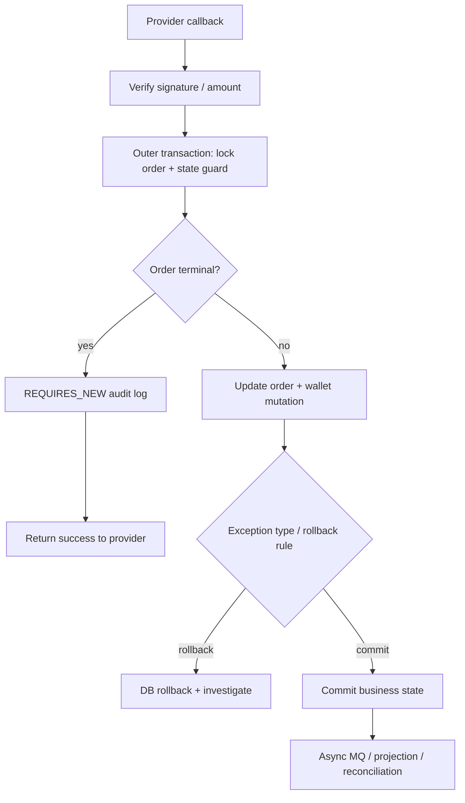

# Backend Learning Log

狀態：weekly checkpoint，不是每日 / 每週流水帳。

用途：記錄每週學習摘要、資料來源、面試題、Production 思考與是否需要回頭補 KB。只保留可支撐面試、production thinking 或 KB 維護判斷的摘要，不保存文章全文、不累積未完成債務。

## 使用規則

- 每週最多新增一個 checkpoint。
- 沒讀完不用補，不回填為學習債務。
- 若主題重複，下一次必須加深 incident、production、trade-off 或 interview depth，不重講基礎。
- 只標註：`已做過`、`參與過`、`分析過`、`可作為目標`、`待驗證`。
- 不改履歷、自傳、三個故事稿；若真的產生好素材，只列為 KB 建議。

## Week 01：Spring Transaction

狀態：已建立第一週內容。

### 本週主題

Spring Transaction：transaction boundary、rollback rule、AOP proxy / self-invocation、DB 成功但外部副作用失敗的風險。

### 為什麼這週學這個

Spring Transaction 是 Senior Java Backend 面試的基本盤，也直接連到 Nick 的主力 cases：

- Provider Integration：callback / query / timeout unknown 不能只靠一個 method transaction 解決。
- Wallet / Bet-Settle：狀態轉移與錢包 mutation 要有明確 transaction boundary。
- MQ / Projection：DB 成功但 MQ publish 失敗是典型 dual-write 風險。
- Legacy Takeover：看舊系統時，要先找 transaction 邊界與非交易副作用。

### 核心概念

- `@Transactional` 通常透過 Spring AOP proxy 套用；同一個物件內部 self-invocation 可能繞過 proxy，導致 transaction advice 沒有生效。
- 預設 rollback 心智：runtime exception / error 常見會 rollback；checked exception 需要明確設定 rollback rule，不能靠感覺。
- transaction boundary 不等於 business flow boundary。一條 payment / wallet flow 可能橫跨 DB、Redis、MQ、external provider，DB transaction 只保護單一資料庫資源。
- transaction 內不要放不可控外部呼叫或長時間操作，否則 lock time、timeout、重試副作用都會變難處理。
- DB commit 成功後，MQ / callback / external notification 失敗，不能靠同一個 local transaction 自動解決；需要 outbox、補償、重試或 reconciliation 思考。

### Production 情境

在 payment callback 中，常見流程是：

```text
callback received
-> verify signature / amount / order
-> check current order state
-> update order success
-> trigger wallet / MQ / projection / notify
```

transaction 只應該保護「狀態檢查 + 狀態更新」這段核心 DB mutation。外部通知或 MQ publish 若放在同一個思考框架裡，就會出現 DB 成功但外部副作用失敗的 failure window。

### 常見錯誤

- 以為 method 標 `@Transactional` 就一定有 transaction。
- 忽略 self-invocation。
- catch exception 後吞掉，導致應 rollback 卻 commit。
- 在 transaction 裡呼叫慢外部 API，拉長 lock time。
- 把 MQ publish 當成跟 DB update 同一個 atomic operation。
- 用 transaction 掩蓋 idempotency 設計不足。

### Incident / Troubleshooting

情境：玩家付款成功，但平台訂單仍是 pending。

排查順序：

1. 查 provider callback 是否進來：request log / signature / provider transaction id。
2. 查 order state transition：pending -> success 是否有 DB update。
3. 查 transaction rollback log：是否丟 exception、是否被 catch。
4. 查是否 self-invocation 或 private method 導致 transaction 沒生效。
5. 查 DB commit 成功後的下游副作用：wallet、MQ、projection 是否有缺。
6. 若 DB success / MQ failed，先補 projection 或 outbox / retry，不要直接重跑整個 callback 造成二次副作用。

### Senior 面試怎麼問

1. `@Transactional` 什麼情境會失效？
2. callback handler 裡 DB update 成功，但 MQ publish 失敗，你怎麼處理？
3. 為什麼 transaction boundary 不等於整條 business flow boundary？

### Senior 面試怎麼回答

1. `分析過`：我會先確認 transaction 是否真的經過 Spring proxy，例如 self-invocation、private method、非 Spring bean、異常被 catch 掉，都可能讓預期中的 rollback 沒發生。面試時我不會只說加 annotation，而會先確認 proxy、exception propagation 與 rollback rule。
2. `分析過 / 可作為目標`：DB 成功但 MQ 失敗屬於 dual-write 風險。短期要有補償或人工修復方式，長期可以考慮 outbox pattern，讓 DB update 與 event record 在同一個 transaction 裡提交，再由 relay 發送 MQ。
3. `分析過`：local DB transaction 只能保護 DB mutation，不能保證 external provider、Redis、MQ、callback notification 全部一起 atomic。Senior 要能把 DB transaction、idempotency、retry、compensation、reconciliation 分開講。

### System Design 延伸思考

Trade-off：

- `直接 transaction + publish MQ`：簡單，但 DB success / MQ failed 有風險。
- `transaction + outbox`：增加 table / relay / retry 複雜度，但 failure window 更可控。
- `distributed transaction`：理論上更強，但成本、複雜度與可用性風險通常很高，不是高交易系統的預設答案。
- `補償 / reconciliation`：適合 provider timeout、callback 重送、projection lag 等不可避免的不確定狀態。

### 與我的面試材料如何連結

- Provider Integration Story：補強 callback / timeout / query fallback 的 transaction boundary。
- Wallet / Bet-Settle Story：補強 wallet mutation、bet / settle / rollback 的 state transition。
- Legacy Takeover Story：補強從 code / log / git history 找 transaction 風險的能力。
- 對應 30 題核心：第 11、12、13、15、18 題。
- 可講進自我介紹：只能說「我會從 production flow 角度分析 transaction boundary 與失敗窗口」，不要說「我設計過完整交易平台 transaction architecture」。

### 本週必看

1. [Declarative Transaction Management](https://docs.spring.io/spring-framework/reference/data-access/transaction/declarative.html)
   - 來源：Spring Framework 官方文件。
   - 為什麼值得看：建立 declarative transaction 的正確心智，不只背 `@Transactional`。
   - 對應：payment callback、wallet / bet-settle transaction boundary。

2. [Rolling Back a Declarative Transaction](https://docs.spring.io/spring-framework/reference/data-access/transaction/declarative/rolling-back.html)
   - 來源：Spring Framework 官方文件。
   - 為什麼值得看：釐清 rollback rule，避免面試時把 checked / unchecked exception 講錯。
   - 對應：callback exception、wallet mutation、batch partial failure。

3. [Proxying Mechanisms](https://docs.spring.io/spring-framework/reference/core/aop/proxying.html)
   - 來源：Spring Framework 官方文件。
   - 為什麼值得看：理解 self-invocation 為什麼會繞過 proxy。
   - 對應：Spring transaction 失效、legacy code review、AI code review。

### 本週可執行任務

30 分鐘內完成：

```text
用 90 秒回答：DB transaction 成功，但 MQ publish 失敗怎麼辦？
```

回答骨架：

1. 先說這是 dual-write 風險。
2. 短期如何查與補。
3. 長期如何用 outbox / retry / reconciliation 降低風險。
4. 保守連回自己的經驗：分析過 payment / wallet / MQ flow，不誇大成完整 outbox owner。

### 本週 KB 維護建議

建議新增：

- 暫無。Week 01 先記在本檔，不回填正式 casebook。

建議補強：

- 若之後 QA 發現 transaction 題回答不穩，再回填 `19-interview-coaching-question-bank.md` 的第 18 題回答。

建議暫不處理：

- 不改 `05 / 08 / 17`。
- 不新增 outbox 專文。
- 不重寫 payment / wallet flow。

### 本週不建議做什麼

- 不要延伸學完整 JTA / distributed transaction。
- 不要重構整個 KB。
- 不要把 outbox 寫成已做過。
- 不要追日文。
- 不要開新 side project 來練 transaction。

## Week 02：Propagation / Isolation / Rollback Rule

狀態：已建立第二週內容。

### 本週主題

Spring transaction propagation、isolation 與 rollback rule。這週不重講 `@Transactional` 基礎，而是把 Week 01 的 transaction boundary 往 production failure window 推深一層。

### 為什麼這週學這個

這是 Senior Java Backend 面試最常追問的 transaction 細節，也直接連到 Nick 的主力 cases：

- Provider Integration：callback handler 若吞 exception、rollback rule 設錯，可能讓 order state commit 到錯誤狀態。
- Wallet / Bet-Settle：wallet mutation、bet record、settle / rollback 需要清楚決定哪些操作共用同一個 transaction，哪些只能補償。
- MQ / Projection：event log、audit log 或 outbox 類記錄若用 `REQUIRES_NEW`，要知道它和外層 business transaction 的成功 / 失敗關係。
- Legacy Takeover：讀舊系統時，看到 `REQUIRES_NEW`、`NESTED`、`rollbackFor`、`isolation` 不能只背定義，要能判斷當初是在保 audit、拆 failure window，還是無意中製造不一致。

### 核心概念

- Propagation 決定「內層 method 要加入外層 transaction，還是另開一個 transaction」。
- Isolation 決定同時多筆交易讀寫資料時能看到什麼；它不是越高越好，因為 lock、deadlock、throughput 都會受影響。
- Rollback rule 決定哪些 exception 會讓 transaction rollback；checked exception 預設不一定 rollback，catch 後吞掉更可能讓 transaction commit。
- `REQUIRES_NEW` 不是萬用保險。它會讓內層 transaction 獨立 commit / rollback，也會額外拿 DB connection；高併發下可能造成 connection pool 壓力。
- `NESTED` 偏向同一個 physical transaction 裡的 savepoint / partial rollback，語意和 `REQUIRES_NEW` 不同。

### Beginner-to-Senior 解釋

- Beginner：`@Transactional` 不是「全部成功或全部失敗」魔法；它只保護目前 transaction 內的 DB 操作。
- Mid：最常踩坑是 inner method propagation 沒想清楚、checked exception 沒 rollback、catch exception 後沒有重新丟出、isolation 調高卻不知道 lock 成本。
- Senior：要能把 propagation / isolation / rollback rule 放回 production flow：哪裡是 money correctness，哪裡是 audit / outbox，哪裡需要終態保護，哪裡不能靠 DB transaction 處理 provider timeout、MQ duplicate 或 projection lag。

### 小型 code / pseudo-code 範例

```java
@Service
class PaymentCallbackService {
    @Transactional(rollbackFor = Exception.class)
    public void handleCallback(CallbackRequest req) throws CallbackException {
        Order order = orderRepo.findForUpdate(req.orderId());
        if (order.isTerminal()) {
            auditService.recordDuplicateCallback(req); // 獨立 audit，不重複入帳
            return;
        }

        order.markSuccess(req.providerTxnId());
        orderRepo.save(order);

        // 若這裡丟 checked exception，沒有 rollbackFor 時可能不 rollback。
        walletService.credit(order);
    }
}

@Service
class CallbackAuditService {
    @Transactional(propagation = Propagation.REQUIRES_NEW)
    public void recordDuplicateCallback(CallbackRequest req) {
        auditRepo.insert(req.orderId(), req.providerTxnId(), "DUPLICATE_CALLBACK");
    }
}
```

重點不是照抄 `REQUIRES_NEW`，而是回答：audit 是否真的應該即使外層 rollback 也保留？connection pool 是否承受得住？如果 audit commit 但 business rollback，排查時會不會誤判？

### 架構 / Flow 圖



### Production 情境

Payment callback 的 transaction design 不能只問「要不要加 `@Transactional`」。更好的問法是：

1. order state guard 和 wallet mutation 是否應在同一個 transaction？
2. duplicate callback audit 是否要獨立 commit？
3. checked business exception 是否會 rollback？
4. isolation 是否真的要調高，還是用 row lock / unique constraint / idempotency key 比較清楚？
5. DB commit 後的 MQ / projection failure 是否有 retry、repair 或 reconciliation？

### 常見錯誤

- 以為 `REQUIRES_NEW` 可以解所有一致性問題。
- 在高併發 flow 裡大量使用 `REQUIRES_NEW`，但沒有估 connection pool。
- 把 isolation 調到很高，卻沒有說明 lock / deadlock / throughput 成本。
- 忘記 checked exception 的 rollback rule。
- catch exception 只記 log 不丟出，導致交易 commit。
- 把 audit log、business state、projection 都混在同一個 correctness 等級。

### Incident / Troubleshooting

情境：callback log 顯示成功，但玩家沒有入帳。

排查順序：

1. 查 callback audit log 是否由 `REQUIRES_NEW` 或獨立 transaction 寫入；它成功不代表 business transaction 成功。
2. 查 order state 是否從 pending 轉 success，有沒有 rollback 或 exception log。
3. 查 wallet mutation 是否和 order update 在同一 transaction；若不同，要看 partial success。
4. 查 exception 類型與 rollback rule，特別是 checked exception、catch 後吞掉、或標成 no-rollback 的例外。
5. 查 isolation / lock wait / deadlock，確認是否因 row lock 或 gap lock 造成 timeout。
6. 若 order success 但 projection / MQ 沒到，先補 projection，不要重跑 callback 造成二次入帳。

### 3 個學習重點

1. Propagation 是在切 transaction 邊界，不是背 enum；要先說清楚外層和內層誰可以獨立成功。
2. Isolation 是 correctness 和 throughput 的取捨；money flow 不能只追效能，report / projection 也不一定需要最高一致性。
3. Rollback rule 要和 exception propagation 一起看；catch、checked exception、self-invocation 都可能讓面試官追問。

### Senior 面試怎麼問

1. `REQUIRES_NEW` 和 `NESTED` 差在哪？你會在 payment callback 哪裡用，哪裡不用？
2. Spring transaction 什麼 exception 預設會 rollback？checked exception 要怎麼處理？
3. MySQL `REPEATABLE READ` 和 `READ COMMITTED` 對 wallet / report query 的 trade-off 是什麼？

### Senior 面試怎麼回答

1. `分析過`：`REQUIRES_NEW` 是獨立 transaction，適合非常明確要和外層成功 / 失敗切開的紀錄，例如某些 audit；但它會多拿 connection，也可能讓 audit 成功、business rollback。`NESTED` 比較像同一個 physical transaction 裡用 savepoint 做局部 rollback，不能把兩者混成一樣。
2. `分析過`：Spring 預設常見是 runtime exception / error rollback，checked exception 需要明確設定 `rollbackFor`。我會同時檢查 exception 是否被 catch 掉、是否有 no-rollback rule、以及 method 是否真的經過 proxy。
3. `分析過 / 待驗證`：money correctness 的核心 mutation 通常要明確狀態機、row lock 或 unique constraint 保護；報表 / projection 查詢可能接受較鬆一致性。MySQL 預設 `REPEATABLE READ` 提供較強一致性，但 lock 行為和 gap lock 需要理解；`READ COMMITTED` 可降低部分 lock 壓力，但要接受每次讀到新 snapshot 和 phantom 類問題。

### System Design 延伸思考

這週的 trade-off 是「transaction 切小」和「狀態一致」之間的平衡：

- 切太大：lock time 長、外部呼叫拖住 DB、deadlock / timeout 風險高。
- 切太小：partial commit、audit / business state 不一致、補償成本高。
- isolation 太高：一致性較強，但吞吐與 lock 成本上升。
- isolation 太低：效能較好，但要用 idempotency、unique key、狀態機與 reconciliation 補強。

### 與我的面試材料如何連結

- 對應 Story：Provider Integration、Wallet / Bet-Settle、Legacy Takeover。
- 對應 Flow：`payment-provider-callback`、`payment-order-provider-request`、`slot-bet-settle-rollback`、`transfer-wallet-money-in-out`。
- 對應 30 題核心：第 11 題 DB transaction / MQ 失敗、第 13 題 callback idempotency、第 18 題 Spring transaction 失效。
- 補強弱點：把「會用 transaction」升級成「會切 transaction boundary、rollback rule、isolation trade-off」。
- 軟實力面向：Risk Communication / Decision Making，能向 PM 或 QA 說明為什麼某些錯誤不能直接重跑 callback。
- AI-Assisted Engineering：AI 產生的 transaction code 必須 review rollback rule、catch block、`REQUIRES_NEW` 濫用、connection pool、idempotency 與 transaction 內外部呼叫。
- 自我介紹：不建議硬塞；若被問 transaction，可保守說「我會從 production flow 的 transaction boundary、rollback rule 與 failure window 分析風險」。

### 本週必看

1. [Transaction Propagation](https://docs.spring.io/spring-framework/reference/data-access/transaction/declarative/tx-propagation.html)
   - 來源：Spring Framework 官方文件。
   - 為什麼值得看：釐清 `REQUIRED`、`REQUIRES_NEW`、`NESTED` 的語意與資源成本。
   - 對應：callback audit、wallet mutation、legacy transaction review。

2. [Rolling Back a Declarative Transaction](https://docs.spring.io/spring-framework/reference/data-access/transaction/declarative/rolling-back.html)
   - 來源：Spring Framework 官方文件。
   - 為什麼值得看：釐清 checked exception、rollback rule 與 pattern rule 風險。
   - 對應：callback exception、wallet mutation、batch partial failure。

3. [MySQL InnoDB Transaction Isolation Levels](https://dev.mysql.com/doc/refman/8.4/en/innodb-transaction-isolation-levels.html)
   - 來源：MySQL 8.4 官方文件。
   - 為什麼值得看：理解 `REPEATABLE READ` / `READ COMMITTED` 的 snapshot、locking 與 phantom trade-off。
   - 對應：wallet / bet-settle consistency、report query、high-traffic table。

### 本週可執行任務

30 分鐘內完成：

```text
用 90 秒回答：payment callback 裡哪些東西應該跟 order state 同 transaction，哪些東西應該拆出去？
```

回答骨架：

1. order state guard + 核心 money mutation 要放在一致性邊界內。
2. audit / duplicate callback log 是否拆出去，要明確說明原因與副作用。
3. 外部 provider / MQ / projection 不能假設和 DB transaction atomic。
4. 補一句 rollback rule：checked exception、catch block、`REQUIRES_NEW` 都要 review。

### 本週 KB 維護建議

建議新增：

- 暫無。Week 02 先記在本檔，不回填正式 casebook。

建議補強：

- 若之後 Nick 練第 18 題答不穩，再把「Propagation / Isolation / Rollback Rule」摘要回填到 `19-interview-coaching-question-bank.md`，但本輪不改 19。

建議暫不處理：

- 不改 `04 / 05 / 08 / 17`。
- 不新增 distributed transaction / JTA 專文。
- 不重寫 payment / wallet flow。

### 本週不建議做什麼

- 不要把 isolation level 全部背成考古題。
- 不要為了練 `REQUIRES_NEW` 開 side project。
- 不要把 audit log 成功誤講成 business flow 成功。
- 不要把本週內容寫進履歷。
- 不要延伸到完整 Saga / Outbox；那是後面週次。

### 本週 explicit non-goal

本週不學完整 distributed transaction、JTA、XA、Saga 或 Outbox；只把 Spring local transaction 的 propagation、isolation、rollback rule 講到能支撐 payment / wallet / MQ 面試追問。
