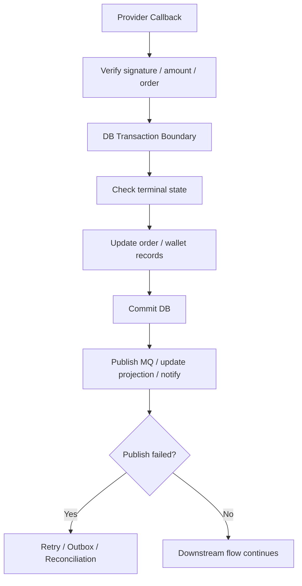
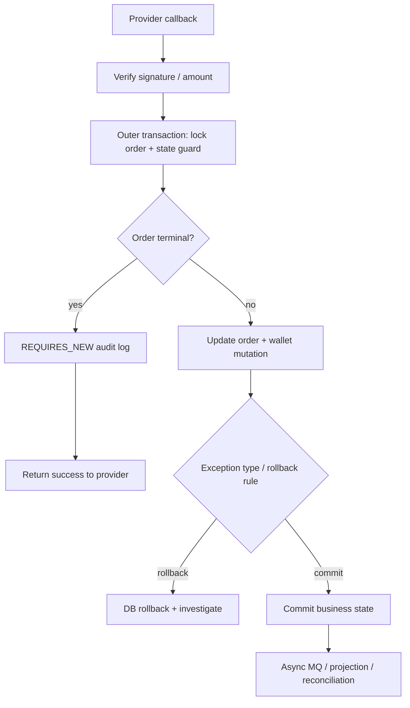

# Backend Learning Log

狀態：weekly checkpoint，不是每日 / 每週流水帳。

用途：記錄每週學習摘要、資料來源、面試題、Production 思考與是否需要回頭補 KB。只保留可支撐面試、production thinking 或 KB 維護判斷的摘要，不保存文章全文、不累積未完成債務。

## 使用規則

- 每週最多新增一個 checkpoint。
- 沒讀完不用補，不回填為學習債務。
- 若主題重複，下一次必須加深 incident、production、trade-off 或 interview depth，不重講基礎。
- 只標註：`已做過`、`參與過`、`分析過`、`可作為目標`、`待驗證`。
- 不改履歷、自傳、三個故事稿；若真的產生好素材，只列為 KB 建議。

## Week 01：Spring Transaction

狀態：已用封版 `Weekly Senior Backend Capability Builder` 格式重跑。

### 本週主題

Spring Transaction：local DB transaction boundary、rollback rule、AOP proxy、business flow boundary 與 cross-system failure window。

### Weekly Mode

Concept Mode + Trade-off Mode。

理由：Week 01 是基礎心智建立週。重點不是背 `@Transactional`，而是建立 Senior Backend 看 transaction 的方式：它保護什麼、不保護什麼、哪些 production failure 不能靠 local transaction 解。

### 為什麼這週學這個

Spring Transaction 是 Senior Java Backend 面試基本盤，也直接連到 Nick 的主力 cases：

- Provider Integration：callback / query / timeout unknown 不能只靠一個 local DB transaction 解決。
- Wallet / Bet-Settle：wallet mutation、bet / settle / rollback 需要明確 state transition 與 transaction boundary。
- MQ / Projection：DB commit 成功但 MQ publish 失敗是典型 dual-write failure window。
- Legacy Takeover：讀舊系統時，要先辨識 transaction boundary、proxy 是否生效、外部副作用是否在 transaction 內。

### 核心概念

控制在 10-15 分鐘可讀完：

- `@Transactional` 是宣告式 transaction 管理，Spring 會透過 transaction interceptor / AOP proxy 在 method 前後處理 begin、commit、rollback。
- 預設 rollback 心智：runtime exception / error 會觸發 rollback；checked exception 通常要明確設定 `rollbackFor`，不能靠感覺。
- transaction boundary 不等於 business flow boundary。一條 payment / wallet / MQ flow 可能橫跨 DB、Redis、MQ、external provider；local transaction 只保護 local resource。
- transaction 內不要放慢外部 API、不可控 provider call 或長時間工作，否則會拉長 lock time、增加 timeout 與重試副作用。
- DB commit 成功後，MQ publish、callback notification、projection update 失敗，不能靠同一個 local transaction 自動回滾；要靠 retry、outbox、compensation 或 reconciliation 收斂。

### Beginner-to-Senior 解釋

Beginner：

`@Transactional` 讓 Spring 幫你管理資料庫 transaction，讓一段 DB 操作要嘛 commit，要嘛 rollback。

Mid：

常見坑不是「忘記加 annotation」而已，而是：

- method 沒有經過 Spring proxy。
- exception 被 catch 掉，沒有往外拋。
- checked exception 沒有設定 rollback rule。
- transaction scope 太大，把外部 API 或慢操作包進去。

Senior：

要能分清楚三件事：

- Local DB transaction：保護單一資料庫內的 mutation。
- Business flow：可能橫跨 provider、MQ、Redis、wallet、projection。
- Failure recovery：跨系統不一致時靠 idempotency、retry、outbox、compensation、reconciliation，而不是幻想一個 annotation 解掉全部問題。

### 小型 code / pseudo-code 範例

```java
@Service
class PaymentCallbackHandler {

    private final PaymentStateService paymentStateService;
    private final EventPublisher eventPublisher;

    PaymentCallbackHandler(PaymentStateService paymentStateService,
                           EventPublisher eventPublisher) {
        this.paymentStateService = paymentStateService;
        this.eventPublisher = eventPublisher;
    }

    public void handleCallback(Callback callback) throws CallbackException {
        paymentStateService.markOrderPaid(callback);

        // This is outside the DB transaction boundary.
        // If publish fails after DB commit, use retry / outbox / reconciliation.
        eventPublisher.publishPaymentPaid(callback.orderId());
    }
}

@Service
class PaymentStateService {

    private final OrderRepo orderRepo;
    private final WalletService walletService;

    PaymentStateService(OrderRepo orderRepo, WalletService walletService) {
        this.orderRepo = orderRepo;
        this.walletService = walletService;
    }

    @Transactional(rollbackFor = Exception.class)
    public void markOrderPaid(Callback callback) throws CallbackException {
        Order order = orderRepo.findByOrderIdForUpdate(callback.orderId());

        if (order.isTerminal()) {
            return; // idempotency guard: do not credit wallet twice
        }

        order.markPaid(callback.providerTxnId());
        orderRepo.save(order);
        walletService.credit(order); // local DB work if same transaction boundary
    }
}
```

重點：`markOrderPaid` 要經過 Spring bean proxy 才能套用 transaction；DB mutation 和 `publishPaymentPaid` 的 external side effect 要分開思考。若需要更可靠地保證 event 不遺失，才考慮 outbox pattern。

### 架構 / Flow 圖



### Production 情境

以 payment callback 為例：

```text
callback received
-> verify signature / amount / order
-> check terminal state
-> update order / wallet transaction in DB transaction
-> commit
-> publish event / projection / notification
```

Senior 觀點：transaction 只保護「狀態檢查 + 狀態更新」這段核心 DB mutation。MQ / projection / notify 是 transaction 外的副作用。若 DB 成功但 MQ 失敗，交易資料不能隨便 rollback；應該補 event、補 projection 或跑 reconciliation。

### Known Production Case Lens

- verified from Nick's documented experience：Nick 的面試材料主軸包含 Provider Integration、Wallet / Bet-Settle、MQ / Projection、Legacy Takeover。
- inferred from general engineering practice：payment callback / wallet flow 常見風險是 DB 狀態已更新，但 MQ / projection / notify 沒成功。
- verified from Nick's documented experience：Nick 目前定位是能分析 production flow / failure window，不把自己包裝成完整 payment architect。
- speculative ideas for future improvement：Outbox 是可作為目標的 pattern，不應講成已完整導入或 owner。

### 常見錯誤

- 以為 method 標 `@Transactional` 就一定有 transaction。
- 以為 transaction 可以包住 DB + MQ + provider call 的所有一致性。
- catch exception 後吞掉，導致應 rollback 的 DB mutation 反而 commit。
- 在 transaction 裡呼叫慢外部 API，拉長 lock time。
- 把 MQ publish 當成和 DB update 同一個 atomic operation。
- 用 transaction 掩蓋 idempotency 設計不足。

### Incident / Troubleshooting

情境：玩家付款成功，但平台訂單仍是 pending。

排查順序：

1. 查 callback 是否進來：request log、signature result、provider transaction id。
2. 查 order state：目前是 pending、success、failed，最後更新時間是什麼。
3. 查 DB mutation 是否 commit：order / wallet transaction / bet record 是否一致。
4. 查 exception path：是否丟出 exception、是否被 catch、rollback rule 是否符合預期。
5. 查 transaction 外副作用：MQ event、projection、notification 是否缺失。
6. 若 DB success / MQ failed，優先補 event / projection 或跑 reconciliation，不要直接重跑整個 callback 造成二次入帳。

### Observability Anchor

- 1 useful log：`orderId`, `providerTxnId`, `currentStatus`, `targetStatus`, `transactionStep`, `exceptionClass`。
- 1 useful metric：`payment_callback_db_update_fail_total` 或 `payment_event_publish_fail_total`。
- 1 useful trace/span：`callback.verify -> order.update.transaction -> event.publish`。
- 1 alert condition：callback success rate 突然下降，或 DB success 但 event publish failure 持續增加。
- 1 thing that should not alert：單筆 duplicate callback 被 terminal-state guard 擋下，這是正常 idempotency 行為。

### Senior 面試怎麼問

1. `@Transactional` 什麼情境會失效？
2. callback handler 裡 DB update 成功，但 MQ publish 失敗，你怎麼處理？
3. 為什麼 transaction boundary 不等於整條 business flow boundary？

### Senior 面試怎麼回答

1. `分析過`：我會先確認 transaction 是否真的經過 Spring proxy，例如 self-invocation、private method、非 Spring bean、exception 被 catch 掉，都可能讓預期中的 rollback 沒發生。面試時我不會只說加 annotation，而會確認 proxy、exception propagation 與 rollback rule。
2. `分析過 / 可作為目標`：DB 成功但 MQ 失敗是 dual-write 風險。短期要能觀測與補償，例如補 event、補 projection 或人工修復；長期可考慮 outbox，讓 DB mutation 與 event record 在同一個 transaction 裡提交，再由 relay 發送 MQ。
3. `分析過`：local DB transaction 只能保護 DB mutation，不能保證 external provider、Redis、MQ、callback notification 全部 atomic。Senior 要把 DB transaction、idempotency、retry、compensation、reconciliation 分開講。

### System Design 延伸思考

Trade-off：

- `直接 transaction + publish MQ`：簡單，但 DB success / MQ failed 有風險。
- `transaction + outbox`：增加 table / relay / retry 複雜度，但 failure window 更可控。
- `distributed transaction`：理論上更強，但成本、複雜度與可用性風險通常很高，不是高交易系統的預設答案。
- `補償 / reconciliation`：適合 provider timeout、callback 重送、projection lag 等不可避免的不確定狀態。

### Mini ADR

- Context：payment / wallet 類 flow 需要保護核心 DB state transition，但同時又要觸發 MQ / projection / notification。
- Decision：local transaction 只包核心 DB mutation；transaction 外副作用要用 retry、outbox、compensation 或 reconciliation 收斂。
- Alternatives：把外部 call 放 transaction 內、使用 distributed transaction、或只靠人工補資料。
- Consequences：系統要接受 eventual consistency，並補足 idempotency、observability 與 repair path。
- When this decision becomes wrong：如果法規或業務要求跨資源強一致，或事件遺失成本極高且無法補償，就要重新評估 outbox / stronger consistency mechanism。

### Technology Landscape

- Related technologies：Spring declarative transaction、programmatic transaction、JPA transaction、Outbox Pattern、Saga、distributed transaction / XA。
- Current industry mainstream：Java backend 多數以 local transaction + idempotency + retry / compensation / reconciliation 處理高交易系統，不會預設使用 distributed transaction。
- When each technology is a better fit：
  - Spring local transaction：單服務 / 單 DB mutation。
  - Outbox：DB commit 後必須可靠送出 event。
  - Saga / compensation：跨多服務長流程，需要可補償步驟。
  - XA / distributed transaction：強一致需求非常高，但成本與可用性可接受。
- Learn Now：Spring transaction boundary、rollback rule、proxy 心智。
- Learn Later：Outbox / Saga 的實作細節。
- Awareness Only：XA / JTA 深層配置與 transaction manager internals。
- Why：目前 Senior Backend 面試最常問的是 boundary、failure window 與補償思路，不是 transaction manager 原始碼。

### Knowledge Boundary

- Must Understand：
  - `@Transactional` 只保護 local transaction boundary。因為 production flow 常跨 DB / MQ / provider。
  - rollback rule 與 exception propagation。因為 exception 被吞掉會讓資料 commit。
  - DB success / MQ failed 是 dual-write 風險。因為這是 payment / projection 常見追問。
- Should Understand：
  - self-invocation / proxy limitation。因為 Week 03 會深入，但 Week 01 要先知道風險存在。
  - Outbox / compensation / reconciliation 的用途。因為這是跨系統 failure recovery 的語言。
- Can Ignore For Now：
  - Spring transaction manager 原始碼。因為面試與 production 排查先看 boundary、log、state。
  - JTA / XA 詳細配置。因為目前不是主線，且容易過度準備。

### One Common Misconception

- Misconception：`@Transactional` 可以保證整條 payment / wallet flow 一致。
- Correction：它只能保證 local transaction 內的 resource，一旦牽涉 MQ、Redis、external provider、notification，就超出 local transaction boundary。
- Why it matters in production / interview：Senior 面試官會追問 timeout、callback 重送、DB success / MQ failed；如果把 transaction 當魔法，會被打穿。

### Future Direction

只有有意義時才放：

- Senior Backend：current priority。能在 code review / incident 中找出 transaction boundary 與外部副作用。
- Platform Backend：future-only topic。Outbox / inbox / event relay 設計會變重要，但不需要 Week 01 全部學完。
- Architect：future-only topic。跨服務 consistency strategy、Saga、distributed transaction trade-off 會變重要，但目前只需知道取捨語言。

### 與我的面試材料如何連結

- Provider Integration Story：補強 callback / timeout / query fallback 的 transaction boundary。
- Wallet / Bet-Settle Story：補強 wallet mutation、bet / settle / rollback 的 state transition。
- Legacy Takeover Story：補強從 code / log / git history 找 transaction 風險的能力。
- 對應 30 題核心：第 11、12、13、15、18 題。
- 可講進自我介紹：只能說「我會從 production flow 角度分析 transaction boundary 與失敗窗口」，不要說「我設計過完整交易平台 transaction architecture」。

### 本週必看

1. [Declarative Transaction Management](https://docs.spring.io/spring-framework/reference/data-access/transaction/declarative.html)
   - 來源：Spring Framework 官方文件。
   - 為什麼值得看：建立 declarative transaction 的正確心智，不只背 `@Transactional`。
   - 對應：payment callback、wallet / bet-settle transaction boundary。

2. [Rolling Back a Declarative Transaction](https://docs.spring.io/spring-framework/reference/data-access/transaction/declarative/rolling-back.html)
   - 來源：Spring Framework 官方文件。
   - 為什麼值得看：釐清 rollback rule，避免面試時把 checked / unchecked exception 講錯。
   - 對應：callback exception、wallet mutation、batch partial failure。

### 本週可執行任務

30 分鐘內完成：

```text
用 90 秒回答：DB transaction 成功，但 MQ publish 失敗怎麼辦？
```

回答骨架：

1. 先說這是 dual-write 風險。
2. 短期如何查與補。
3. 長期如何用 outbox / retry / reconciliation 降低風險。
4. 保守連回自己的經驗：分析過 payment / wallet / MQ flow，不誇大成完整 outbox owner。

### Learning Check

學完本週 packet 後，Nick 應該能：

1. 用 60 秒說明：`@Transactional` 保護 local DB transaction，但不等於整條 business flow atomic。
2. 說出 1 個 production failure mode：DB commit 成功，但 MQ publish 失敗，導致 projection 沒更新。
3. 回答 1 題 Senior interview question：DB success / MQ failed 怎麼處理。
4. 判斷什麼時候不該用這個 approach：不要用 local transaction 去包慢 provider call 或幻想它能解 distributed consistency。

### 本週 KB 維護建議

建議新增：

- 暫無。Week 01 先記在本檔，不回填正式 casebook。

建議補強：

- 若之後 QA 發現 transaction 題回答不穩，再回填 `19-interview-coaching-question-bank.md` 的第 18 題回答。

建議暫不處理：

- 不改 `05 / 08 / 17`。
- 不新增 outbox 專文。
- 不重寫 payment / wallet flow。

### 本週不建議做什麼

- 不要延伸學完整 JTA / distributed transaction。
- 不要重構整個 KB。
- 不要把 outbox 寫成已做過。
- 不要追日文。
- 不要開新 side project 來練 transaction。
- 不要因為 Week 01 學 transaction，就把所有 consistency pattern 都塞進本週。

## Week 02：Propagation / Isolation / Rollback Rule

狀態：已用封版 `Weekly Senior Backend Capability Builder` 格式重跑。

### 本週主題

Spring transaction propagation、isolation、rollback rule：從「transaction 有沒有生效」推進到「transaction 邊界怎麼切、rollback 何時發生、isolation 成本怎麼判斷」。

### Weekly Mode

Trade-off Mode + Troubleshooting Mode。

理由：Week 02 不該變成背 enum。這週重點是判斷：哪些操作要在同一個 transaction、哪些要拆出去、哪些錯誤會 rollback、哪些 isolation 選擇會換來 lock / deadlock / throughput 成本。

### 為什麼這週學這個

這是 Senior Java Backend 面試很常追問的 transaction 第二層，也直接連到 Nick 的 production cases：

- Provider Integration：callback handler 若吞 exception、rollback rule 設錯，可能讓 order state commit 到錯誤狀態。
- Wallet / Bet-Settle：wallet mutation、bet record、settle / rollback 需要清楚決定哪些操作共用同一個 transaction，哪些只能補償。
- MQ / Projection：audit log、event log 或 outbox 類記錄如果獨立 commit，要知道它和 business transaction 的成功 / 失敗關係。
- Legacy Takeover：讀舊系統時看到 `REQUIRES_NEW`、`NESTED`、`rollbackFor`、`isolation`，要能判斷它是在拆風險，還是在製造不一致。

### 核心概念

控制在 10-15 分鐘可讀完：

- Propagation 決定「內層 method 要加入外層 transaction，還是另開一個 transaction」。
- Isolation 決定 concurrent transaction 互相能看到什麼；它不是越高越好，因為 lock、deadlock、throughput 都會受影響。
- Rollback rule 決定哪些 exception 會讓 transaction rollback；runtime exception / error 是常見預設心智，checked exception 通常要明確設定 `rollbackFor`。
- `REQUIRES_NEW` 會讓內層 transaction 獨立 commit / rollback，也會多拿 DB connection；它不是「更安全」的同義詞。
- `NESTED` 比較像同一個 physical transaction 裡用 savepoint 做 partial rollback，語意和 `REQUIRES_NEW` 不同。
- catch exception 後只記 log 不往外丟，是 production 事故裡很常見的 rollback 失效原因。

### Beginner-to-Senior 解釋

Beginner：

Propagation、isolation、rollback rule 是 `@Transactional` 的重要參數。它們決定 transaction 怎麼加入、資料怎麼隔離、什麼 exception 會 rollback。

Mid：

常見坑不是不會背定義，而是：

- `REQUIRES_NEW` 用太多造成 connection pool 壓力。
- audit log 獨立 commit，卻被誤解成 business transaction 成功。
- checked exception 沒設 `rollbackFor`，資料意外 commit。
- catch exception 後只記 log，rollback 根本沒發生。
- isolation 調高，但沒有估 lock wait / deadlock 成本。

Senior：

要把這些參數放回 production flow。Payment callback、wallet mutation、bet-settle rollback 這類流程，核心不是「用哪個 enum」，而是回答：

- 這段資料是否必須一起成功或一起失敗？
- 哪些紀錄可以獨立保存，例如 audit？
- 哪些異常會讓錢或訂單狀態錯掉？
- 哪些不一致不能靠 DB transaction 解，只能靠 idempotency、compensation 或 reconciliation 收斂？

### 小型 code / pseudo-code 範例

```java
@Service
class PaymentCallbackService {

    private final OrderRepo orderRepo;
    private final WalletService walletService;
    private final CallbackAuditService auditService;

    PaymentCallbackService(OrderRepo orderRepo,
                           WalletService walletService,
                           CallbackAuditService auditService) {
        this.orderRepo = orderRepo;
        this.walletService = walletService;
        this.auditService = auditService;
    }

    @Transactional(rollbackFor = Exception.class)
    public void handleCallback(CallbackRequest req) throws CallbackException {
        Order order = orderRepo.findForUpdate(req.orderId());

        if (order.isTerminal()) {
            auditService.recordDuplicateCallback(req);
            return;
        }

        order.markSuccess(req.providerTxnId());
        orderRepo.save(order);
        walletService.credit(order);
    }
}

@Service
class CallbackAuditService {

    private final AuditRepo auditRepo;

    CallbackAuditService(AuditRepo auditRepo) {
        this.auditRepo = auditRepo;
    }

    @Transactional(propagation = Propagation.REQUIRES_NEW)
    public void recordDuplicateCallback(CallbackRequest req) {
        auditRepo.insert(req.orderId(), req.providerTxnId(), "DUPLICATE_CALLBACK");
    }
}
```

重點不是照抄 `REQUIRES_NEW`，而是回答三件事：

1. duplicate callback audit 是否真的應該獨立保存？
2. audit commit 但 business transaction rollback 時，排查者會不會誤判？
3. 高併發 callback 下，額外 transaction 會不會造成 connection pool 壓力？

### 架構 / Flow 圖



### Production 情境

Payment callback 的 transaction design 不能只問「要不要加 `@Transactional`」。比較 Senior 的問法是：

1. order state guard 和 wallet mutation 是否應在同一個 transaction？
2. duplicate callback audit 要不要獨立 commit？
3. checked exception、business exception、provider exception 哪些要 rollback？
4. isolation 是真的要調高，還是用 row lock、unique constraint、idempotency key 比較清楚？
5. DB commit 後的 MQ / projection failure 是否有 retry、repair 或 reconciliation path？

### Known Production Case Lens

- verified from Nick's documented experience：Nick 的主力材料包含 Provider Integration、Wallet / Bet-Settle、MQ / Projection、Legacy Takeover。
- inferred from general engineering practice：payment callback / wallet flow 常見問題是 audit 成功、business mutation 失敗，或 DB 成功但 projection 沒更新。
- inferred from general engineering practice：`REQUIRES_NEW` 可以保留 audit，但會增加 connection 使用與 partial success 解讀成本。
- verified from Nick's documented experience：Nick 要保守講「分析過 transaction boundary / failure window」，不要講成完整 transaction architecture owner。
- speculative ideas for future improvement：Outbox / stronger consistency mechanism 是 future improvement，不是目前已導入成果。

### 常見錯誤

- 以為 `REQUIRES_NEW` 可以解所有一致性問題。
- 在高併發 flow 裡大量使用 `REQUIRES_NEW`，但沒有估 connection pool。
- 把 isolation 調到很高，卻沒有說明 lock / deadlock / throughput 成本。
- 忘記 checked exception 的 rollback rule。
- catch exception 只記 log 不丟出，導致交易 commit。
- 把 audit log、business state、projection 都混在同一個 correctness 等級。

### Incident / Troubleshooting

情境：callback log 顯示成功，但玩家沒有入帳。

排查順序：

1. 查 callback audit log 是否由 `REQUIRES_NEW` 或獨立 transaction 寫入；它成功不代表 business transaction 成功。
2. 查 order state 是否從 pending 轉 success，有沒有 rollback 或 exception log。
3. 查 wallet mutation 是否和 order update 在同一 transaction；若不同，要看 partial success。
4. 查 exception 類型與 rollback rule，特別是 checked exception、catch 後吞掉、或標成 no-rollback 的例外。
5. 查 isolation / lock wait / deadlock，確認是否因 row lock 或 gap lock 造成 timeout。
6. 若 order success 但 projection / MQ 沒到，先補 projection，不要重跑 callback 造成二次入帳。

### Observability Anchor

- 1 useful log：`orderId`, `providerTxnId`, `outerTx`, `innerTx`, `propagation`, `exceptionClass`, `rollbackDecision`。
- 1 useful metric：`callback_business_rollback_total`、`callback_audit_requires_new_total` 或 `db_connection_pool_wait_seconds`。
- 1 useful trace/span：`callback.handle -> order.lock -> wallet.credit -> audit.record_requires_new`。
- 1 alert condition：callback DB rollback rate 上升，或 connection pool wait time / active connection 長時間偏高。
- 1 thing that should not alert：duplicate callback 被 terminal-state guard 擋下並記 audit，若比例正常，這是預期 idempotency 行為。

### 3 個學習重點

1. Propagation 是在切 transaction 邊界，不是背 enum；要先說清楚外層和內層誰可以獨立成功。
2. Isolation 是 correctness 和 throughput 的取捨；money flow 不能只追效能，report / projection 也不一定需要最高一致性。
3. Rollback rule 要和 exception propagation 一起看；catch、checked exception、self-invocation 都可能讓面試官追問。

### Senior 面試怎麼問

1. `REQUIRES_NEW` 和 `NESTED` 差在哪？你會在 payment callback 哪裡用，哪裡不用？
2. Spring transaction 什麼 exception 預設會 rollback？checked exception 要怎麼處理？
3. MySQL `REPEATABLE READ` 和 `READ COMMITTED` 對 wallet / report query 的 trade-off 是什麼？

### Senior 面試怎麼回答

1. `分析過`：`REQUIRES_NEW` 是獨立 transaction，適合非常明確要和外層成功 / 失敗切開的紀錄，例如某些 audit；但它會多拿 connection，也可能讓 audit 成功、business rollback。`NESTED` 比較像同一個 physical transaction 裡用 savepoint 做局部 rollback，不能把兩者混成一樣。
2. `分析過`：Spring 預設常見是 runtime exception / error rollback，checked exception 需要明確設定 `rollbackFor`。我會同時檢查 exception 是否被 catch 掉、是否有 no-rollback rule、以及 method 是否真的經過 proxy。
3. `分析過 / 待驗證`：money correctness 的核心 mutation 通常要明確狀態機、row lock 或 unique constraint 保護；報表 / projection 查詢可能接受較鬆一致性。Isolation level 不是越高越好，要看讀寫衝突、lock cost、deadlock risk 與 business correctness。

### System Design 延伸思考

這週的 trade-off 是「transaction 切小」和「狀態一致」之間的平衡：

- 切太大：lock time 長、外部呼叫拖住 DB、deadlock / timeout 風險高。
- 切太小：partial commit、audit / business state 不一致、補償成本高。
- isolation 太高：一致性較強，但吞吐與 lock 成本上升。
- isolation 太低：效能較好，但要用 idempotency、unique key、狀態機與 reconciliation 補強。

### Mini ADR

- Context：callback / wallet 類 flow 需要同時保護核心 business state，又希望保留 audit / duplicate request 記錄。
- Decision：核心 money mutation 優先放在同一個 local transaction；audit 是否使用 `REQUIRES_NEW` 必須逐 case 判斷，不能當預設。
- Alternatives：全部放同一 transaction、audit 永遠 `REQUIRES_NEW`、只記 log 不寫 DB、或把 event / audit 改成 outbox。
- Consequences：拆 transaction 可保留更多排查資訊，但會引入 partial success 解讀成本與 connection pool 壓力。
- When this decision becomes wrong：如果 audit volume 很高、connection pool 已經吃緊、或 audit 成功會讓營運誤判 business 成功，就要改設計。

### Technology Landscape

- Related technologies：Spring propagation、rollback rule、database isolation level、row lock、optimistic lock、pessimistic lock、unique constraint、outbox。
- Current industry mainstream：核心交易多用 local transaction + row lock / unique constraint / idempotency；跨系統狀態再用 retry / compensation / reconciliation，不會預設靠 distributed transaction。
- When each technology is a better fit：
  - `REQUIRED`：大多數 service method 預設，適合同一段 business mutation。
  - `REQUIRES_NEW`：適合確定要和外層成功 / 失敗切開的 audit 或 outbox-like 記錄，但要估資源成本。
  - `NESTED`：適合同一 transaction 中希望局部 rollback 的場景，但依資料庫與 transaction manager 支援而定。
  - Higher isolation：適合讀寫衝突造成 correctness 風險很高的場景，但要承擔 lock / throughput 成本。
  - Unique constraint / idempotency key：適合防 duplicate callback、duplicate settle、duplicate rollback。
- Learn Now：`REQUIRED`、`REQUIRES_NEW`、rollback rule、catch exception 的風險。
- Learn Later：isolation level 的細節、lock wait / deadlock analysis、outbox implementation。
- Awareness Only：完整 JTA / XA、transaction manager internals。
- Why：現階段面試最需要你能判斷 transaction 邊界與 production failure，不是背所有 propagation enum。

### Knowledge Boundary

- Must Understand：
  - `REQUIRED` vs `REQUIRES_NEW`。因為這直接影響 business state 和 audit 是否一起 commit。
  - checked exception / `rollbackFor` / catch block。因為這是資料意外 commit 的常見原因。
  - isolation 有成本。因為高交易系統要在 correctness 和 throughput 間取捨。
- Should Understand：
  - `NESTED` / savepoint 心智。因為面試可能追問，但實務使用要看支援情況。
  - row lock、unique constraint、idempotency key 如何配合 transaction。因為 wallet / callback 不只靠 isolation。
  - connection pool 壓力。因為 `REQUIRES_NEW` 會額外拿 connection。
- Can Ignore For Now：
  - 所有 propagation enum 的冷門細節。因為 Week 02 目標是能用於 production 判斷。
  - JTA / XA 設定。因為目前不是求職主線，容易過度準備。
  - InnoDB MVCC 原始碼。因為先能排查 lock wait / deadlock 與 query behavior 即可。

### One Common Misconception

- Misconception：`REQUIRES_NEW` 比 `REQUIRED` 更安全。
- Correction：它只是把 inner transaction 獨立出來，不代表更安全；它可能造成 partial commit、connection pool 壓力、排查誤判。
- Why it matters in production / interview：面試官常用 audit log、outbox、callback duplicate 追問。如果只說「用 `REQUIRES_NEW` 保證記錄成功」，但講不出副作用，就不像 Senior。

### Future Direction

只有有意義時才放：

- Senior Backend：current priority。能判斷 transaction propagation、rollback rule、isolation trade-off 是面試和 code review 基本盤。
- Platform Backend：future-only topic。Outbox / inbox、event relay、cross-service consistency 會更重要，但 Week 02 不需要完整實作。
- Architect：future-only topic。跨服務 consistency strategy、distributed transaction trade-off、event governance 是未來責任，不是現在要全部塞進本週。

### 與我的面試材料如何連結

- 對應 Story：Provider Integration、Wallet / Bet-Settle、Legacy Takeover。
- 對應 Flow：`payment-provider-callback`、`payment-order-provider-request`、`slot-bet-settle-rollback`、`transfer-wallet-money-in-out`。
- 對應 30 題核心：第 11 題 DB transaction / MQ 失敗、第 13 題 callback idempotency、第 18 題 Spring transaction 失效。
- 補強弱點：把「會用 transaction」升級成「會切 transaction boundary、rollback rule、isolation trade-off」。
- 軟實力面向：Risk Communication / Decision Making，能向 PM 或 QA 說明為什麼某些錯誤不能直接重跑 callback。
- AI-Assisted Engineering：AI 產生的 transaction code 必須 review rollback rule、catch block、`REQUIRES_NEW` 濫用、connection pool、idempotency 與 transaction 內外部呼叫。
- 自我介紹：不建議硬塞；若被問 transaction，可保守說「我會從 production flow 的 transaction boundary、rollback rule 與 failure window 分析風險」。

### 本週必看

1. [Transaction Propagation](https://docs.spring.io/spring-framework/reference/data-access/transaction/declarative/tx-propagation.html)
   - 來源：Spring Framework 官方文件。
   - 為什麼值得看：釐清 `REQUIRED`、`REQUIRES_NEW`、`NESTED` 的語意與資源成本。
   - 對應：callback audit、wallet mutation、legacy transaction review。

2. [Rolling Back a Declarative Transaction](https://docs.spring.io/spring-framework/reference/data-access/transaction/declarative/rolling-back.html)
   - 來源：Spring Framework 官方文件。
   - 為什麼值得看：釐清 checked exception、rollback rule 與 pattern rule 風險。
   - 對應：callback exception、wallet mutation、batch partial failure。

### 本週可執行任務

30 分鐘內完成：

```text
用 90 秒回答：payment callback 裡哪些東西應該跟 order state 同 transaction，哪些東西應該拆出去？
```

回答骨架：

1. order state guard + 核心 money mutation 要放在一致性邊界內。
2. audit / duplicate callback log 是否拆出去，要明確說明原因與副作用。
3. 外部 provider / MQ / projection 不能假設和 DB transaction atomic。
4. 補一句 rollback rule：checked exception、catch block、`REQUIRES_NEW` 都要 review。

### Learning Check

學完本週 packet 後，Nick 應該能：

1. 用 60 秒說明：propagation 是 transaction 邊界選擇，不是 enum 背誦。
2. 說出 1 個 production failure mode：audit log 用 `REQUIRES_NEW` 成功，但 business transaction rollback，排查者誤判為 callback 成功。
3. 回答 1 題 Senior interview question：`REQUIRES_NEW` 和 `NESTED` 差在哪，何時不用。
4. 判斷什麼時候不該用這個 approach：高併發核心 callback 不應無腦使用 `REQUIRES_NEW`，也不應用高 isolation 掩蓋 idempotency 設計不足。

### 本週 KB 維護建議

建議新增：

- 暫無。Week 02 先記在本檔，不回填正式 casebook。

建議補強：

- 若之後 Nick 練第 18 題答不穩，再把「Propagation / Isolation / Rollback Rule」摘要回填到 `19-interview-coaching-question-bank.md`，但本輪不改 19。

建議暫不處理：

- 不改 `04 / 05 / 08 / 17`。
- 不新增 distributed transaction / JTA 專文。
- 不重寫 payment / wallet flow。

### 本週不建議做什麼

- 不要把 isolation level 全部背成考古題。
- 不要為了練 `REQUIRES_NEW` 開 side project。
- 不要把 audit log 成功誤講成 business flow 成功。
- 不要把本週內容寫進履歷。
- 不要延伸到完整 Saga / Outbox；那是後面週次。

### 本週 explicit non-goal

本週不學完整 distributed transaction、JTA、XA、Saga 或 Outbox；只把 Spring local transaction 的 propagation、isolation、rollback rule 講到能支撐 payment / wallet / MQ 面試追問。
