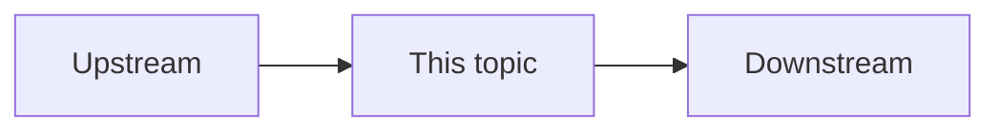

# Company System Deep Dive Template

> 每次只選一個 project 的一個 topic。目標是學會系統，不是全掃 repo。

## 1. Topic

- Project:
- Local path:
- Topic:
- Scope:
- Why it is worth studying now:
- A/B/C value ranking:
- Resume/autobiography linkage: Not evaluated by default

## 2. System Context

- Product / system position:
- Upstream:
- Downstream:
- Actors:
- Sync / async boundary:



## 3. Runtime Flow

Step-by-step:

1.
2.
3.

Mark:

- Sync call:
- Async call:
- DB write:
- MQ publish / consume:
- External call:
- Manual operation:

## 4. Code Reading Map

- Entry / controller:
- Service:
- DAO / mapper / repository:
- MQ producer:
- MQ consumer:
- Scheduler / job:
- External client:
- Important config:

Call graph:

```text
Controller
↓
Service
↓
DAO / MQ / External
```

## 5. Data Flow / Data Structure

- Tables:
- Important fields:
- DTO / request / response:
- Event / message:
- Redis keys:
- State transition:

## 6. Engineering Thinking

Clearly separate fact / inference / unknown.

### Code-backed fact

-

### Reasonable inference

-

### Unknown / needs verification

-

Discuss if relevant:

- Transaction boundary:
- Idempotency:
- Retry:
- Timeout:
- Compensation:
- Rollback:
- Consistency:
- Failure window:
- Manual repair / reconciliation:

## 7. Production Risk

- Duplicate processing:
- Lost event:
- Partial success:
- Stale cache:
- Race condition:
- Slow query:
- MQ backlog:
- External timeout:
- Missing observability:
- Manual operation risk:

## 8. Technology Comparison

Compare current design with alternatives only if relevant.

| Option | Pros | Cons | Migration cost | Worth changing when | Not worth changing when |
| --- | --- | --- | --- | --- | --- |
| Current |  |  |  |  |  |
| Alternative A |  |  |  |  |  |
| Alternative B |  |  |  |  |  |

Examples:

- RabbitMQ / XXL-MQ vs Kafka / RocketMQ / Pulsar。
- ZooKeeper vs Eureka / Nacos / Consul / Kubernetes Service Discovery。
- cron / XXL-Job vs event-driven / CDC。
- direct DB update vs outbox / inbox。
- local transaction vs Saga / compensation。

## 9. If Redesigning Today

- Minimal safe improvement:
- Medium refactor:
- Large migration:
- What must be verified first:
- What should NOT be changed yet:

## 10. Learning Level Check

| Level | Score | Note |
| --- | --- | --- |
| L1 Flow |  |  |
| L2 Code |  |  |
| L3 Why |  |  |
| L4 Alternatives |  |  |
| L5 Redesign |  |  |
| L6 Interview |  |  |

## 11. Interview Value

- Can say as analysis / learning:
- Can say only with direct evidence:
- Must not exaggerate:

Senior interview questions this topic supports:

1.
2.
3.

## 12. New Findings

List 0-3 genuinely new findings from code / git / system notes.

If none:

```text
No new A-level finding this run.
```

### Finding 1

- Level: A / B
- Finding:
- Evidence:
- Why it matters:
- KB action:

## 13. KB Update

- Save this deep dive? Yes / No
- Update deep-dive-log? Yes / No
- Backfill formal interview materials? No by default
- Resume / autobiography / claim gate needed? No by default
- Relationship Check result:
